##### Android系统

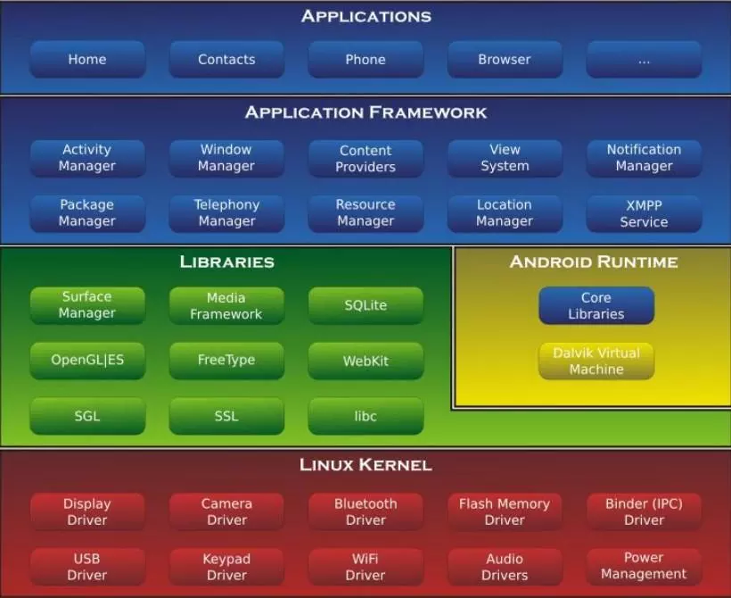

.jpg)

##### Android开机启动过程

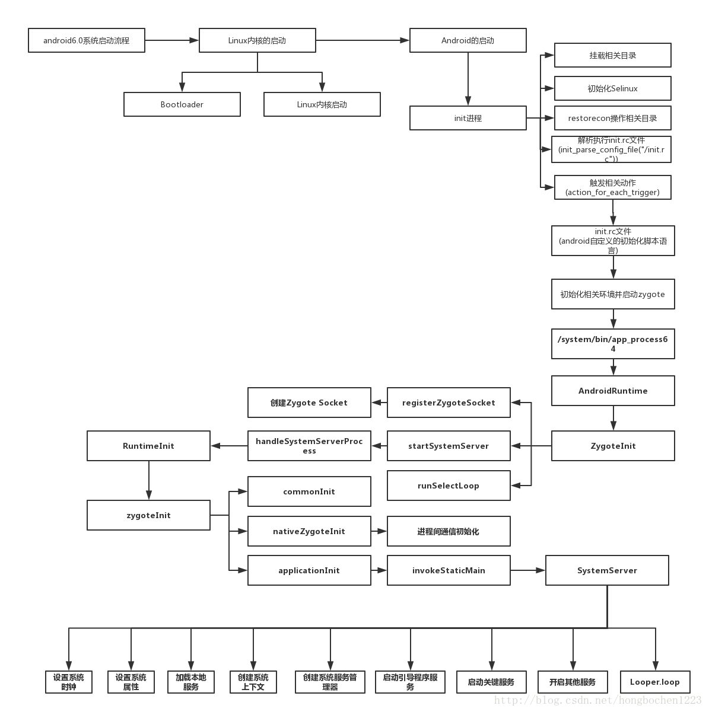

##### AndroidApp启动过程

- 启动过程
  1. 点击桌面App图标，Launcher进程采用Binder IPC向system_server进程发起startActivity请求
  2. system_server进程接收到请求后，向zygote进程发送创建进程的请求
  3. Zygote进程fork出新的子进程，即App进程
  4. App进程，通过Binder IPC向sytem_server进程发起attachApplication请求
  5. system_server进程在收到请求后，进行一系列准备工作后，再通过binder IPC向App进程发送scheduleLaunchActivity请求
  6. App进程的binder线程（ApplicationThread）在收到请求后，通过handler向主线程发送LAUNCH_ACTIVITY消息
  7. 主线程在收到Message后，通过发射机制创建目标Activity，并回调Activity.onCreate()等方法
  8. 到此，App便正式启动，开始进入Activity生命周期，执行完onCreate/onStart/onResume方法，UI渲染结束后便可以看到App的主界面
- 基础知识
  - zygote：zygote意为“受精卵“。Android是基于Linux系统的，而在Linux中，所有的进程都是由init进程直接或者是间接fork出来的，zygote进程也不例外。在Android系统里面，zygote是一个进程的名字。Android是基于Linux System的，当你的手机开机的时候，Linux的内核加载完成之后就会启动一个叫“init“的进程。在Linux System里面，所有的进程都是由init进程fork出来的，我们的zygote进程也不例外。
  - system_server：SystemServer也是一个进程，而且是由zygote进程fork出来的。SystemServer开启了ActivityManagerService、PackageManagerService、WindowManagerService等等服务。
  - ActivityManagerService：简称AMS，服务端对象，负责系统中所有Activity的生命周期。ActivityManagerService进行初始化的时机很明确，就是在SystemServer进程开启的时候，就会初始化ActivityManagerService。

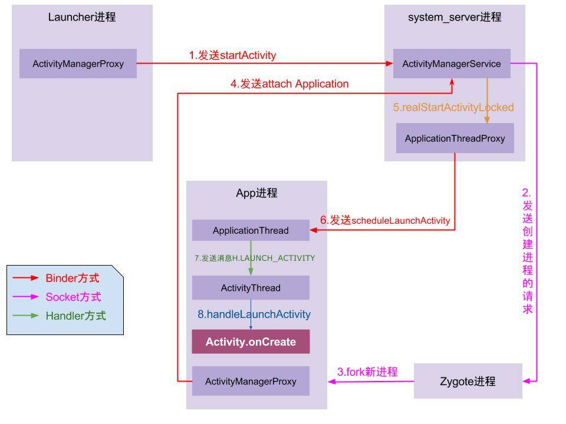

##### JVM，ART，Dalvik

- JVM：Java 虚拟机；类加载器 classloader + 执行引擎 execution engine + 运行时数据区域 runtime data area；
  - 程序计数器：当前线程所执行的字节码的行号指示器，用于记录下一条要运行的指令，线程私有（如果正在执行的是Native方法，计数器值则为空）
  - 虚拟机栈：对象的引用、方法出口等，线程私有
  - 本地方法栈：和虚拟栈相似，只不过它服务于Native方法，线程私有
  - 堆：java内存最大的一块，所有对象实例、数组都存放在java堆，GC回收的地方，线程共享
  - 方法区：存放已被加载的类信息、常量、静态变量、即时编译器编译后的代码数据等。（即永久带），回收目标主要是常量池的回收和类型的卸载，各线程共享


.png)

- Classloader：类加载器

  - 加载class方式
    - 隐式：运行过程中，碰到new方式生成对象时，隐式调用classLoader到JVM
    - 显式：通过class.forname()动态加载
  - 双亲委派模型（Parent Delegation Model）：类的加载过程采用双亲委托机制，这种机制能更好的保证 Java 平台的安全。该模型要求除了顶层的Bootstrap class loader启动类加载器外，其余的类加载器都应当有自己的`父类加载器`。子类加载器和父类加载器`不是以继承（Inheritance）的关系`来实现，而是通过`组合（Composition）关系`来复用父加载器的代码。每个类加载器都有自己的命名空间（由该加载器及所有父类加载器所加载的类组成，在同一个命名空间中，不会出现类的完整名字（包括类的包名）相同的两个类；在不同的命名空间中，有可能会出现类的完整名字（包括类的包名）相同的两个类）
    - Bootstrap Class Loader：是虚拟机的一部分， 主要加载JVM自身工作需要的类，完全由JVM控制，开发者无法访问.(无法被Java代码引用)；将指定目录下的符合虚拟机规范的类加载到虚拟机内存中，默认是\lib
    - Extension Class Loader：负责加载\lib\ext目录中的，或者被java.ext.dirs系统变量所指定的路径中的所有类库，开发者可以直接使用拓展类加载器
    - App Class Loader：由于这个类加载器是getSystemClassLoder()方法的返回值，所以又称系统加载器 ,它负责加载classPath路径上的指定的类库 ,如果程序中没有定义过类加载器，一般作为默认的类加载器

  

- Java内存堆与栈的区别

  - 栈内存用来存储基本类型的变量和对象的引用变量，堆内存用来存储Java中的对象，无论是成员变量，局部变量，还是类变量，它们指向的对象都存储在堆内存中
  - 栈内存归属于单个线程，每个线程都会有一个栈内存，其存储的变量只能在其所属线程中可见，即栈内存可以理解成线程的私有内存，堆内存中的对象对所有线程可见。堆内存中的对象可以被所有线程访问
  - 如果栈内存没有可用的空间存储方法调用和局部变量，JVM会抛出java.lang.StackOverFlowError，如果是堆内存没有可用的空间存储生成的对象，JVM会抛出java.lang.OutOfMemoryError
  - 栈的内存要远远小于堆内存，如果你使用递归的话，那么你的栈很快就会充满，-Xss选项设置栈内存的大小，-Xms选项可以设置堆的开始时的大小

- Java四种引用

  - 强引用（StrongReference）：强引用是使用最普遍的引用。如果一个对象具有强引用，那垃圾回收器绝不会回收它。当内存空间不足，Java虚拟机宁愿抛出OutOfMemoryError错误，使程序异常终止，也不会靠随意回收具有强引用的对象来解决内存不足的问题
  - 软引用（SoftReference）：如果内存空间不足了，就会回收这些对象的内存。只要垃圾回收器没有回收它，软引用可以和一个引用队列（ReferenceQueue）联合使用，如果软引用所引用的对象被垃圾回收器
  - 回收，Java虚拟机就会把这个软引用加入到与之关联的引用队列中
  - 弱引用（WeakReference）：弱引用与软引用的区别在于：只具有弱引用的对象拥有更短暂的生命周期，在垃圾回收器线程扫描它所管辖的内存区域的过程中，一旦发现了只具有弱引用的对象，不管当前内存空间足够与否，都会回收它的内存。弱引用可以和一个引用队列（ReferenceQueue）联合使用，如果弱引用所引用的对象被垃圾回收，Java虚拟机就会把这个弱引用加入到与之关联的引用队列中
  - 虚引用（PhantomReference）：虚引用在任何时候都可能被垃圾回收器回收，主要用来跟踪对象被垃圾回收器回收的活动，被回收时会收到一个系统通知。虚引用与软引用和弱引用的一个区别在于：虚引用必须和引用队列 （ReferenceQueue）联合使用。当垃圾回收器准备回收一个对象时，如果发现它还有虚引用，就会在回收对象的内存之前，把这个虚引用加入到与之关联的引用队列中

- GC

  - GC标记算法：引用计数法；根搜索算法(可达性算法)

  - GC回收算法

    - 标记-清除法：标记出没有用的对象，然后一个一个回收掉

      缺点：标记和清除两个过程效率不高，产生内存碎片导致需要分配较大对象时无法找到足够的连续内存而需要触发一次GC操作

    - 复制算法: 按照容量划分二个大小相等的内存区域，当一块用完的时候将活着的对象复制到另一块上，然后再把已使用的内存空间一次清理掉

      缺点：将内存缩小为了原来的一半

    - 标记-整理法：标记出没有用的对象，让所有存活的对象都向一端移动，然后直接清除掉端边界以外的内

      优点：解决了标记- 清除算法导致的内存碎片问题和在存活率较高时复制算法效率低的问题

    - 分代回收：根据对象存活周期的不同将内存划分为几块，一般是新生代和老年代，新生代基本采用复制算法，老年代采用标记整理算法

- ART：ART代表Android Runtime,其处理应用程序执行的方式完全不同于Dalvik，Dalvik是依靠一个Just-In-Time(JIT)编译器去解释字节码。开发者编译后的应用代码需要通过一个解释器在用户的设备上运行，这一机制并不高效，但让应用能更容易在不同硬件和架构上运行。ART则完全改变了这套做法，在应用安装的时候就预编译字节码到机器语言，这一机制叫Ahead-Of-Time(AOT)编译。在移除解释代码这一过程后，应用程序执行将更有效率，启动更快

- Dalvik：它可以支持已转换为.dex(即Dalvik Executable)格式的Java应用程序的运行，.dex格式是专为Dalvik应用设计的一种压缩格式，适合内存和处理器速度有限的系统。Dalvik经过优化，允许在有限的内存中同时运行多个虚拟机的实例，并且每一个Dalvik应用作为独立的Linux进程执行，独立的进程可以防止在虚拟机崩溃的时候所有程序都被关闭

##### 四大组件

- Activity

  - standard：标准模式；每次启动Activity都会创建一个新的Activity实例,并且将其压入任务栈栈顶，而不管这个Activity是否已经存在，Activity的启动三回调(*onCreate()->onStart()->onResume()*)都会执行
  - singleTop：栈顶复用模式；这种模式下，如果新Activity已经位于任务栈的栈顶，那么此Activity不会被重新创建，所以它的启动三回调就不会执行，同时Activity的`onNewIntent()`方法会被回调，如果Activity已经存在但是不在栈顶，那么作用与*standard模式*一样
  - singleTask：栈内复用模式；创建这样的Activity的时候，系统会先确认它所需任务栈已经创建，否则先创建任务栈.然后放入Activity，如果栈中已经有一个Activity实例,那么这个Activity就会被调到栈顶，同时Activity的`onNewIntent()`方法会被回调，并且singleTask会清理在当前Activity上面的所有Activity(clear top)
  - singleInstance：加强版的singleTask模式；这种模式的Activity只能单独位于一个任务栈内，由于栈内复用的特性，后续请求均不会创建新的Activity，除非这个独特的任务栈被系统销毁了

  

  

- Service

  

  - 启动服务

    .png)

    .png)

  - 绑定服务

    .png)

    .png)

  - IntentService

    - 通过HandlerThread 单独开启1个工作线程：IntentService

    - 创建1个内部 Handler ：ServiceHandler

    - 绑定 ServiceHandler 与 IntentService

    - 通过 onStartCommand()传递服务Intent 到ServiceHandler、依次插入Intent到工作队列中 & 逐个发送给 onHandleIntent()

    - 通过onHandleIntent()依次处理所有Intent对象所对应的任务

      ```java
      @Override
      public void onCreate() {
          super.onCreate();
          // 1. 通过实例化andlerThread新建线程 & 启动；故 使用IntentService时，不需额外新建线程
          // HandlerThread继承自Thread，内部封装了 Looper
          HandlerThread thread = new HandlerThread("IntentService[" + mName + "]");
          thread.start();
        
          // 2. 获得工作线程的 Looper & 维护自己的工作队列
          mServiceLooper = thread.getLooper();

          // 3. 新建mServiceHandler & 绑定上述获得Looper
          // 新建的Handler 属于工作线程 ->>分析1
          mServiceHandler = new ServiceHandler(mServiceLooper); 
      }

      /** 
       * 分析1：ServiceHandler源码分析
       **/   
      private final class ServiceHandler extends Handler {
               // 构造函数
               public ServiceHandler(Looper looper) {
               super(looper);
             	}

              // IntentService的handleMessage（）把接收的消息交给onHandleIntent()处理
              @Override
               public void handleMessage(Message msg) {
                // onHandleIntent 方法在工作线程中执行
                // onHandleIntent() = 抽象方法，使用时需重写 ->>分析2
                onHandleIntent((Intent)msg.obj);
                // 执行完调用 stopSelf() 结束服务
                stopSelf(msg.arg1);
          	}
      }

      /** 
       * 分析2： onHandleIntent()源码分析
       * onHandleIntent() = 抽象方法，使用时需重写
       **/ 
      @WorkerThread
      protected abstract void onHandleIntent(Intent intent);
      ```

      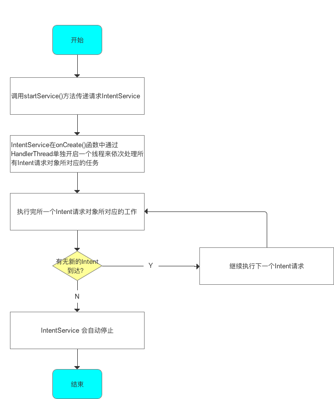

  - HandlerThread

    - HandlerThread本质上是一个线程类，它继承了Thread

    - HandlerThread有自己的内部Looper对象，可以进行looper循环

    - 通过获取HandlerThread的looper对象传递给Handler对象，可以在handleMessage方法中执行异步任务

    - 创建HandlerThread后必须先调用HandlerThread.start()方法，Thread会先调用run方法，创建Looper对象

      ```java
      HandlerThread handlerThread = new HandlerThread("downloadImage");

      //必须先开启线程
      handlerThread.start();

      /**
       * 该callback运行于子线程
       */
      class ChildCallback implements Handler.Callback {
           @Override
           public boolean handleMessage(Message msg) {
           	//在子线程中进行相应的网络请求
              //通知主线程去更新UI
               mUIHandler.sendMessage(msg1);
               return false;
           }
      }

      //子线程Handler
      Handler childHandler = new Handler(handlerThread.getLooper(),new ChildCallback());
      ```

- BroadcastReceiver

  - 注册方式

    - 静态注册

      ```java
      <receiver 
          android:enabled=["true" | "false"]
      //此broadcastReceiver能否接收其他App的发出的广播
      //默认值是由receiver中有无intent-filter决定的：如果有intent-filter，默认值为true，否则为false
          android:exported=["true" | "false"]
          android:icon="drawable resource"
          android:label="string resource"
      //继承BroadcastReceiver子类的类名
          android:name=".mBroadcastReceiver"
      //具有相应权限的广播发送者发送的广播才能被此BroadcastReceiver所接收；
          android:permission="string"
      //BroadcastReceiver运行所处的进程
      //默认为app的进程，可以指定独立的进程
      //注：Android四大基本组件都可以通过此属性指定自己的独立进程
          android:process="string" >

      //用于指定此广播接收器将接收的广播类型
      //本示例中给出的是用于接收网络状态改变时发出的广播
       <intent-filter>
      <action android:name="android.net.conn.CONNECTIVITY_CHANGE" />
          </intent-filter>
      </receiver>
      ```

    - 动态注册

      ```java
      //选择在Activity生命周期方法中的onResume()中注册
      //1. 实例化BroadcastReceiver子类 &  IntentFilter
      mBroadcastReceiver mBroadcastReceiver = new mBroadcastReceiver();
      IntentFilter intentFilter = new IntentFilter();

      //2. 设置接收广播的类型
      intentFilter.addAction(android.net.conn.CONNECTIVITY_CHANGE);

      //3. 动态注册：调用Context的registerReceiver（）方法
      registerReceiver(mBroadcastReceiver, intentFilter);

      //销毁在onPause()方法中的广播
      unregisterReceiver(mBroadcastReceiver);
      ```

      ​

  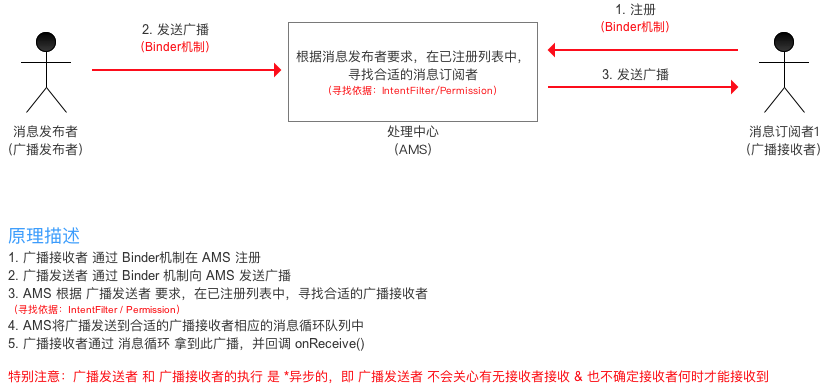

  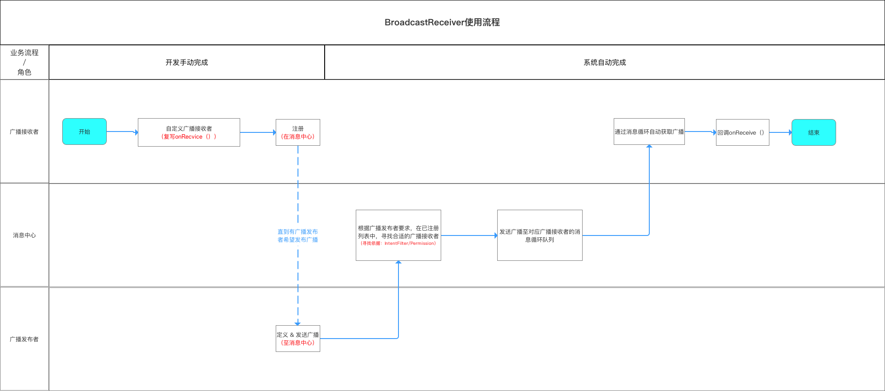

  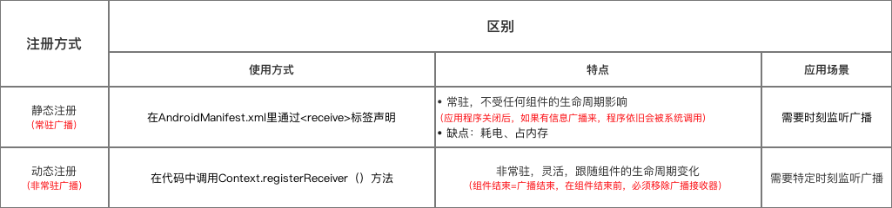

- ContentProvider

  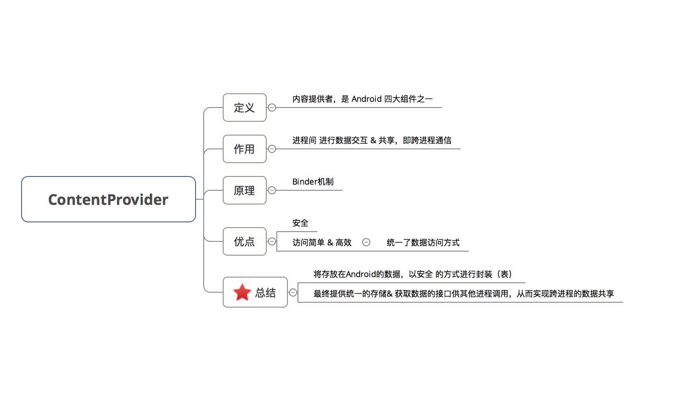

  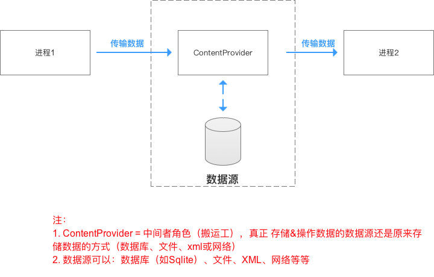

##### Hander

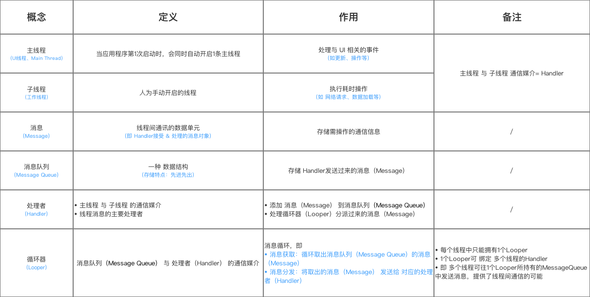

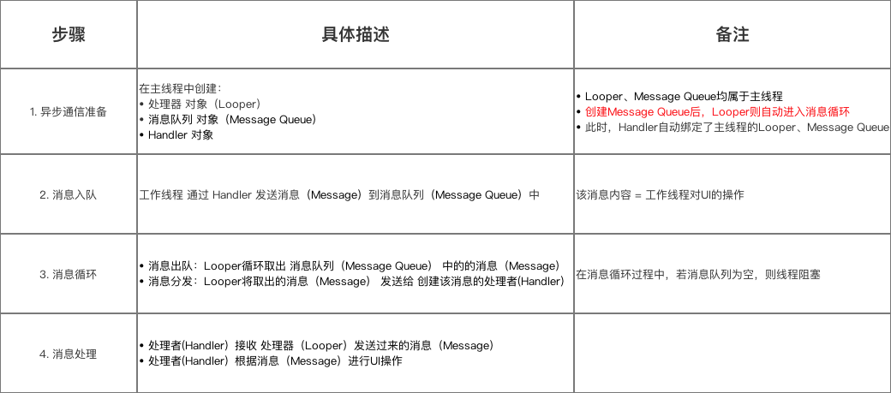

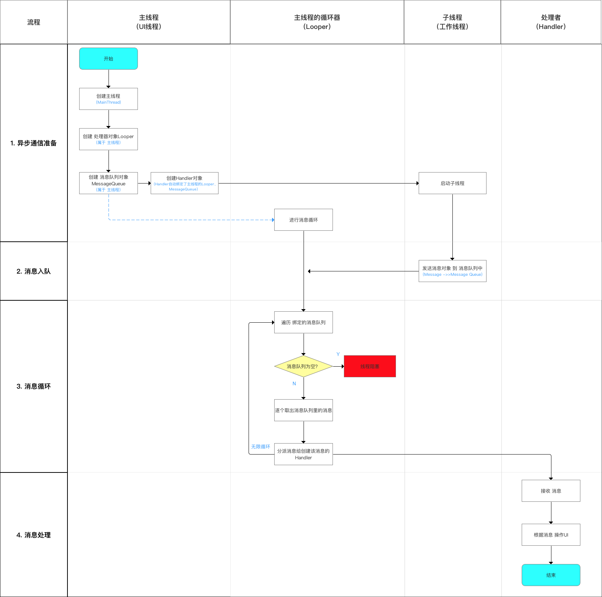

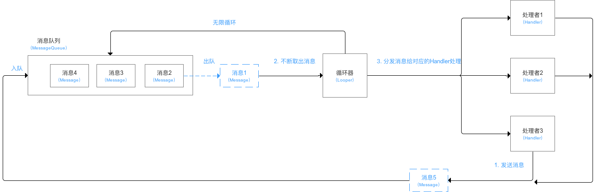

##### Binder

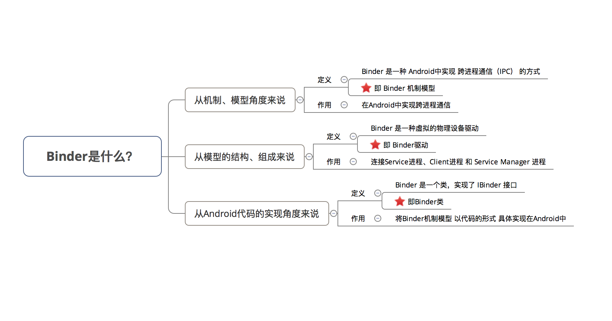

- 进程空间

  - 一个进程空间分为 用户空间 & 内核空间（`Kernel`），即把进程内 用户 & 内核 隔离开来（所有进程共用1个内核空间）

  - 区别

    - 进程间，用户空间的数据不可共享，所以用户空间 = 不可共享空间
    - 进程间，内核空间的数据可共享，所以内核空间 = 可共享空间

  - 用户空间&内核空间进行交互需通过系统调用

    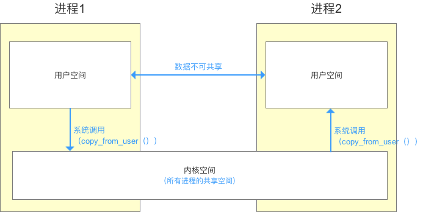

- 进程隔离&跨进程通信（IPC）

  - 进程隔离：为了保证 安全性 & 独立性，一个进程 不能直接操作或者访问另一个进程，即`Android`的进程是**相互独立、隔离的**

  - 跨进程通信（ `IPC` ）：即进程间需进行数据交互、通信

  - 跨进程通信的基本原理

    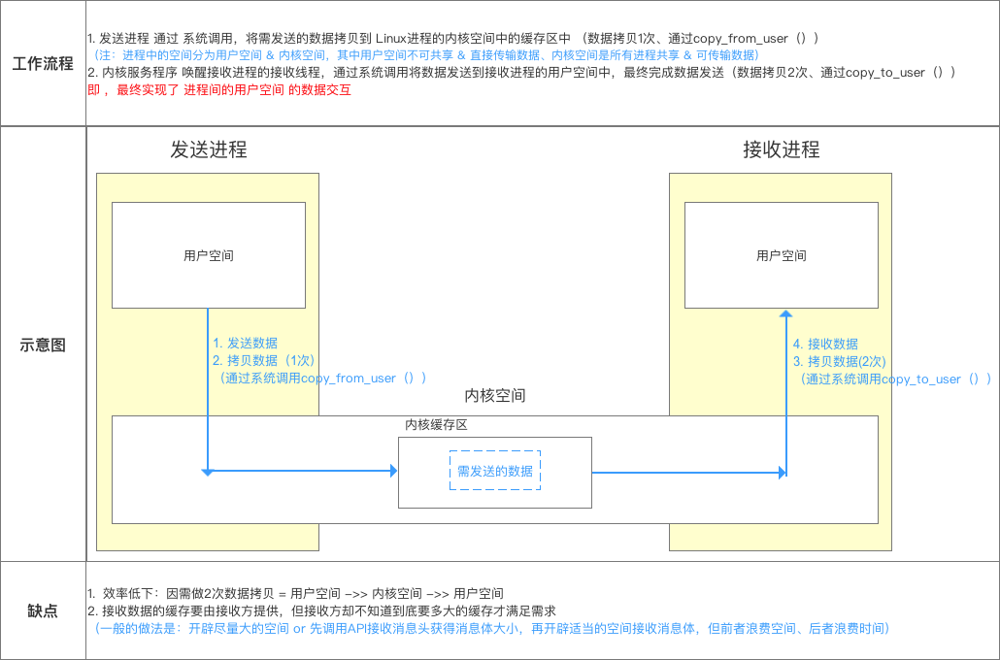

- Binder模型

  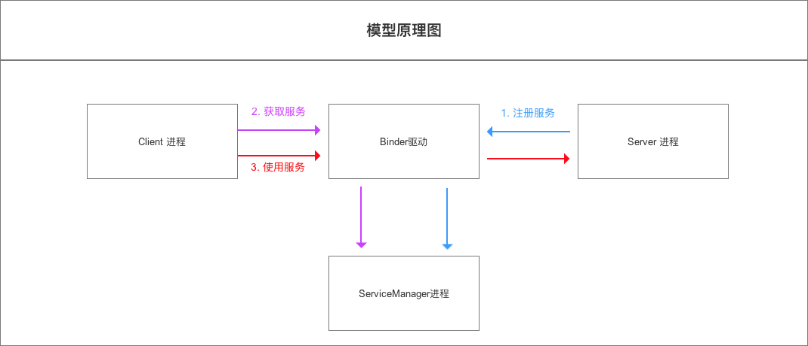

  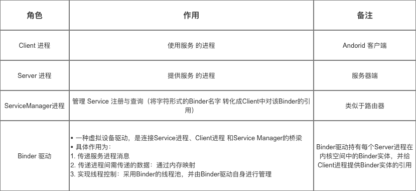

  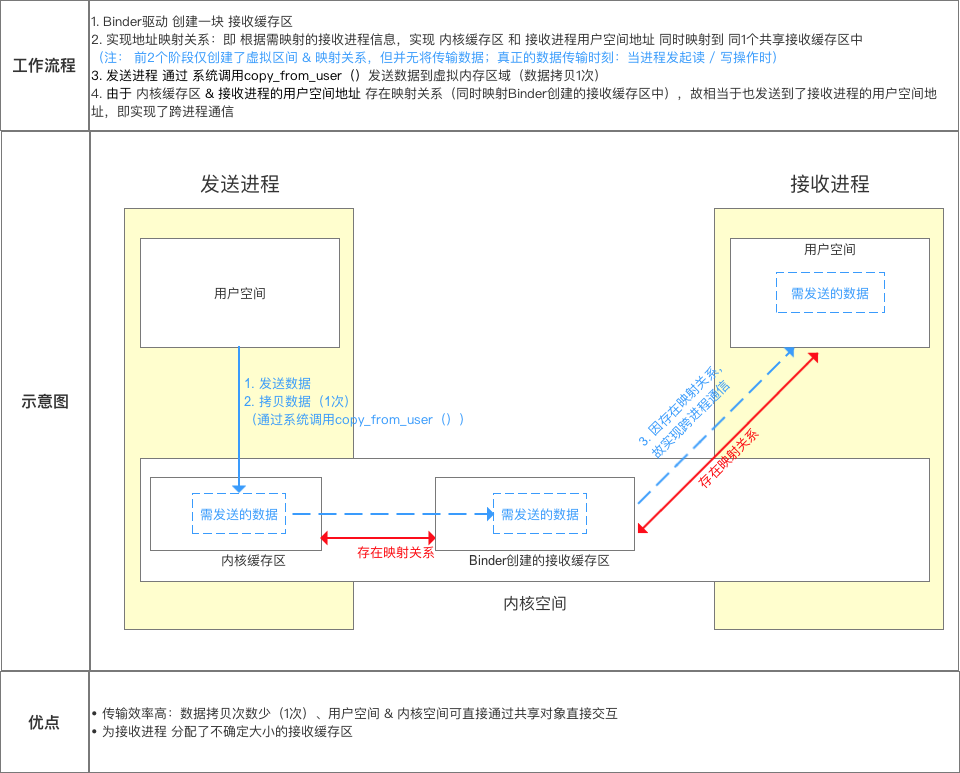

  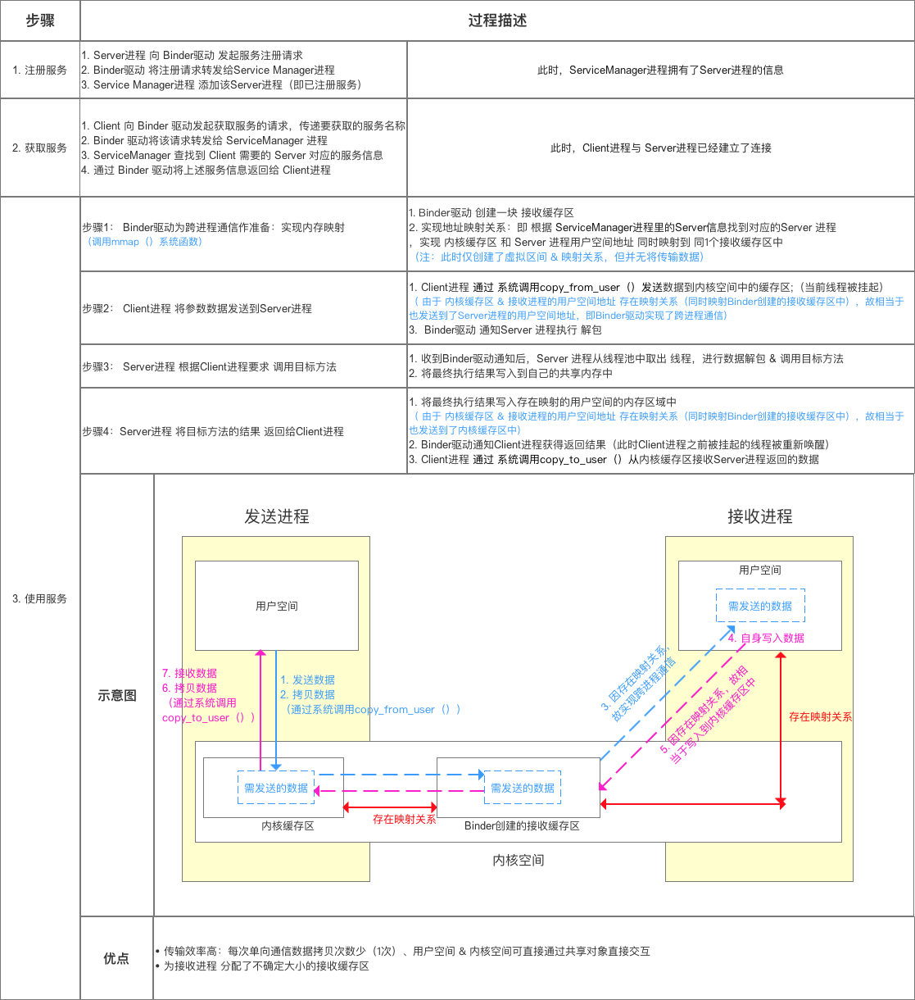

- 说明

  - `Client`进程、`Server`进程 & `Service Manager` 进程之间的交互 都必须通过`Binder`驱动（使用 `open` 和 `ioctl`文件操作函数），而非直接交互（虚线表示并非直接交互）

    - `Client`进程、`Server`进程 & `Service Manager`进程属于进程空间的用户空间，不可进行进程间交互

    - `Binder`驱动 属于 进程空间的 内核空间，可进行进程间 & 进程内交互

      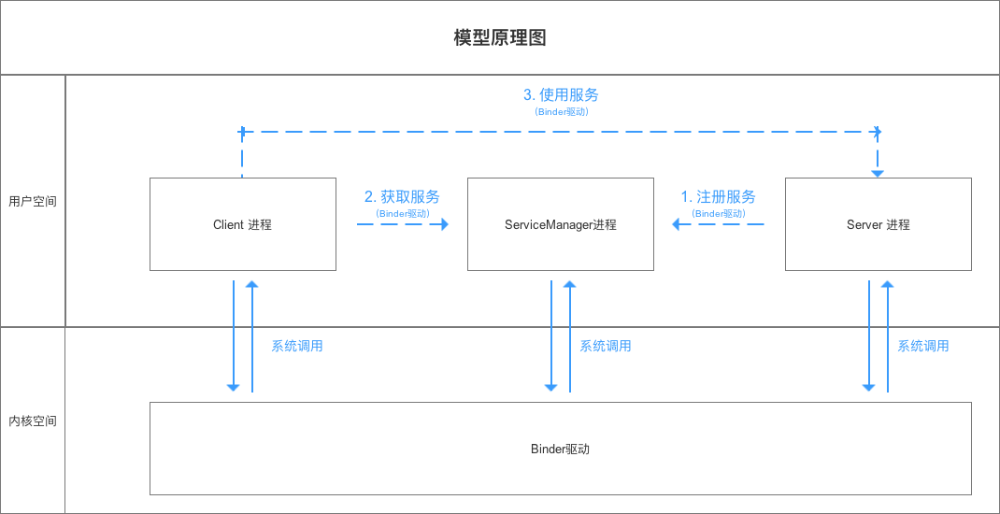

  - `Binder`驱动 & `Service Manager`进程 属于 `Android`基础架构（即系统已经实现好了）；而`Client` 进程 和 `Server` 进程 属于`Android`应用层（需要开发者自己实现）

    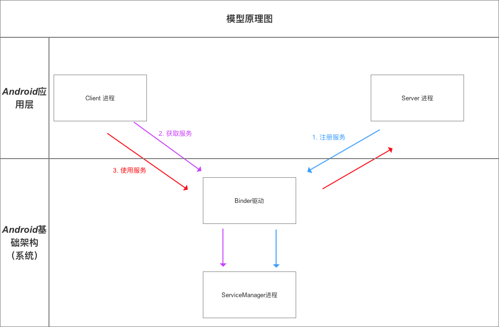

  - Binder请求的线程管理

    - `Server`进程会创建很多线程来处理`Binder`请求
    - `Binder`模型的线程管理 采用`Binder`驱动的线程池，并由`Binder`驱动自身进行管理，而不是由`Server`进程来管理的
    - 一个进程的`Binder`线程数默认最大是16，超过的请求会被阻塞等待空闲的Binder线程，所以，在进程间通信时处理并发问题时，如使用`ContentProvider`时，它的`CRUD`（创建、检索、更新和删除）方法只能同时有16个线程同时工作

- Binder机制 在Android中的具体实现原理

  `Binder`机制在 `Android`中的实现主要依靠 `Binder`类，其实现了`IBinder` 接口

  1. 注册服务：`Server`进程 通过`Binder`驱动 向 `Service Manager`进程 注册服务；`Server`进程 创建 一个 `Binder` 对象

     - `Binder` 实体是 `Server`进程 在 `Binder` 驱动中的存在形式
     - 该对象保存 `Server` 和 `ServiceManager` 的信息（保存在内核空间中）
     - `Binder` 驱动通过 内核空间的`Binder` 实体 找到用户空间的`Server`对象

     ```java
     Binder binder = new Stub();
         // 步骤1：创建Binder对象 ->>分析1
         // 步骤2：创建 IInterface 接口类 的匿名类
         // 创建前，需要预先定义 继承了IInterface 接口的接口 -->分析3
         IInterface plus = new IPlus(){
               // 确定Client进程需要调用的方法
               public int add(int a,int b) {
                    return a+b;
              }

               // 实现IInterface接口中唯一的方法
               public IBinder asBinder（）{ 
                     return null ;
                }
     };
               // 步骤3
               binder.attachInterface(plus，"add two int");
              // 1. 将（add two int，plus）作为（key,value）对存入到Binder对象中的一个Map<String,IInterface>对象中
              // 2. 之后，Binder对象 可根据add two int通过queryLocalIInterface（）获得对应IInterface对象（即plus）的引用，可依靠该引用完成对请求方法的调用
             // 分析完毕，跳出

     <-- 分析1：Stub类 -->
         public class Stub extends Binder {
         // 继承自Binder类 ->>分析2
               // 复写onTransact（）
               @Override
               boolean onTransact(int code, Parcel data, Parcel reply, int flags){
               // 具体逻辑等到步骤3再具体讲解，此处先跳过
               switch (code) { 
                     case Stub.add： { 
                            data.enforceInterface("add two int"); 
                            int  arg0  = data.readInt();
                            int  arg1  = data.readInt();
                            int  result = this.queryLocalIInterface("add two int") .add( arg0,  arg1); 
                             reply.writeInt(result); 
                             return true; 
                       }
                } 
           return super.onTransact(code, data, reply, flags); 
     }
             
     // 回到上面的步骤1，继续看步骤2
     <-- 分析2：Binder 类 -->
      public class Binder implement IBinder{
         // Binder机制在Android中的实现主要依靠的是Binder类，其实现了IBinder接口
         // IBinder接口：定义了远程操作对象的基本接口，代表了一种跨进程传输的能力
         // 系统会为每个实现了IBinder接口的对象提供跨进程传输能力
         // 即Binder类对象具备了跨进程传输的能力
             void attachInterface(IInterface plus, String descriptor)；
             // 作用：
               // 1. 将（descriptor，plus）作为（key,value）对存入到Binder对象中的一个Map<String,IInterface>对象中
               // 2. 之后，Binder对象 可根据descriptor通过queryLocalIInterface（）获得对应IInterface对象（即plus）的引用，可依靠该引用完成对请求方法的调用

             IInterface queryLocalInterface(Stringdescriptor) ；
             // 作用：根据 参数 descriptor 查找相应的IInterface对象（即plus引用）

             boolean onTransact(int code, Parcel data, Parcel reply, int flags)；
             // 定义：继承自IBinder接口的
             // 作用：执行Client进程所请求的目标方法（子类需要复写）
             // 参数说明：
             // code：Client进程请求方法标识符。即Server进程根据该标识确定所请求的目标方法
             // data：目标方法的参数。（Client进程传进来的，此处就是整数a和b）
             // reply：目标方法执行后的结果（返回给Client进程）
              // 注：运行在Server进程的Binder线程池中；当Client进程发起远程请求时，远程请求会要求系统底层执行回调该方法

             final class BinderProxy implements IBinder {
              // 即Server进程创建的Binder对象的代理对象类
              // 该类属于Binder的内部类
             }
             // 回到分析1原处
     }

     <-- 分析3：IInterface接口实现类 -->
      public interface IPlus extends IInterface {
               // 继承自IInterface接口->>分析4
               // 定义需要实现的接口方法，即Client进程需要调用的方法
              public int add(int a,int b);
     // 返回步骤2
     }

     <-- 分析4：IInterface接口类 -->
     // 进程间通信定义的通用接口
     // 通过定义接口，然后再服务端实现接口、客户端调用接口，就可实现跨进程通信。
     public interface IInterface
     {
         // 只有一个方法：返回当前接口关联的 Binder 对象。
         public IBinder asBinder();
     }
       // 回到分析3原处。
     ```

  2. 获取服务：`Client`进程 使用 某个 `service`前（此处是 **相加函数**），须 通过`Binder`驱动 向 `ServiceManager`进程 获取相应的`Service`信息

     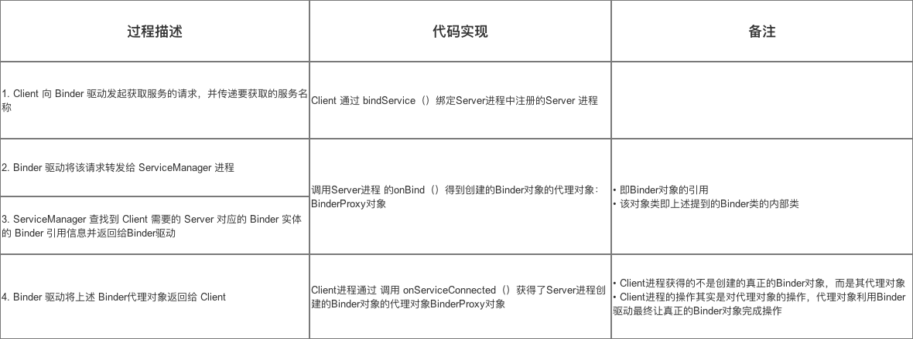

  3. 使用服务：`Client`进程 根据获取到的 `Service`信息（`Binder`代理对象），通过`Binder`驱动 建立与 该`Service`所在`Server`进程通信的链路，并开始使用服务

     1. `Client`进程 将参数（整数a和b）发送到`Server`进程

     2. `Server`进程 根据`Client`进程要求调用 目标方法（即加法函数）

     3. `Server`进程 将目标方法的结果（即加法后的结果）返回给`Client`进程

     4. 实现步骤

        1. Client进程 将参数（整数a和b）发送到Server进程

           ```java
           // 1. Client进程 将需要传送的数据写入到Parcel对象中
           // data = 数据 = 目标方法的参数（Client进程传进来的，此处就是整数a和b） + IInterface接口对象的标识符descriptor
             android.os.Parcel data = android.os.Parcel.obtain();
             data.writeInt(a); 
             data.writeInt(b); 
             data.writeInterfaceToken("add two int");；
             // 方法对象标识符让Server进程在Binder对象中根据"add two int"通过queryLocalIInterface（）查找相应的IInterface对象（即Server创建的plus），Client进程需要调用的相加方法就在该对象中

             android.os.Parcel reply = android.os.Parcel.obtain();
           // reply：目标方法执行后的结果（此处是相加后的结果）

           // 2. 通过 调用代理对象的transact（） 将 上述数据发送到Binder驱动
             binderproxy.transact(Stub.add, data, reply, 0)
             // 参数说明：
               // 1. Stub.add：目标方法的标识符（Client进程 和 Server进程 自身约定，可为任意）
               // 2. data ：上述的Parcel对象
               // 3. reply：返回结果
               // 0：可不管

           // 注：在发送数据后，Client进程的该线程会暂时被挂起
           // 所以，若Server进程执行的耗时操作，请不要使用主线程，以防止ANR
                 
           // 3. Binder驱动根据 代理对象 找到对应的真身Binder对象所在的Server 进程（系统自动执行）
           // 4. Binder驱动把 数据 发送到Server 进程中，并通知Server 进程执行解包（系统自动执行）
           ```

        2. Server进程根据Client进要求 调用 目标方法（即加法函数）

           ```java
           // 1. 收到Binder驱动通知后，Server 进程通过回调Binder对象onTransact（）进行数据解包 & 调用目标方法
             public class Stub extends Binder {
                     // 复写onTransact（）
                     @Override
                     boolean onTransact(int code, Parcel data, Parcel reply, int flags){
                     // code即在transact（）中约定的目标方法的标识符
                     switch (code) { 
                           case Stub.add： { 
                             // a. 解包Parcel中的数据
                                  data.enforceInterface("add two int"); 
                                   // a1. 解析目标方法对象的标识符
                                  int  arg0  = data.readInt();
                                  int  arg1  = data.readInt();
                                  // a2. 获得目标方法的参数
                                  // b. 根据"add two int"通过queryLocalIInterface（）获取相应的IInterface对象（即Server创建的plus）的引用，通过该对象引用调用方法
                                  int  result = this.queryLocalIInterface("add two int") .add( arg0,  arg1); 
                                   // c. 将计算结果写入到reply
                                   reply.writeInt(result); 
                                   return true; 
                             }
                      } 
                 return super.onTransact(code, data, reply, flags); 
           // 2. 将结算结果返回 到Binder驱动
           ```

        3. Server进程 将目标方法的结果（即加法后的结果）返回给Client进程

           ```java
           // 1. Binder驱动根据 代理对象 沿原路 将结果返回 并通知Client进程获取返回结果
           // 2. 通过代理对象 接收结果（之前被挂起的线程被唤醒）
               binderproxy.transact(Stub.ADD, data, reply, 0)；
               reply.readException();；
               result = reply.readInt()；
                     }
           }
           ```

           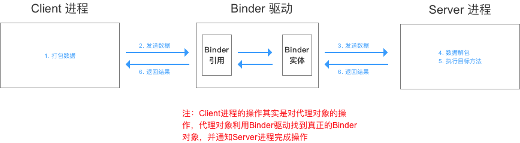

           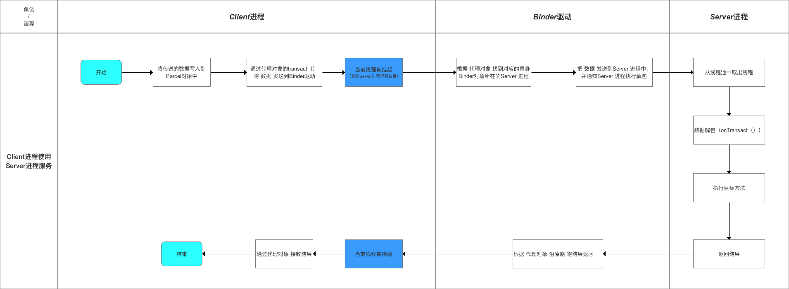


- 优点

  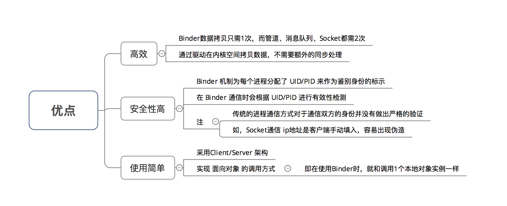

- Binder模型原理及源码分析

  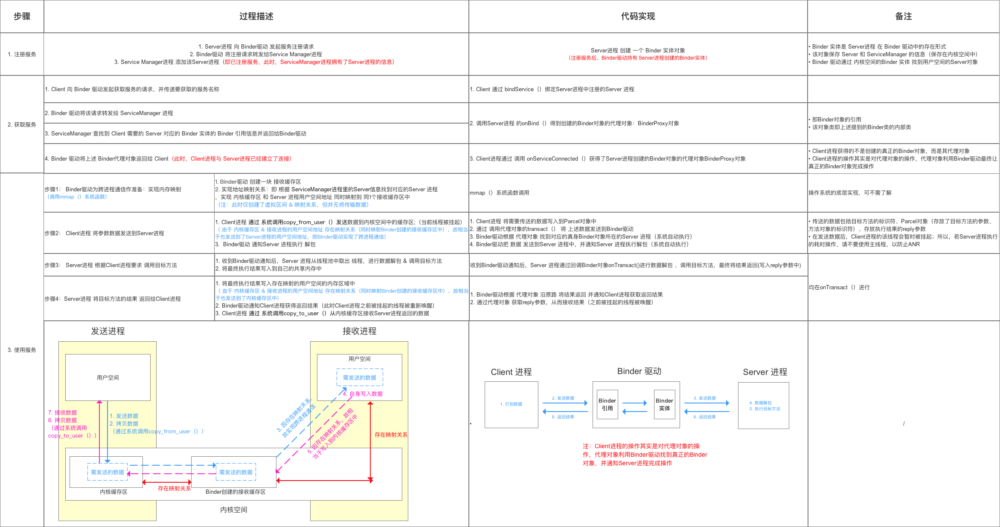


##### AIDL

- Android Interface Definition Language，翻译过来就是Android接口定义语言，是用于定义服务器和客户端通信接口的一种描述语言，可以拿来生成用于IPC的代码


- AIDL文件以 **.aidl** 为后缀名
  - 八种基本数据类型：byte、char、short、int、long、float、double、boolean
  - String，CharSequence
  - 实现了Parcelable接口的数据类型
  - List 类型，List承载的数据必须是AIDL支持的类型，或者是其它声明的AIDL对象
  - Map类型，Map承载的数据必须是AIDL支持的类型，或者是其它声明的AIDL对象
- AIDL文件可以分为两类，一类用来声明实现了Parcelable接口的数据类型，以供其他AIDL文件使用那些非默认支持的数据类型，还有一类是用来定义接口方法，声明要暴露哪些接口给客户端调用，定向Tag就是用来标注这些方法的参数值
- 定向Tag，定向Tag表示在跨进程通信中数据的流向，用于标注方法的参数值，分为 in、out、inout 三种。其中 in 表示数据只能由客户端流向服务端， out 表示数据只能由服务端流向客户端，而 inout 则表示数据可在服务端与客户端之间双向流通。此外，如果AIDL方法接口的参数值类型是：基本数据类型、String、CharSequence或者其他AIDL文件定义的方法接口，那么这些参数值的定向 Tag 默认是且只能是 in，所以除了这些类型外，其他参数值都需要明确标注使用哪种定向Tag。定向Tag具体的使用差别后边会有介绍
- 明确导包，在AIDL文件中需要明确标明引用到的数据类型所在的包名，即使两个文件处在同个包名下

##### 事件分发机制

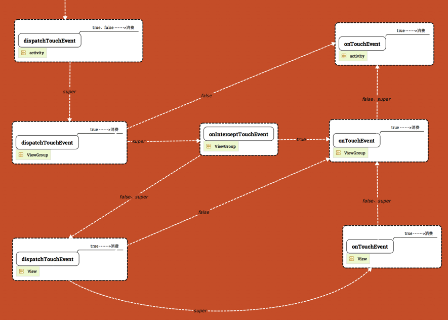


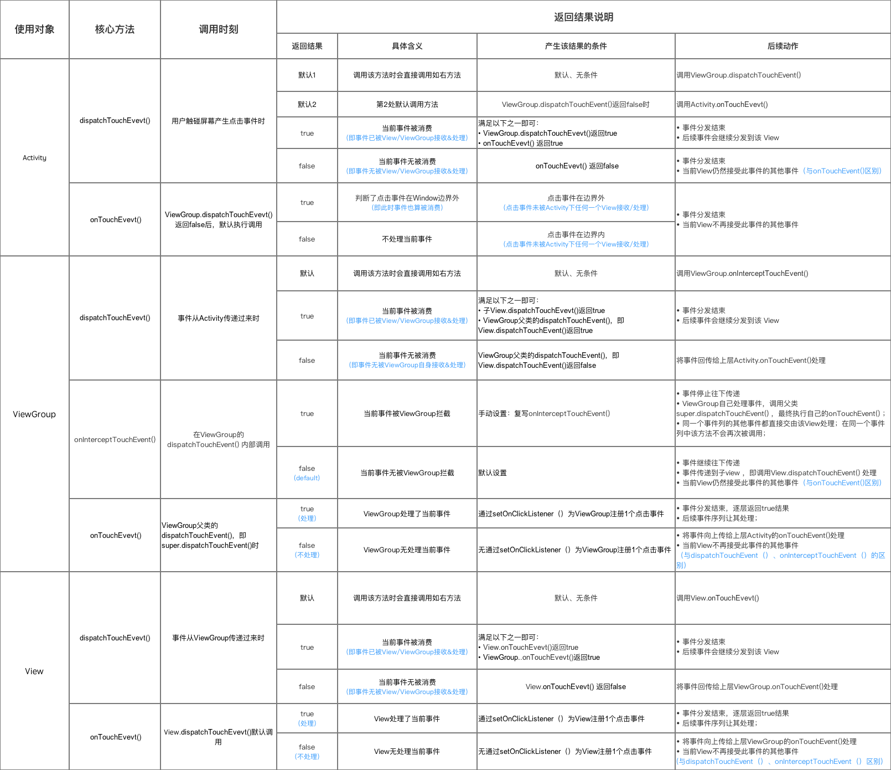

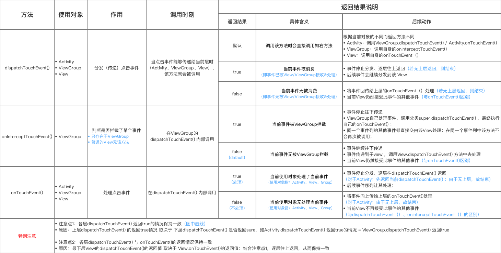

##### 自定义View

- measure

  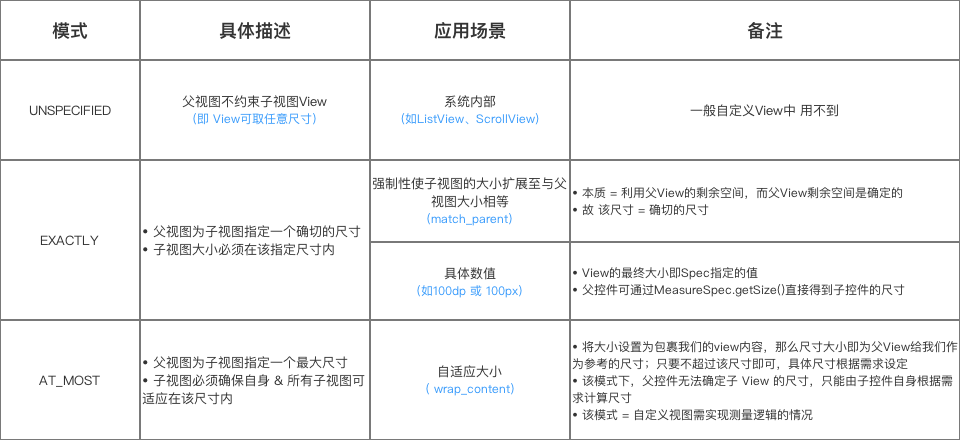

  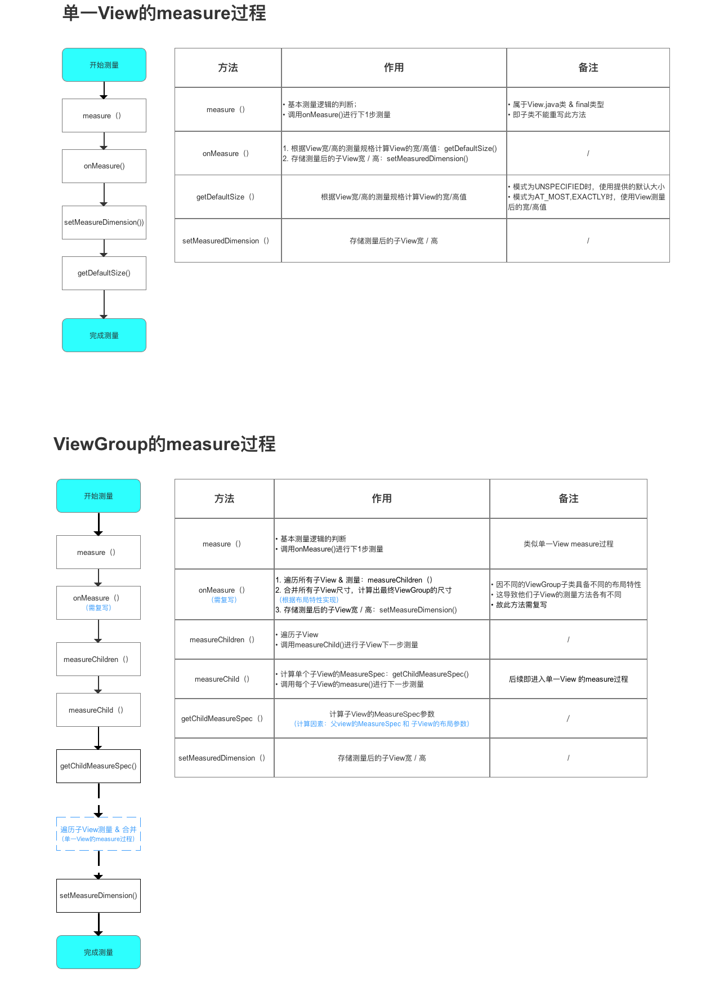

- layout

  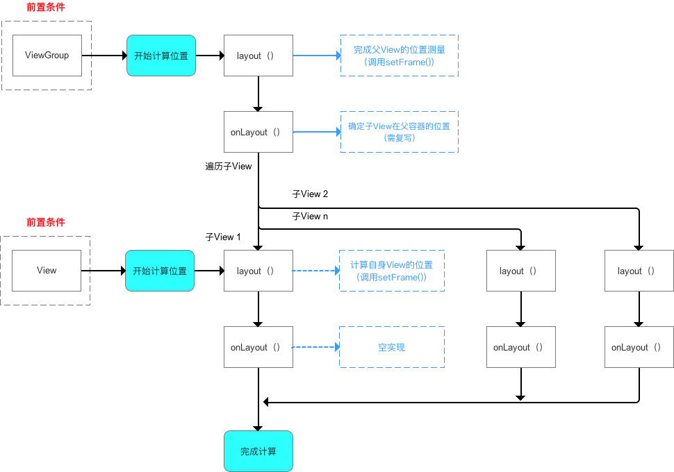

- draw

  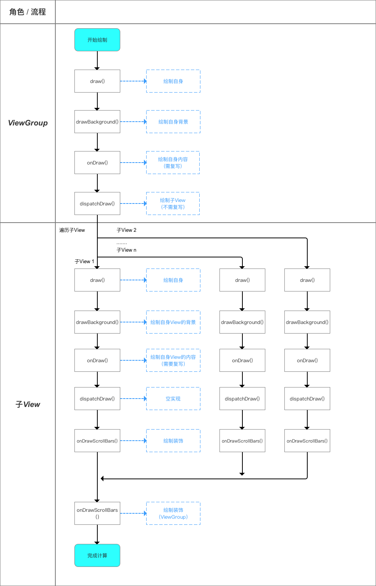

##### MVC，MVP，MVVM

- MVC

  1. 先实现一个 model，需要有通知View更新的能力,当model加载成功，如从db、获取后，需要告知View

     ```java
     public class StudentModel {
         String mId;
         WelcomeActivity mActivity;

         public StudentModel (WelcomeActivity activity) {
             this.mActivity = activity;
         }
         
         public void loadModel (){
             //search from db or intent
             mId = "1201030018";
             mActivity.updateUI(this);
         }
     }
     ```

  2. Controller ： 我们为了更好的理解MVC，将Activity进行了拆解。提取了一个简单的Controller

     ```java
     public class WelcomeController {
         WelcomeActivity mActivity;
         StudentModel mStudent;

         WelcomeController (WelcomeActivity activity) {
             this.mActivity = activity;
         }

         public void loadData (){
             mStudent = new StudentModel(mActivity);
             mStudent.loadModel();
         }
     }
     ```

  3. View ： View需要发出点击事件，并且传递给Controller,同时需要根据Model更新UI

     ```java
     public class WelcomeActivity extends AppCompatActivity {

         @Override
         protected void onCreate(Bundle savedInstanceState) {
            //省略
             final WelcomeController controller = new WelcomeController(this);
             mFindBtn.setOnClickListener(new View.OnClickListener() {
                 @Override
                 public void onClick(View view) {
                     controller.loadData();
                 }
             });
         }

         public void updateUI (StudentModel model) {
             mID.setText(model.mId);
         }
     }
     ```

  

- MVP

  1. 我们需要先对Model进行封装，当loadModel后，不直接通知View更新，而是通知监听方（Presenter）

     ```java
     public class StudentModel {
         String mId;
         OnGetListener mListener;

         public StudentModel (OnGetListener listener) {
             this.mListener = listener;
         }
         
         public void loadModel (){
             //search from db or intent
             mId = "1201030018";
             if (mListener != null) {
                 mListener.onSuccess(this);
             }
         }
         
         interface OnGetListener {
             void onSuccess (StudentModel student);
         }
     }
     ```

  2. 再定义Presenter ，接收到来自View的操作命令后，进行逻辑处理，处理Model，修改完成后通知View进行修改

     ```java
     public class WelcomePresenter {
         WelcomeActivity mActivity;
         StudentModel mStudent;

         WelcomePresenter (WelcomeActivity activity) {
             this.mActivity = activity;
         }

         public void loadData (){
             mStudent = new StudentModel(new StudentModel.OnGetListener() {
                 @Override
                 public void onSuccess(StudentModel student) {
                     mActivity.updateUI(student);
                 }
             });
         }
     }
     ```

  3. 对于View，操作方式只是修改了持有的对象 `WelcomeController`->`WelcomePresenter`，其他保持不变

  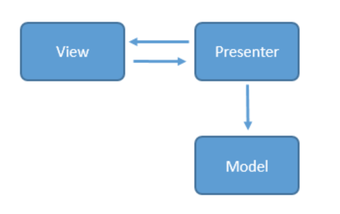

- MVVM

  1. 把Controller\Presenter扔掉，先写一个ViewModel这个VM的概念是一个和视图相关的模型，因此可以和DAO相关的模型不一样，因为我们只需要展示`student id`的数据以及`click事件`，以及`loadData`行为，用来从Model中获取数据，于是我们实现了一个VM

     ```java
     public class StudentViewModel extends BaseObservable{
         String studentID;
         View.OnClickListener btnListener;
        //省略get set

         public StudentViewModel() {
             btnListener = new View.OnClickListener() {
                 @Override
                 public void onClick(View view) {
                     loadData();
                 }
             };
         }

         public void loadData() {
             StudentModel model = new StudentModel(new StudentModel.OnGetListener() {
                 @Override
                 public void onSuccess(StudentModel student) {
                     setStudentID(student.mId);
                 }
             });
             model.loadModel();
         }
     }
     ```

  2. 接着使用databinding语法 对 xml 进行数据绑定,我们将 Click事件、输出结果都绑定到VM上

     ```xml
     <?xml version="1.0" encoding="utf-8"?>
     <layout xmlns:android="http://schemas.android.com/apk/res/android"
             xmlns:tools="http://schemas.android.com/tools">
         <data>
             <variable name="userVM" type="com.moon.coderread.StudentViewModel"/>
         </data>
         <LinearLayout
                //省略
             <TextView
                     android:id="@+id/id"
                     android:layout_width="match_parent"
                     android:layout_height="20dp"
                     android:text="@{userVM.studentID}"/>
               <Button
                     android:id="@+id/findBtn"
                     android:onClick="@{userVM.btnListener}"
                     android:text="find Student ID"
                     android:layout_width="wrap_content"
                     android:layout_height="wrap_content"/>
         </LinearLayout>
     </layout>
     ```

  3. 最后在`View(Activity)`中引入VM

     ```java
     public class WelcomeActivity extends AppCompatActivity {

         @Override
         protected void onCreate(Bundle savedInstanceState) {
             ActivityWelcomeBinding binding = DataBindingUtil.setContentView(this,R.layout.activity_welcome);

             final StudentViewModel studentViewModel = new StudentViewModel();
             binding.setUserVM(studentViewModel);
         }
     }
     ```

  

- 关系

  - MVVM可以算是MVP的升级版，其中的VM是ViewModel的缩写，ViewModel可以理解成是View的数据模型和Presenter的合体，ViewModel和View之间的交互通过Data Binding完成，而Data Binding可以实现双向的交互，这就使得视图和控制层之间的耦合程度进一步降低，关注点分离更为彻底，同时减轻了Activity的压力。
  - 相同点
    - Model：数据对象，同时，提供本应用外部对应用程序数据的操作的接口，也可能在数据变化时发出变更通知。Model不依赖于View的实现，只要外部程序调用Model的接口就能够实现对数据的增删改查。
    - View：UI层，提供对最终用户的交互操作功能，包括UI展现代码及一些相关的界面逻辑代码。
  - 不同点
    - Controller：Controller接收View的操作事件，根据事件不同，或者调用Model的接口进行数据操作，或者进行View的跳转，从而也意味着一个Controller可以对应多个View。Controller对View的实现不太关心，只会被动地接收，Model的数据变更不通过Controller直接通知View，通常View采用观察者模式监听Model的变化。
    - Presenter：Presenter与Controller一样，接收View的命令，对Model进行操作；与Controller不同的是Presenter会反作用于View，Model的变更通知首先被Presenter获得，然后Presenter再去更新View。一个Presenter只对应于一个View。根据Presenter和View对逻辑代码分担的程度不同，这种模式又有两种情况：Passive View和Supervisor Controller。
    - ViewModel：注意这里的“Model”指的是View的Model，跟MVVM中的一个Model不是一回事。所谓View的Model就是包含View的一些数据属性和操作的这么一个东东，这种模式的关键技术就是数据绑定（data binding），View的变化会直接影响ViewModel，ViewModel的变化或者内容也会直接体现在View上。这种模式实际上是框架替应用开发者做了一些工作，开发者只需要较少的代码就能实现比较复杂的交互。

##### Clean Architecture

- 简介

  

  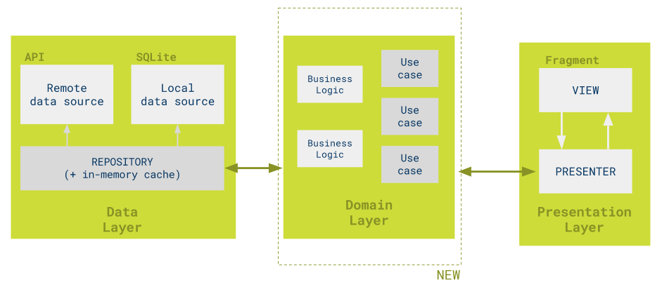

  - Enterprise Business Rules：业务对象
  - Application Business Rules：用于处理我们的业务对象，业务逻辑所在，也称为Interactor
  - Interface Adapters： 接口转换，拿到我们需要的数据，表现层（Presenters）和控制层（Controllers）就在这一层
  - Frameworks and Drivers: 这里是所有具体的实现了：比如：UI，工具类，基础框架等等
  - 表现层 (Presentation Layer)：表现层以MVP为基础
  - 领域层 (Domain Layer)：Interactor的实现类和业务对象
  - 数据层 (Data Layer)：Repository模式
  - Clean框架流程：Activity发起获取数据信号（View）->调用Presenter接口（Presenter）->调用UseCase接口（Domain）->调用Repository接口（Data）->拿到原始数据->回调Repository（Data）->回调UseCase（Domain）->回调Presenter（Presenter）->回调Activity（View）

##### RecyclerView，ListView

- RecyclerView

  - 优点
    - item复用性高：把ViewHolder的实现封装起来，规范了ViewHolder，把item的view写入ViewHolder中，可以通过复用ViewHolder来实现view的复用
    - 灵活、可定制化高、可拓展性高：整体上看RecyclerView架构，提供了一种插拔式的体验：高度的解耦，异常的灵活
    - 控制其显示的方式-通过布局管理器LayoutManager
    - 控制Item间的间隔（可绘制）-通过ItemDecoration
    - 控制Item增删的动画- 通过ItemAnimator
  - 缺点
    - RecyclerView实现控制点击、长按事件较为麻烦，需要自己写

- ListView

  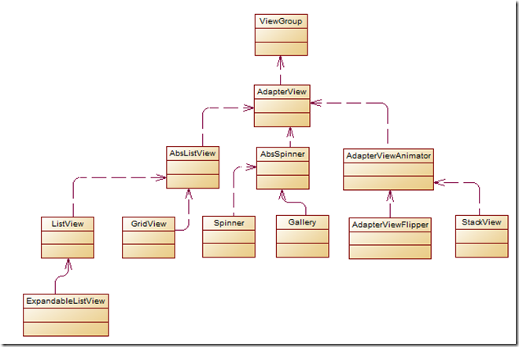

- 区别

  - 层次不同：RecyclerView比ListView多两级缓存，支持多个离ItemView缓存，支持开发者自定义缓存处理逻辑，支持所有RecyclerView共用同一个RecyclerViewPool(缓存池)

    - 缓存机制基本一致
      - mActiveViews和mAttachedScrap功能相似，意义在于快速重用屏幕上可见的列表项ItemView，而不需要重新createView和bindView
      - mScrapView和mCachedViews + mReyclerViewPool功能相似，意义在于缓存离开屏幕的ItemView，目的是让即将进入屏幕的ItemView重用
      - RecyclerView的优势在于a.mCacheViews的使用，可以做到屏幕外的列表项ItemView进入屏幕内时也无须bindView快速重用；b.mRecyclerPool可以供多个RecyclerView共同使用，在特定场景下，如viewpaper+多个列表页下有优势.客观来说，RecyclerView在特定场景下对ListView的缓存机制做了补强和完善


    - ListView缓存(两级缓存)

      .png)

    - RecyclerView缓存(四级缓存)

      .jpg)

  - 缓存不同

    - RecyclerView缓存RecyclerView.ViewHolder，抽象可理解为： View + ViewHolder(避免每次createView时调用findViewById) + flag(标识状态)
    - ListView缓存View

    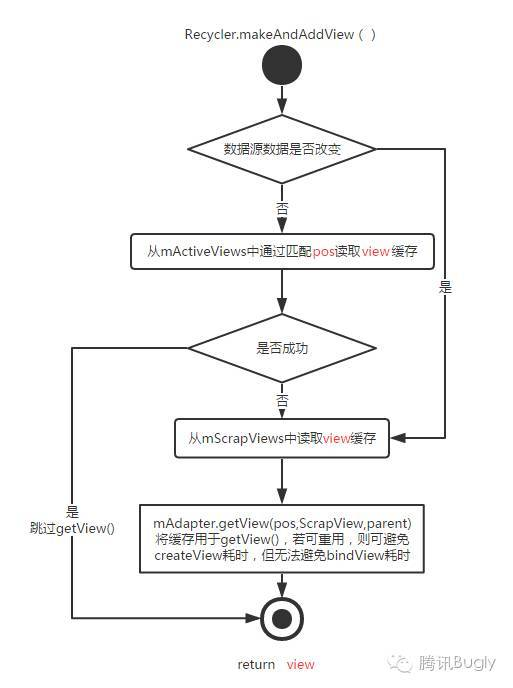

    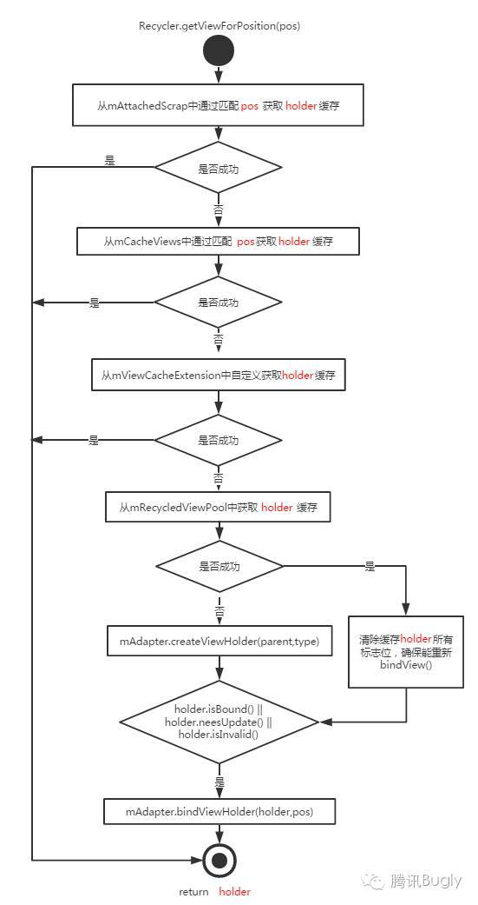