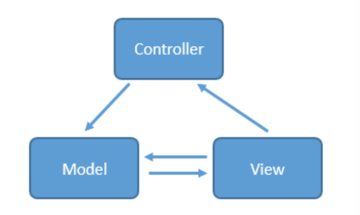
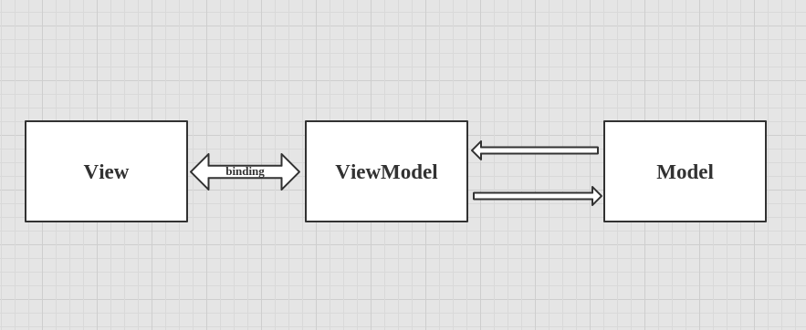

##### Android系统


.jpg)

##### Android开机启动过程


##### AndroidApp启动过程

- 启动过程
  1. 点击桌面App图标，Launcher进程采用Binder IPC向system_server进程发起startActivity请求
  2. system_server进程接收到请求后，向zygote进程发送创建进程的请求
  3. Zygote进程fork出新的子进程，即App进程
  4. App进程，通过Binder IPC向sytem_server进程发起attachApplication请求
  5. system_server进程在收到请求后，进行一系列准备工作后，再通过binder IPC向App进程发送scheduleLaunchActivity请求
  6. App进程的binder线程（ApplicationThread）在收到请求后，通过handler向主线程发送LAUNCH_ACTIVITY消息
  7. 主线程在收到Message后，通过发射机制创建目标Activity，并回调Activity.onCreate()等方法
  8. 到此，App便正式启动，开始进入Activity生命周期，执行完onCreate/onStart/onResume方法，UI渲染结束后便可以看到App的主界面
- 基础知识
  - zygote：zygote意为“受精卵“。Android是基于Linux系统的，而在Linux中，所有的进程都是由init进程直接或者是间接fork出来的，zygote进程也不例外。在Android系统里面，zygote是一个进程的名字。Android是基于Linux System的，当你的手机开机的时候，Linux的内核加载完成之后就会启动一个叫“init“的进程。在Linux System里面，所有的进程都是由init进程fork出来的，我们的zygote进程也不例外。
  - system_server：SystemServer也是一个进程，而且是由zygote进程fork出来的。SystemServer开启了ActivityManagerService、PackageManagerService、WindowManagerService等等服务。
  - ActivityManagerService：简称AMS，服务端对象，负责系统中所有Activity的生命周期。ActivityManagerService进行初始化的时机很明确，就是在SystemServer进程开启的时候，就会初始化ActivityManagerService。


##### JVM，ART，Dalvik

- JVM：Java 虚拟机；类加载器 classloader + 执行引擎 execution engine + 运行时数据区域 runtime data area；
  - 程序计数器：当前线程所执行的字节码的行号指示器，用于记录下一条要运行的指令，线程私有（如果正在执行的是Native方法，计数器值则为空）
  - 虚拟机栈：对象的引用、方法出口等，线程私有
  - 本地方法栈：和虚拟栈相似，只不过它服务于Native方法，线程私有
  - 堆：java内存最大的一块，所有对象实例、数组都存放在java堆，GC回收的地方，线程共享
  - 方法区：存放已被加载的类信息、常量、静态变量、即时编译器编译后的代码数据等。（即永久带），回收目标主要是常量池的回收和类型的卸载，各线程共享


.png)

- Classloader：类加载器

  - 加载class方式
    - 隐式：运行过程中，碰到new方式生成对象时，隐式调用classLoader到JVM
    - 显式：通过class.forname()动态加载
  - 双亲委派模型（Parent Delegation Model）：类的加载过程采用双亲委托机制，这种机制能更好的保证 Java 平台的安全。该模型要求除了顶层的Bootstrap class loader启动类加载器外，其余的类加载器都应当有自己的`父类加载器`。子类加载器和父类加载器`不是以继承（Inheritance）的关系`来实现，而是通过`组合（Composition）关系`来复用父加载器的代码。每个类加载器都有自己的命名空间（由该加载器及所有父类加载器所加载的类组成，在同一个命名空间中，不会出现类的完整名字（包括类的包名）相同的两个类；在不同的命名空间中，有可能会出现类的完整名字（包括类的包名）相同的两个类）
    - Bootstrap Class Loader：是虚拟机的一部分， 主要加载JVM自身工作需要的类，完全由JVM控制，开发者无法访问.(无法被Java代码引用)；将指定目录下的符合虚拟机规范的类加载到虚拟机内存中，默认是\lib
    - Extension Class Loader：负责加载\lib\ext目录中的，或者被java.ext.dirs系统变量所指定的路径中的所有类库，开发者可以直接使用拓展类加载器
    - App Class Loader：由于这个类加载器是getSystemClassLoder()方法的返回值，所以又称系统加载器 ,它负责加载classPath路径上的指定的类库 ,如果程序中没有定义过类加载器，一般作为默认的类加载器

  

- Java内存堆与栈的区别

  - 栈内存用来存储基本类型的变量和对象的引用变量，堆内存用来存储Java中的对象，无论是成员变量，局部变量，还是类变量，它们指向的对象都存储在堆内存中
  - 栈内存归属于单个线程，每个线程都会有一个栈内存，其存储的变量只能在其所属线程中可见，即栈内存可以理解成线程的私有内存，堆内存中的对象对所有线程可见。堆内存中的对象可以被所有线程访问
  - 如果栈内存没有可用的空间存储方法调用和局部变量，JVM会抛出java.lang.StackOverFlowError，如果是堆内存没有可用的空间存储生成的对象，JVM会抛出java.lang.OutOfMemoryError
  - 栈的内存要远远小于堆内存，如果你使用递归的话，那么你的栈很快就会充满，-Xss选项设置栈内存的大小，-Xms选项可以设置堆的开始时的大小

- Java四种引用

  - 强引用（StrongReference）：强引用是使用最普遍的引用。如果一个对象具有强引用，那垃圾回收器绝不会回收它。当内存空间不足，Java虚拟机宁愿抛出OutOfMemoryError错误，使程序异常终止，也不会靠随意回收具有强引用的对象来解决内存不足的问题
  - 软引用（SoftReference）：如果内存空间不足了，就会回收这些对象的内存。只要垃圾回收器没有回收它，软引用可以和一个引用队列（ReferenceQueue）联合使用，如果软引用所引用的对象被垃圾回收器
  - 回收，Java虚拟机就会把这个软引用加入到与之关联的引用队列中
  - 弱引用（WeakReference）：弱引用与软引用的区别在于：只具有弱引用的对象拥有更短暂的生命周期，在垃圾回收器线程扫描它所管辖的内存区域的过程中，一旦发现了只具有弱引用的对象，不管当前内存空间足够与否，都会回收它的内存。弱引用可以和一个引用队列（ReferenceQueue）联合使用，如果弱引用所引用的对象被垃圾回收，Java虚拟机就会把这个弱引用加入到与之关联的引用队列中
  - 虚引用（PhantomReference）：虚引用在任何时候都可能被垃圾回收器回收，主要用来跟踪对象被垃圾回收器回收的活动，被回收时会收到一个系统通知。虚引用与软引用和弱引用的一个区别在于：虚引用必须和引用队列 （ReferenceQueue）联合使用。当垃圾回收器准备回收一个对象时，如果发现它还有虚引用，就会在回收对象的内存之前，把这个虚引用加入到与之关联的引用队列中

- GC

  - GC标记算法：引用计数法；根搜索算法(可达性算法)

  - GC回收算法

    - 标记-清除法：标记出没有用的对象，然后一个一个回收掉

      缺点：标记和清除两个过程效率不高，产生内存碎片导致需要分配较大对象时无法找到足够的连续内存而需要触发一次GC操作

    - 复制算法: 按照容量划分二个大小相等的内存区域，当一块用完的时候将活着的对象复制到另一块上，然后再把已使用的内存空间一次清理掉

      缺点：将内存缩小为了原来的一半

    - 标记-整理法：标记出没有用的对象，让所有存活的对象都向一端移动，然后直接清除掉端边界以外的内

      优点：解决了标记- 清除算法导致的内存碎片问题和在存活率较高时复制算法效率低的问题

    - 分代回收：根据对象存活周期的不同将内存划分为几块，一般是新生代和老年代，新生代基本采用复制算法，老年代采用标记整理算法

- ART：ART代表Android Runtime,其处理应用程序执行的方式完全不同于Dalvik，Dalvik是依靠一个Just-In-Time(JIT)编译器去解释字节码。开发者编译后的应用代码需要通过一个解释器在用户的设备上运行，这一机制并不高效，但让应用能更容易在不同硬件和架构上运行。ART则完全改变了这套做法，在应用安装的时候就预编译字节码到机器语言，这一机制叫Ahead-Of-Time(AOT)编译。在移除解释代码这一过程后，应用程序执行将更有效率，启动更快

- Dalvik：它可以支持已转换为.dex(即Dalvik Executable)格式的Java应用程序的运行，.dex格式是专为Dalvik应用设计的一种压缩格式，适合内存和处理器速度有限的系统。Dalvik经过优化，允许在有限的内存中同时运行多个虚拟机的实例，并且每一个Dalvik应用作为独立的Linux进程执行，独立的进程可以防止在虚拟机崩溃的时候所有程序都被关闭

##### 四大组件

- Activity

  - standard：标准模式；每次启动Activity都会创建一个新的Activity实例,并且将其压入任务栈栈顶，而不管这个Activity是否已经存在，Activity的启动三回调(*onCreate()->onStart()->onResume()*)都会执行
  - singleTop：栈顶复用模式；这种模式下，如果新Activity已经位于任务栈的栈顶，那么此Activity不会被重新创建，所以它的启动三回调就不会执行，同时Activity的`onNewIntent()`方法会被回调，如果Activity已经存在但是不在栈顶，那么作用与*standard模式*一样
  - singleTask：栈内复用模式；创建这样的Activity的时候，系统会先确认它所需任务栈已经创建，否则先创建任务栈.然后放入Activity，如果栈中已经有一个Activity实例,那么这个Activity就会被调到栈顶，同时Activity的`onNewIntent()`方法会被回调，并且singleTask会清理在当前Activity上面的所有Activity(clear top)
  - singleInstance：加强版的singleTask模式；这种模式的Activity只能单独位于一个任务栈内，由于栈内复用的特性，后续请求均不会创建新的Activity，除非这个独特的任务栈被系统销毁了

  

  

- Service

  

  - 启动服务

    .png)

    .png)

  - 绑定服务

    .png)

    .png)

  - IntentService

    - 通过HandlerThread 单独开启1个工作线程：IntentService

    - 创建1个内部 Handler ：ServiceHandler

    - 绑定 ServiceHandler 与 IntentService

    - 通过 onStartCommand()传递服务Intent 到ServiceHandler、依次插入Intent到工作队列中 & 逐个发送给 onHandleIntent()

    - 通过onHandleIntent()依次处理所有Intent对象所对应的任务

      ```java
      @Override
      public void onCreate() {
          super.onCreate();
          // 1. 通过实例化andlerThread新建线程 & 启动；故 使用IntentService时，不需额外新建线程
          // HandlerThread继承自Thread，内部封装了 Looper
          HandlerThread thread = new HandlerThread("IntentService[" + mName + "]");
          thread.start();
        
          // 2. 获得工作线程的 Looper & 维护自己的工作队列
          mServiceLooper = thread.getLooper();

          // 3. 新建mServiceHandler & 绑定上述获得Looper
          // 新建的Handler 属于工作线程 ->>分析1
          mServiceHandler = new ServiceHandler(mServiceLooper); 
      }

      /** 
       * 分析1：ServiceHandler源码分析
       **/   
      private final class ServiceHandler extends Handler {
               // 构造函数
               public ServiceHandler(Looper looper) {
               super(looper);
             	}

              // IntentService的handleMessage（）把接收的消息交给onHandleIntent()处理
              @Override
               public void handleMessage(Message msg) {
                // onHandleIntent 方法在工作线程中执行
                // onHandleIntent() = 抽象方法，使用时需重写 ->>分析2
                onHandleIntent((Intent)msg.obj);
                // 执行完调用 stopSelf() 结束服务
                stopSelf(msg.arg1);
          	}
      }

      /** 
       * 分析2： onHandleIntent()源码分析
       * onHandleIntent() = 抽象方法，使用时需重写
       **/ 
      @WorkerThread
      protected abstract void onHandleIntent(Intent intent);
      ```

      

  - HandlerThread

    - HandlerThread本质上是一个线程类，它继承了Thread

    - HandlerThread有自己的内部Looper对象，可以进行looper循环

    - 通过获取HandlerThread的looper对象传递给Handler对象，可以在handleMessage方法中执行异步任务

    - 创建HandlerThread后必须先调用HandlerThread.start()方法，Thread会先调用run方法，创建Looper对象

      ```java
      HandlerThread handlerThread = new HandlerThread("downloadImage");

      //必须先开启线程
      handlerThread.start();

      /**
       * 该callback运行于子线程
       */
      class ChildCallback implements Handler.Callback {
           @Override
           public boolean handleMessage(Message msg) {
           	//在子线程中进行相应的网络请求
              //通知主线程去更新UI
               mUIHandler.sendMessage(msg1);
               return false;
           }
      }

      //子线程Handler
      Handler childHandler = new Handler(handlerThread.getLooper(),new ChildCallback());
      ```

- BroadcastReceiver

  - 注册方式

    - 静态注册

      ```java
      <receiver 
          android:enabled=["true" | "false"]
      //此broadcastReceiver能否接收其他App的发出的广播
      //默认值是由receiver中有无intent-filter决定的：如果有intent-filter，默认值为true，否则为false
          android:exported=["true" | "false"]
          android:icon="drawable resource"
          android:label="string resource"
      //继承BroadcastReceiver子类的类名
          android:name=".mBroadcastReceiver"
      //具有相应权限的广播发送者发送的广播才能被此BroadcastReceiver所接收；
          android:permission="string"
      //BroadcastReceiver运行所处的进程
      //默认为app的进程，可以指定独立的进程
      //注：Android四大基本组件都可以通过此属性指定自己的独立进程
          android:process="string" >

      //用于指定此广播接收器将接收的广播类型
      //本示例中给出的是用于接收网络状态改变时发出的广播
       <intent-filter>
      <action android:name="android.net.conn.CONNECTIVITY_CHANGE" />
          </intent-filter>
      </receiver>
      ```

    - 动态注册

      ```java
      //选择在Activity生命周期方法中的onResume()中注册
      //1. 实例化BroadcastReceiver子类 &  IntentFilter
      mBroadcastReceiver mBroadcastReceiver = new mBroadcastReceiver();
      IntentFilter intentFilter = new IntentFilter();

      //2. 设置接收广播的类型
      intentFilter.addAction(android.net.conn.CONNECTIVITY_CHANGE);

      //3. 动态注册：调用Context的registerReceiver（）方法
      registerReceiver(mBroadcastReceiver, intentFilter);

      //销毁在onPause()方法中的广播
      unregisterReceiver(mBroadcastReceiver);
      ```

      ​

  

  

  

- ContentProvider

  

  

##### Hander


##### Binder


- 进程空间

  - 一个进程空间分为 用户空间 & 内核空间（`Kernel`），即把进程内 用户 & 内核 隔离开来（所有进程共用1个内核空间）

  - 区别

    - 进程间，用户空间的数据不可共享，所以用户空间 = 不可共享空间
    - 进程间，内核空间的数据可共享，所以内核空间 = 可共享空间

  - 用户空间&内核空间进行交互需通过系统调用

    

- 进程隔离&跨进程通信（IPC）

  - 进程隔离：为了保证 安全性 & 独立性，一个进程 不能直接操作或者访问另一个进程，即`Android`的进程是**相互独立、隔离的**

  - 跨进程通信（ `IPC` ）：即进程间需进行数据交互、通信

  - 跨进程通信的基本原理

    

- Binder模型

  

  

  

  

- 说明

  - `Client`进程、`Server`进程 & `Service Manager` 进程之间的交互 都必须通过`Binder`驱动（使用 `open` 和 `ioctl`文件操作函数），而非直接交互（虚线表示并非直接交互）

    - `Client`进程、`Server`进程 & `Service Manager`进程属于进程空间的用户空间，不可进行进程间交互

    - `Binder`驱动 属于 进程空间的 内核空间，可进行进程间 & 进程内交互

      

  - `Binder`驱动 & `Service Manager`进程 属于 `Android`基础架构（即系统已经实现好了）；而`Client` 进程 和 `Server` 进程 属于`Android`应用层（需要开发者自己实现）

    

  - Binder请求的线程管理

    - `Server`进程会创建很多线程来处理`Binder`请求
    - `Binder`模型的线程管理 采用`Binder`驱动的线程池，并由`Binder`驱动自身进行管理，而不是由`Server`进程来管理的
    - 一个进程的`Binder`线程数默认最大是16，超过的请求会被阻塞等待空闲的Binder线程，所以，在进程间通信时处理并发问题时，如使用`ContentProvider`时，它的`CRUD`（创建、检索、更新和删除）方法只能同时有16个线程同时工作

- Binder机制 在Android中的具体实现原理

  `Binder`机制在 `Android`中的实现主要依靠 `Binder`类，其实现了`IBinder` 接口

  1. 注册服务：`Server`进程 通过`Binder`驱动 向 `Service Manager`进程 注册服务；`Server`进程 创建 一个 `Binder` 对象

     - `Binder` 实体是 `Server`进程 在 `Binder` 驱动中的存在形式
     - 该对象保存 `Server` 和 `ServiceManager` 的信息（保存在内核空间中）
     - `Binder` 驱动通过 内核空间的`Binder` 实体 找到用户空间的`Server`对象

     ```java
     Binder binder = new Stub();
         // 步骤1：创建Binder对象 ->>分析1
         // 步骤2：创建 IInterface 接口类 的匿名类
         // 创建前，需要预先定义 继承了IInterface 接口的接口 -->分析3
         IInterface plus = new IPlus(){
               // 确定Client进程需要调用的方法
               public int add(int a,int b) {
                    return a+b;
              }

               // 实现IInterface接口中唯一的方法
               public IBinder asBinder（）{ 
                     return null ;
                }
     };
               // 步骤3
               binder.attachInterface(plus，"add two int");
              // 1. 将（add two int，plus）作为（key,value）对存入到Binder对象中的一个Map<String,IInterface>对象中
              // 2. 之后，Binder对象 可根据add two int通过queryLocalIInterface（）获得对应IInterface对象（即plus）的引用，可依靠该引用完成对请求方法的调用
             // 分析完毕，跳出

     <-- 分析1：Stub类 -->
         public class Stub extends Binder {
         // 继承自Binder类 ->>分析2
               // 复写onTransact（）
               @Override
               boolean onTransact(int code, Parcel data, Parcel reply, int flags){
               // 具体逻辑等到步骤3再具体讲解，此处先跳过
               switch (code) { 
                     case Stub.add： { 
                            data.enforceInterface("add two int"); 
                            int  arg0  = data.readInt();
                            int  arg1  = data.readInt();
                            int  result = this.queryLocalIInterface("add two int") .add( arg0,  arg1); 
                             reply.writeInt(result); 
                             return true; 
                       }
                } 
           return super.onTransact(code, data, reply, flags); 
     }
             
     // 回到上面的步骤1，继续看步骤2
     <-- 分析2：Binder 类 -->
      public class Binder implement IBinder{
         // Binder机制在Android中的实现主要依靠的是Binder类，其实现了IBinder接口
         // IBinder接口：定义了远程操作对象的基本接口，代表了一种跨进程传输的能力
         // 系统会为每个实现了IBinder接口的对象提供跨进程传输能力
         // 即Binder类对象具备了跨进程传输的能力
             void attachInterface(IInterface plus, String descriptor)；
             // 作用：
               // 1. 将（descriptor，plus）作为（key,value）对存入到Binder对象中的一个Map<String,IInterface>对象中
               // 2. 之后，Binder对象 可根据descriptor通过queryLocalIInterface（）获得对应IInterface对象（即plus）的引用，可依靠该引用完成对请求方法的调用

             IInterface queryLocalInterface(Stringdescriptor) ；
             // 作用：根据 参数 descriptor 查找相应的IInterface对象（即plus引用）

             boolean onTransact(int code, Parcel data, Parcel reply, int flags)；
             // 定义：继承自IBinder接口的
             // 作用：执行Client进程所请求的目标方法（子类需要复写）
             // 参数说明：
             // code：Client进程请求方法标识符。即Server进程根据该标识确定所请求的目标方法
             // data：目标方法的参数。（Client进程传进来的，此处就是整数a和b）
             // reply：目标方法执行后的结果（返回给Client进程）
              // 注：运行在Server进程的Binder线程池中；当Client进程发起远程请求时，远程请求会要求系统底层执行回调该方法

             final class BinderProxy implements IBinder {
              // 即Server进程创建的Binder对象的代理对象类
              // 该类属于Binder的内部类
             }
             // 回到分析1原处
     }

     <-- 分析3：IInterface接口实现类 -->
      public interface IPlus extends IInterface {
               // 继承自IInterface接口->>分析4
               // 定义需要实现的接口方法，即Client进程需要调用的方法
              public int add(int a,int b);
     // 返回步骤2
     }

     <-- 分析4：IInterface接口类 -->
     // 进程间通信定义的通用接口
     // 通过定义接口，然后再服务端实现接口、客户端调用接口，就可实现跨进程通信。
     public interface IInterface
     {
         // 只有一个方法：返回当前接口关联的 Binder 对象。
         public IBinder asBinder();
     }
       // 回到分析3原处。
     ```

  2. 获取服务：`Client`进程 使用 某个 `service`前（此处是 **相加函数**），须 通过`Binder`驱动 向 `ServiceManager`进程 获取相应的`Service`信息

     

  3. 使用服务：`Client`进程 根据获取到的 `Service`信息（`Binder`代理对象），通过`Binder`驱动 建立与 该`Service`所在`Server`进程通信的链路，并开始使用服务

     1. `Client`进程 将参数（整数a和b）发送到`Server`进程

     2. `Server`进程 根据`Client`进程要求调用 目标方法（即加法函数）

     3. `Server`进程 将目标方法的结果（即加法后的结果）返回给`Client`进程

     4. 实现步骤

        1. Client进程 将参数（整数a和b）发送到Server进程

           ```java
           // 1. Client进程 将需要传送的数据写入到Parcel对象中
           // data = 数据 = 目标方法的参数（Client进程传进来的，此处就是整数a和b） + IInterface接口对象的标识符descriptor
             android.os.Parcel data = android.os.Parcel.obtain();
             data.writeInt(a); 
             data.writeInt(b); 
             data.writeInterfaceToken("add two int");；
             // 方法对象标识符让Server进程在Binder对象中根据"add two int"通过queryLocalIInterface（）查找相应的IInterface对象（即Server创建的plus），Client进程需要调用的相加方法就在该对象中

             android.os.Parcel reply = android.os.Parcel.obtain();
           // reply：目标方法执行后的结果（此处是相加后的结果）

           // 2. 通过 调用代理对象的transact（） 将 上述数据发送到Binder驱动
             binderproxy.transact(Stub.add, data, reply, 0)
             // 参数说明：
               // 1. Stub.add：目标方法的标识符（Client进程 和 Server进程 自身约定，可为任意）
               // 2. data ：上述的Parcel对象
               // 3. reply：返回结果
               // 0：可不管

           // 注：在发送数据后，Client进程的该线程会暂时被挂起
           // 所以，若Server进程执行的耗时操作，请不要使用主线程，以防止ANR
                 
           // 3. Binder驱动根据 代理对象 找到对应的真身Binder对象所在的Server 进程（系统自动执行）
           // 4. Binder驱动把 数据 发送到Server 进程中，并通知Server 进程执行解包（系统自动执行）
           ```

        2. Server进程根据Client进要求 调用 目标方法（即加法函数）

           ```java
           // 1. 收到Binder驱动通知后，Server 进程通过回调Binder对象onTransact（）进行数据解包 & 调用目标方法
             public class Stub extends Binder {
                     // 复写onTransact（）
                     @Override
                     boolean onTransact(int code, Parcel data, Parcel reply, int flags){
                     // code即在transact（）中约定的目标方法的标识符
                     switch (code) { 
                           case Stub.add： { 
                             // a. 解包Parcel中的数据
                                  data.enforceInterface("add two int"); 
                                   // a1. 解析目标方法对象的标识符
                                  int  arg0  = data.readInt();
                                  int  arg1  = data.readInt();
                                  // a2. 获得目标方法的参数
                                  // b. 根据"add two int"通过queryLocalIInterface（）获取相应的IInterface对象（即Server创建的plus）的引用，通过该对象引用调用方法
                                  int  result = this.queryLocalIInterface("add two int") .add( arg0,  arg1); 
                                   // c. 将计算结果写入到reply
                                   reply.writeInt(result); 
                                   return true; 
                             }
                      } 
                 return super.onTransact(code, data, reply, flags); 
           // 2. 将结算结果返回 到Binder驱动
           ```

        3. Server进程 将目标方法的结果（即加法后的结果）返回给Client进程

           ```java
           // 1. Binder驱动根据 代理对象 沿原路 将结果返回 并通知Client进程获取返回结果
           // 2. 通过代理对象 接收结果（之前被挂起的线程被唤醒）
               binderproxy.transact(Stub.ADD, data, reply, 0)；
               reply.readException();；
               result = reply.readInt()；
                     }
           }
           ```

           

           


- 优点

  

- Binder模型原理及源码分析

  


##### AIDL

- Android Interface Definition Language，翻译过来就是Android接口定义语言，是用于定义服务器和客户端通信接口的一种描述语言，可以拿来生成用于IPC的代码


- AIDL文件以 **.aidl** 为后缀名
  - 八种基本数据类型：byte、char、short、int、long、float、double、boolean
  - String，CharSequence
  - 实现了Parcelable接口的数据类型
  - List 类型，List承载的数据必须是AIDL支持的类型，或者是其它声明的AIDL对象
  - Map类型，Map承载的数据必须是AIDL支持的类型，或者是其它声明的AIDL对象
- AIDL文件可以分为两类，一类用来声明实现了Parcelable接口的数据类型，以供其他AIDL文件使用那些非默认支持的数据类型，还有一类是用来定义接口方法，声明要暴露哪些接口给客户端调用，定向Tag就是用来标注这些方法的参数值
- 定向Tag，定向Tag表示在跨进程通信中数据的流向，用于标注方法的参数值，分为 in、out、inout 三种。其中 in 表示数据只能由客户端流向服务端， out 表示数据只能由服务端流向客户端，而 inout 则表示数据可在服务端与客户端之间双向流通。此外，如果AIDL方法接口的参数值类型是：基本数据类型、String、CharSequence或者其他AIDL文件定义的方法接口，那么这些参数值的定向 Tag 默认是且只能是 in，所以除了这些类型外，其他参数值都需要明确标注使用哪种定向Tag。定向Tag具体的使用差别后边会有介绍
- 明确导包，在AIDL文件中需要明确标明引用到的数据类型所在的包名，即使两个文件处在同个包名下

##### 事件分发机制


##### 自定义View

- measure

  

  

- layout

  

- draw

  

##### MVC，MVP，MVVM

- MVC

  1. 先实现一个 model，需要有通知View更新的能力,当model加载成功，如从db、获取后，需要告知View

     ```java
     public class StudentModel {
         String mId;
         WelcomeActivity mActivity;

         public StudentModel (WelcomeActivity activity) {
             this.mActivity = activity;
         }
         
         public void loadModel (){
             //search from db or intent
             mId = "1201030018";
             mActivity.updateUI(this);
         }
     }
     ```

  2. Controller ： 我们为了更好的理解MVC，将Activity进行了拆解。提取了一个简单的Controller

     ```java
     public class WelcomeController {
         WelcomeActivity mActivity;
         StudentModel mStudent;

         WelcomeController (WelcomeActivity activity) {
             this.mActivity = activity;
         }

         public void loadData (){
             mStudent = new StudentModel(mActivity);
             mStudent.loadModel();
         }
     }
     ```

  3. View ： View需要发出点击事件，并且传递给Controller,同时需要根据Model更新UI

     ```java
     public class WelcomeActivity extends AppCompatActivity {

         @Override
         protected void onCreate(Bundle savedInstanceState) {
            //省略
             final WelcomeController controller = new WelcomeController(this);
             mFindBtn.setOnClickListener(new View.OnClickListener() {
                 @Override
                 public void onClick(View view) {
                     controller.loadData();
                 }
             });
         }

         public void updateUI (StudentModel model) {
             mID.setText(model.mId);
         }
     }
     ```

  

- MVP

  1. 我们需要先对Model进行封装，当loadModel后，不直接通知View更新，而是通知监听方（Presenter）

     ```java
     public class StudentModel {
         String mId;
         OnGetListener mListener;

         public StudentModel (OnGetListener listener) {
             this.mListener = listener;
         }
         
         public void loadModel (){
             //search from db or intent
             mId = "1201030018";
             if (mListener != null) {
                 mListener.onSuccess(this);
             }
         }
         
         interface OnGetListener {
             void onSuccess (StudentModel student);
         }
     }
     ```

  2. 再定义Presenter ，接收到来自View的操作命令后，进行逻辑处理，处理Model，修改完成后通知View进行修改

     ```java
     public class WelcomePresenter {
         WelcomeActivity mActivity;
         StudentModel mStudent;

         WelcomePresenter (WelcomeActivity activity) {
             this.mActivity = activity;
         }

         public void loadData (){
             mStudent = new StudentModel(new StudentModel.OnGetListener() {
                 @Override
                 public void onSuccess(StudentModel student) {
                     mActivity.updateUI(student);
                 }
             });
         }
     }
     ```

  3. 对于View，操作方式只是修改了持有的对象 `WelcomeController`->`WelcomePresenter`，其他保持不变

  

- MVVM

  1. 把Controller\Presenter扔掉，先写一个ViewModel这个VM的概念是一个和视图相关的模型，因此可以和DAO相关的模型不一样，因为我们只需要展示`student id`的数据以及`click事件`，以及`loadData`行为，用来从Model中获取数据，于是我们实现了一个VM

     ```java
     public class StudentViewModel extends BaseObservable{
         String studentID;
         View.OnClickListener btnListener;
        //省略get set

         public StudentViewModel() {
             btnListener = new View.OnClickListener() {
                 @Override
                 public void onClick(View view) {
                     loadData();
                 }
             };
         }

         public void loadData() {
             StudentModel model = new StudentModel(new StudentModel.OnGetListener() {
                 @Override
                 public void onSuccess(StudentModel student) {
                     setStudentID(student.mId);
                 }
             });
             model.loadModel();
         }
     }
     ```

  2. 接着使用databinding语法 对 xml 进行数据绑定,我们将 Click事件、输出结果都绑定到VM上

     ```xml
     <?xml version="1.0" encoding="utf-8"?>
     <layout xmlns:android="http://schemas.android.com/apk/res/android"
             xmlns:tools="http://schemas.android.com/tools">
         <data>
             <variable name="userVM" type="com.moon.coderread.StudentViewModel"/>
         </data>
         <LinearLayout
                //省略
             <TextView
                     android:id="@+id/id"
                     android:layout_width="match_parent"
                     android:layout_height="20dp"
                     android:text="@{userVM.studentID}"/>
               <Button
                     android:id="@+id/findBtn"
                     android:onClick="@{userVM.btnListener}"
                     android:text="find Student ID"
                     android:layout_width="wrap_content"
                     android:layout_height="wrap_content"/>
         </LinearLayout>
     </layout>
     ```

  3. 最后在`View(Activity)`中引入VM

     ```java
     public class WelcomeActivity extends AppCompatActivity {

         @Override
         protected void onCreate(Bundle savedInstanceState) {
             ActivityWelcomeBinding binding = DataBindingUtil.setContentView(this,R.layout.activity_welcome);

             final StudentViewModel studentViewModel = new StudentViewModel();
             binding.setUserVM(studentViewModel);
         }
     }
     ```

  

- 关系

  - MVVM可以算是MVP的升级版，其中的VM是ViewModel的缩写，ViewModel可以理解成是View的数据模型和Presenter的合体，ViewModel和View之间的交互通过Data Binding完成，而Data Binding可以实现双向的交互，这就使得视图和控制层之间的耦合程度进一步降低，关注点分离更为彻底，同时减轻了Activity的压力。
  - 相同点
    - Model：数据对象，同时，提供本应用外部对应用程序数据的操作的接口，也可能在数据变化时发出变更通知。Model不依赖于View的实现，只要外部程序调用Model的接口就能够实现对数据的增删改查。
    - View：UI层，提供对最终用户的交互操作功能，包括UI展现代码及一些相关的界面逻辑代码。
  - 不同点
    - Controller：Controller接收View的操作事件，根据事件不同，或者调用Model的接口进行数据操作，或者进行View的跳转，从而也意味着一个Controller可以对应多个View。Controller对View的实现不太关心，只会被动地接收，Model的数据变更不通过Controller直接通知View，通常View采用观察者模式监听Model的变化。
    - Presenter：Presenter与Controller一样，接收View的命令，对Model进行操作；与Controller不同的是Presenter会反作用于View，Model的变更通知首先被Presenter获得，然后Presenter再去更新View。一个Presenter只对应于一个View。根据Presenter和View对逻辑代码分担的程度不同，这种模式又有两种情况：Passive View和Supervisor Controller。
    - ViewModel：注意这里的“Model”指的是View的Model，跟MVVM中的一个Model不是一回事。所谓View的Model就是包含View的一些数据属性和操作的这么一个东东，这种模式的关键技术就是数据绑定（data binding），View的变化会直接影响ViewModel，ViewModel的变化或者内容也会直接体现在View上。这种模式实际上是框架替应用开发者做了一些工作，开发者只需要较少的代码就能实现比较复杂的交互。

##### Clean Architecture

- 简介

  

  

  - Enterprise Business Rules：业务对象
  - Application Business Rules：用于处理我们的业务对象，业务逻辑所在，也称为Interactor
  - Interface Adapters： 接口转换，拿到我们需要的数据，表现层（Presenters）和控制层（Controllers）就在这一层
  - Frameworks and Drivers: 这里是所有具体的实现了：比如：UI，工具类，基础框架等等
  - 表现层 (Presentation Layer)：表现层以MVP为基础
  - 领域层 (Domain Layer)：Interactor的实现类和业务对象
  - 数据层 (Data Layer)：Repository模式
  - Clean框架流程：Activity发起获取数据信号（View）->调用Presenter接口（Presenter）->调用UseCase接口（Domain）->调用Repository接口（Data）->拿到原始数据->回调Repository（Data）->回调UseCase（Domain）->回调Presenter（Presenter）->回调Activity（View）

##### RecyclerView，ListView

- RecyclerView

  - 优点
    - item复用性高：把ViewHolder的实现封装起来，规范了ViewHolder，把item的view写入ViewHolder中，可以通过复用ViewHolder来实现view的复用
    - 灵活、可定制化高、可拓展性高：整体上看RecyclerView架构，提供了一种插拔式的体验：高度的解耦，异常的灵活
    - 控制其显示的方式-通过布局管理器LayoutManager
    - 控制Item间的间隔（可绘制）-通过ItemDecoration
    - 控制Item增删的动画- 通过ItemAnimator
  - 缺点
    - RecyclerView实现控制点击、长按事件较为麻烦，需要自己写

- ListView

  

- 区别

  - 层次不同：RecyclerView比ListView多两级缓存，支持多个离ItemView缓存，支持开发者自定义缓存处理逻辑，支持所有RecyclerView共用同一个RecyclerViewPool(缓存池)

    - 缓存机制基本一致
      - mActiveViews和mAttachedScrap功能相似，意义在于快速重用屏幕上可见的列表项ItemView，而不需要重新createView和bindView
      - mScrapView和mCachedViews + mReyclerViewPool功能相似，意义在于缓存离开屏幕的ItemView，目的是让即将进入屏幕的ItemView重用
      - RecyclerView的优势在于a.mCacheViews的使用，可以做到屏幕外的列表项ItemView进入屏幕内时也无须bindView快速重用；b.mRecyclerPool可以供多个RecyclerView共同使用，在特定场景下，如viewpaper+多个列表页下有优势.客观来说，RecyclerView在特定场景下对ListView的缓存机制做了补强和完善

    - ListView缓存(两级缓存)

      .png)

    - RecyclerView缓存(四级缓存)

      .jpg)


  - 缓存不同

    - RecyclerView缓存RecyclerView.ViewHolder，抽象可理解为： View + ViewHolder(避免每次createView时调用findViewById) + flag(标识状态)
    - ListView缓存View

    

    

##### 多线程

- 继承Thread与实现Runnable对比

  

- 线程池

  - 简介

    

    ```java
    //shutdown：设置线程池的状态为SHUTDOWN，然后中断所有没有正在执行任务的线程
    //shutdownNow：设置线程池的状态为STOP，然后尝试停止所有的正在执行或暂停任务的线程，并返回等待执行任务的列表
    //使用建议：一般调用shutdown()关闭线程池；若任务不一定要执行完，则调用shutdownNow()
    //关闭线程的原理
    //a.遍历线程池中的所有工作线程
    //b.逐个调用线程的interrupt()中断线程(注：无法响应中断的任务可能永远无法终止)
    public ThreadPoolExecutor(int corePoolSize,  
                                  int maximumPoolSize,  
                                  long keepAliveTime,  
                                  TimeUnit unit,  
                                  BlockingQueue<Runnable> workQueue,  
                                  ThreadFactory threadFactory) {  
            this(corePoolSize, maximumPoolSize, keepAliveTime, unit, workQueue,  
                 threadFactory, defaultHandler);  
    }
    ```

    - corePoolSize：线程池的核心线程数，默认情况下，核心线程数会一直在线程池中存活，即使它们处理闲置状态。如果将ThreadPoolExecutor的allowCoreThreadTimeOut属性设置为true，那么闲置的核心线程在等待新任务到来时会执行超时策略，这个时间间隔由keepAliveTime所指定，当等待时间超过keepAliveTime所指定的时长后，核心线程就会被终止。
    - maximumPoolSize：线程池所能容纳的最大线程数量，当活动线程数到达这个数值后，后续的新任务将会被阻塞。
    - keepAliveTime：非核心线程闲置时的超时时长，超过这个时长，非核心线程就会被回收。当ThreadPoolExecutor的allowCoreThreadTimeOut属性设置为true时，keepAliveTime同样会作用于核心线程。
    - unit：用于指定keepAliveTime参数的时间单位，这是一个枚举，常用的有TimeUnit.MILLISECONDS(毫秒)，TimeUnit.SECONDS(秒)以及TimeUnit.MINUTES(分钟)等。
    - workQueue：线程池中的任务队列，通过线程池的execute方法提交Runnable对象会存储在这个队列中。
    - threadFactory：线程工厂，为线程池提供创建新线程的功能。ThreadFactory是一个接口，它只有一个方法：Thread newThread（Runnable r）。

    

  - 线程结构

    

  - 4类功能线程池

    

    - FixedThreadPool(定长线程池)

      ```java
      ExecutorService fixedThreadPool=Executors.newFixedThreadPool(5);

      public static ExecutorService newFixedThreadPool(int nThreads) {  
              return new ThreadPoolExecutor(nThreads, nThreads,  
                                            0L, TimeUnit.MILLISECONDS,  
                                            new LinkedBlockingQueue<Runnable>());  
      }
      ```

    - ScheduledThreadPool(定时线程池)

      ```java
      ScheduledThreadPoolExecutor：可以执行并行任务也就是多条线程同时执行；适用于多个后台线程执行周期性任务，同时为了满足资源管理的需求而需要限制后台线程数量的应用场景。
      ScheduledExecutorService scheduledThreadPoolExecutor=Executors.newScheduledThreadPool(5);  
      public static ScheduledExecutorService newScheduledThreadPool(int corePoolSize)  
      public static ScheduledExecutorService newScheduledThreadPool(int corePoolSize, ThreadFactory threadFactory) 

      SingleThreadScheduledExecutor：可以执行单条线程；适用于需要单个后台线程执行周期任务，同时需要保证任务顺序执行的应用场景。
      ScheduledExecutorService singleThreadScheduledExecutor=Executors.newSingleThreadScheduledExecutor();
      public static ScheduledExecutorService newSingleThreadScheduledExecutor()  
      public static ScheduledExecutorService newSingleThreadScheduledExecutor(ThreadFactory threadFactory)

      执行方法
      public ScheduledFuture<?> schedule(Runnable command,long delay, TimeUnit unit);
      public ScheduledFuture<?> scheduleWithFixedDelay(Runnable command,long initialDelay,long delay,TimeUnit unit);
      ```

    - CachedThreadPool(可缓存线程池)

      ```java
      ExecutorService cachedThreadPool=Executors.newCachedThreadPool();

      public static ExecutorService newCachedThreadPool() {  
              return new ThreadPoolExecutor(0, Integer.MAX_VALUE,  
                                            60L, TimeUnit.SECONDS,  
                                            new SynchronousQueue<Runnable>());  
      }
      ```

    - SingleThreadExecutor(单线程化线程池)

      ```java
      ExecutorService singleThreadExecutor=Executors.newSingleThreadExecutor();

      public static ExecutorService newSingleThreadExecutor() {  
              return new FinalizableDelegatedExecutorService  
                  (new ThreadPoolExecutor(1, 1,  
                                          0L, TimeUnit.MILLISECONDS,  
                                          new LinkedBlockingQueue<Runnable>()));  
      }
      ```

  - Callable，Future，FutureTask

    

    - Callable

      ```java
      public interface Callable<V> {   
            V call() throws Exception;   
      }
      ```

    - Future

      ```java
      public interface Future<V> {  
          boolean cancel(boolean mayInterruptIfRunning);  
          boolean isCancelled();  
          boolean isDone();  
          V get() throws InterruptedException, ExecutionException;  
          V get(long timeout, TimeUnit unit) throws InterruptedException, 			ExecutionException, TimeoutException;  
      } 
      ```

      - V get() ：获取异步执行的结果，如果没有结果可用，此方法会阻塞直到异步计算完成。
      - V get(Long timeout , TimeUnit unit) ：获取异步执行结果，如果没有结果可用，此方法会阻塞，但是会有时间限制，如果阻塞时间超过设定的timeout时间，该方法将抛出异常。
      - boolean isDone() ：如果任务执行结束，无论是正常结束或是中途取消还是发生异常，都返回true。
      - boolean isCancelled() ：如果任务完成前被取消，则返回true。
      - boolean cancel(boolean mayInterruptRunning) ：如果任务还没开始，执行cancel(...)方法将返回false；如果任务已经启动，执行cancel(true)方法将以中断执行此任务线程的方式来试图停止任务，如果停止成功，返回true；当任务已经启动，执行cancel(false)方法将不会对正在执行的任务线程产生影响(让线程正常执行到完成)，此时返回false；当任务已经完成，执行cancel(...)方法将返回false。mayInterruptRunning参数表示是否中断执行中的线程。

    - FutureTask

      ```java
      public class FutureTask<V> implements RunnableFuture<V> {  }

      public interface RunnableFuture<V> extends Runnable, Future<V> {  
          void run();
      }	
      ```

  - ThreadLocal，Volatile，synchronized，Lock，Atomic

    - ThreadLocal

      - 作用：提供线程内的局部变量，这种变量在线程的生命周期内起作用，减少同一个线程内多个函数或者组件之间一些公共变量的传递的复杂度。
      - 原理
        - ThreadLocal的操作都是针对当前线程持有的一个ThreadLocalMap对象，其内部维护了一个Entry[]（弱引用）数组。所以不同线程操作同一个ThreadLocal对象，内部说白了都是操作各个线程自己的ThreadLocalMap对象而已。
        - 每个Thread维护一个ThreadLocalMap映射表，这个映射表的key是ThreadLocal实例本身，value是真正需要存储的Object；ThreadLocalMap是使用ThreadLocal的弱引用作为Key。
      - 内存泄漏
        - 原因：ThreadLocalMap使用ThreadLocal的弱引用作为key，如果一个ThreadLocal没有外部强引用引用他，那么系统gc的时候，这个ThreadLocal势必会被回收，这样一来，ThreadLocalMap中就会出现key为null的Entry，就没有办法访问这些key为null的Entry的value，如果当前线程再迟迟不结束的话，这些key为null的Entry的value就会一直存在一条强引用链：ThreadLocal Ref -> Thread -> ThreaLocalMap -> Entry -> value永远无法回收，造成内存泄露。
        - 解决方法：要调用ThreadLocalMap的genEntry函数或者set函数；调用ThreadLocal的remove函数，手动删除不再需要的ThreadLocal，防止内存泄露（JDK建议将ThreadLocal变量定义成private static的，这样的话ThreadLocal的生命周期就更长，由于一直存在ThreadLocal的强引用，所以ThreadLocal也就不会被回收，也就能保证任何时候都能根据ThreadLocal的弱引用访问到Entry的value值，然后remove它，防止内存泄露）。

      ```java
      public class ThreadLocalDemo {
          private static ThreadLocal<String> threadLocal = new ThreadLocal<String>(){
              @Override
              protected String initialValue() {
                  return "hello";
              }
          };
          static class MyRunnable implements Runnable{
              private int num;
              public MyRunnable(int num){
                  this.num = num;
              }
              @Override
              public void run() {
                  threadLocal.set(String.valueOf(num));
                  System.out.println("threadLocalValue:"+threadLocal.get());
              }
          }

          public static void main(String[] args){
              new Thread(new MyRunnable(1));
              new Thread(new MyRunnable(2));
              new Thread(new MyRunnable(3));
          }
      }

      //运行结果
      //threadLocalValue:2 
      //threadLocalValue:3 
      //threadLocalValue:4
      ```

    - Volatile

      - 作用：Volatile可以看做是一个轻量级的synchronized，它可以在多线程并发的情况下保证变量的“可见性”，什么是可见性？就是在一个线程的工作内存中修改了该变量的值，该变量的值立即能回显到主内存中，从而保证所有的线程看到这个变量的值是一致的。所以在处理同步问题上它大显作用，而且它的开销比synchronized小、使用成本更低。
      - 原理：汇编指令实现 

      ```java
      public class Singleton {
          private static volatile Singleton instance;

          private Singleton() {
          }

          public static Singleton getInstance() {
              if (instance == null) {
                  synchronized (Singleton.class) {
                      if (instance == null) {
                          instance = new Singleton();
                      }
                  }
              }
              return instance;
          }
      }
      ```

    - synchronized

      - 作用：synchronized叫做同步锁，是Lock的一个简化版本，由于是简化版本，那么性能肯定是不如Lock的，不过它操作起来方便，只需要在一个方法或把需要同步的代码块包装在它内部，那么这段代码就是同步的了，所有线程对这块区域的代码访问必须先持有锁才能进入，否则则拦截在外面等待正在持有锁的线程处理完毕再获取锁进入，正因为它基于这种阻塞的策略，所以它的性能不太好，但是由于操作上的优势，只需要简单的声明一下即可，而且被它声明的代码块也是具有操作的原子性。
      - 原理：重入锁ReentrantLock+一个Condition，所以说是Lock的简化版本，因为一个Lock往往可以对应多个Condition

      ```java
      public synchronized void increment(){
      	count++;
      }

      public void increment(){
      	synchronized (Counte.class){
      		count++;
      	}
      }
      ```

    - Lock

      - ReentrantLock类是可重入、互斥、实现了Lock接口的锁，它与使用synchronized方法和快具有相同的基本行为和语义，并且扩展了其能力。
      - 等待可中断，持有锁的线程长期不释放的时候，正在等待的线程可以选择放弃等待，这相当于Synchronized来说可以避免出现死锁的情况。
      - 公平锁，多个线程等待同一个锁时，必须按照申请锁的时间顺序获得锁，Synchronized锁非公平锁，ReentrantLock默认的构造函数是创建的非公平锁，可以通过参数true设为公平锁，但公平锁表现的性能不是很好。
      - 锁绑定多个条件，一个ReentrantLock对象可以同时绑定对个对象。

      ```java
      Lock lock = new ReentrantLock();

      lock.lock(); 
      try {  
      	...
      } finally {  
      	lock.unlock();
      }
      ```

    - Atomic

      - 作用：对于原子操作类，Java的concurrent并发包中主要为我们提供了这么几个常用的：AtomicInteger、AtomicLong、AtomicBoolean、AtomicReference<T>。 对于原子操作类，最大的特点是在多线程并发操作同一个资源的情况下，使用Lock-Free算法来替代锁，这样开销小、速度快，对于原子操作类是采用原子操作指令实现的，从而可以保证操作的原子性。什么是原子性？比如一个操作i++；实际上这是三个原子操作，先把i的值读取、然后修改(+1)、最后写入给i。所以使用Atomic原子类操作数，比如：i++；那么它会在这步操作都完成情况下才允许其它线程再对它进行操作，而这个实现则是通过Lock-Free+原子操作指令来确定的 
      - 原理：采用Lock-Free算法替代锁+原子操作指令实现并发情况下资源的安全、完整、一致性

      ```java
      public class Counter {
          private AtomicInteger count = new AtomicInteger();

          public int getCount() {
              return count.get();
          }

          public void increment() {
              count.incrementAndGet();
          }
      }
      ```

  - 并发合集

    - ConcurrentHashMap

      - 简介：ConcurrentHashMap 的成员变量中，包含了一个 Segment 的数组（`final Segment<K,V>[] segments;`），而 Segment 是 ConcurrentHashMap 的内部类，然后在 Segment 这个类中，包含了一个 HashEntry 的数组（`transient volatile HashEntry<K,V>[] table;`）。而 HashEntry 也是 ConcurrentHashMap 的内部类。HashEntry 中，包含了 key 和 value 以及 next 指针（类似于 HashMap 中 Entry），所以 HashEntry 可以构成一个链表。所以通俗的讲，ConcurrentHashMap 数据结构为一个 Segment 数组，Segment 的数据结构为 HashEntry 的数组，而 HashEntry 存的是我们的键值对，可以构成链表。

      - 原理
        - 可以将ConcurrentHashMap理解为，不直接持有一个HashMap，而是用多个Segment代替了一个HashMap。但实际实现的Map部分和HashMap的原理基本相同，对脚标取模来确定table[i]所属段，从而对不同的段获取不同的段锁。
        - 每个Segment持有一个锁，通过分段加锁的方式，既实现了线程安全，又兼顾了性能

      - 高并发

        1. 用分离锁实现多个线程间的更深层次的共享访问。
        2. 用 HashEntery 对象的不变性来降低执行读操作的线程在遍历链表期间对加锁的需求。
        3. 通过对同一个 Volatile 变量的写 / 读访问，协调不同线程间读 / 写操作的内存可见性。

      - ArrayBlockingQueue

        	一个由数组支持的有界阻塞队列。此队列按 FIFO（先进先出）原则对元素进行排序。队列的头部是在队列中存在时间最长的元素。队列的尾部是在队列中存在时间最短的元素。新元素插入到队列的尾部，队列获取操作则是从队列头部开始获得元素。这是一个典型的“有界缓存区”，固定大小的数组在其中保持生产者插入的元素和使用者提取的元素。一旦创建了这样的缓存区，就不能再增加其容量。试图向已满队列中放入元素会导致操作受阻塞；试图从空队列中提取元素将导致类似阻塞。

        ​	此类支持对等待的生产者线程和使用者线程进行排序的可选公平策略。默认情况下，不保证是这种排序。然而，通过将公平性(fairness)设置为true而构造的队列允许按照 FIFO 顺序访问线程。公平性通常会降低吞吐量，但也减少了可变性和避免了“不平衡性”。

      - LinkedBlockingQueue

        	一个基于已链接节点的、范围任意的blocking queue。此队列按 FIFO（先进先出）排序元素。队列的头部是在队列中时间最长的元素。队列的尾部是在队列中时间最短的元素。新元素插入到队列的尾部，并且队列获取操作会获得位于队列头部的元素。链接队列的吞吐量通常要高于基于数组的队列，但是在大多数并发应用程序中，其可预知的性能要低。

        ​	可选的容量范围构造方法参数作为防止队列过度扩展的一种方法。如果未指定容量，则它等于Integer.MAX_VALUE。除非插入节点会使队列超出容量，否则每次插入后会动态地创建链接节点。

        ​	如果构造一个LinkedBlockingQueue对象，而没有指定其容量大小，LinkedBlockingQueue会默认一个类似无限大小的容量（Integer.MAX_VALUE），这样的话，如果生产者的速度一旦大于消费者的速度，也许还没有等到队列满阻塞产生，系统内存就有可能已被消耗殆尽了。

      - CopyOnWriteArrayList

        	CopyOnWrite容器即写时复制的容器。往一个容器添加元素的时候，不直接往当前容器添加，而是先将当前容器进行Copy，复制出一个新的容器，然后新的容器里添加元素，添加完元素之后，再将原容器的引用指向新的容器。这样做的好处是可以对CopyOnWrite容器进行并发的读，而不需要加锁，因为当前容器不会添加任何元素。所以CopyOnWrite容器也是一种读写分离的思想，读和写不同的容器。类似的有CopyOnWriteArraySet。

      - AbstractQueuedSynchronizer

        	为实现依赖于先进先出 (FIFO) 等待队列的阻塞锁和相关同步器（信号量、事件，等等）提供一个框架。此类的设计目标是成为依靠单个原子 int 值来表示状态的大多数同步器的一个有用基础。子类必须定义更改此状态的受保护方法，并定义哪种状态对于此对象意味着被获取或被释放。假定这些条件之后，此类中的其他方法就可以实现所有排队和阻塞机制。子类可以维护其他状态字段，但只是为了获得同步而只追踪使用 getState()、setState(int) 和 compareAndSetState(int, int) 方法来操作以原子方式更新的int值。


  - AsyncTask

    

    

    

##### 热修复(热更新)，插件化，模块化，组件化开发

- 热修复(热更新)

  

  - 简介：修复线上问题而提出的修补方案，程序修补过程无需重新发版

  - 原理：将这些个类打包成一个补丁文件，然后通过这个补丁文件封装出一个Element对象，并且将这个Element对象插到原有dexElements数组的最前端

    

  - 类加载器：PathClassLoader，DexClassLoader

    

    - 简介：都继承BaseDexClassLoader，这个构造函数只做了一件事，就是通过传递进来的相关参数，初始化了一个DexPathList对象。DexPathList的构造函数，就是将参数中传递进来的程序文件（就是补丁文件）封装成Element对象，并将这些对象添加到一个Element的数组集合dexElements中去。

      ```java
      public BaseDexClassLoader(String dexPath, File optimizedDirectory,
                  String libraryPath, ClassLoader parent) {
      	super(parent);
      	this.pathList = new DexPathList(this, dexPath, libraryPath, optimizedDirectory);
      }

      //dexPath：要加载的程序文件（一般是dex文件，也可以是jar/apk/zip文件）所在目录
      //optimizedDirectory：dex文件的输出目录（因为在加载jar/apk/zip等压缩格式的程序文件时会解压出其中的dex文件，该目录就是专门用于存放这些被解压出来的dex文件的）
      //libraryPath：加载程序文件时需要用到的库路径
      //parent：父加载器
      ```

    - 使用场景

      - PathClassLoader：只能加载已经安装到Android系统中的apk文件（/data/app目录），是Android默认使用的类加载器。

      - DexClassLoader：可以加载任意目录下的dex/jar/apk/zip文件，也就是我们一开始提到的补丁

    - PathClassLoader与DexClassLoader代码差异

        - PathClassLoader与DexClassLoader都继承于BaseDexClassLoader。
        - PathClassLoader与DexClassLoader在构造函数中都调用了父类的构造函数，但DexClassLoader多传了一个optimizedDirectory。

        ```java
        // PathClassLoader
        public class PathClassLoader extends BaseDexClassLoader {
            public PathClassLoader(String dexPath, ClassLoader parent) {
                super(dexPath, null, null, parent);
            }

            public PathClassLoader(String dexPath, String librarySearchPath, ClassLoader parent) {
                super(dexPath, null, librarySearchPath, parent);
            }
        }

        // DexClassLoader
        public class DexClassLoader extends BaseDexClassLoader {
            public DexClassLoader(String dexPath, String optimizedDirectory,
                    String librarySearchPath, ClassLoader parent) {
                super(dexPath, new File(optimizedDirectory), librarySearchPath, parent);
            }
        }
        ```

    - 加载类步骤

        - 在DexClassLoader的findClass 方法中通过一个DexPathList对象findClass()方法来获取class
        - 在DexPathList的findClass 方法中，对之前构造好dexElements数组集合进行遍历，一旦找到类名与name相同的类时，就直接返回这个class，找不到则返回null

      

      

  - 热修复框架

    - QQ 空间超级补丁方案

      ​	要在已经编译完成后的类中植入对其他类的引用，就需要操作字节码，惯用的方案是插桩。常见的工具有javaassist，asm等；QQ 空间补丁方案就是使用javaassist 插桩的方式解决了CLASS_ISPREVERIFIED的难题

    - Tinker

      ​	通过修复好的class.dex 和原有的class.dex比较差生差量包补丁文件patch.dex，在手机上这个patch.dex又会和原有的class.dex 合并生成新的文件fix_class.dex，用这个新的fix_class.dex 整体替换原有的dexPathList的中的内容，可以说是从根本上把bug给干掉了

    - HotFix(AddFix)

      ​	AndFix 提供了一种运行时在Native修改Filed指针的方式，实现方法的替换，达到即时生效无需重启，对应用无性能消耗的目的。

    - Sophix

      采用全量替换的思路，从一种更高的层次实现了热修复


- 插件化

  - 简介：和模块化差不多，只是它是可以把模块打包成独立的apk，可以动态的加载，删除，独立的插件apk可以在线下载安装，有利于减少apk的体积和实现模块的热修复。目前热门的插件化方案有：阿里的[atlas](https://github.com/alibaba/atlas)，360公司的[RePlugin](https://github.com/Qihoo360/RePlugin)，滴滴的[VirtualAPK](https://github.com/didi/VirtualAPK)等等
  - 插件化框架
    - RePlugin(360)

      - Hook住了ClassLoader，One Hook也极大的提高了实现复杂程度性

        1. 增加了Gradle插件脚本，实现开发中自动代码修改与生成
        2. 分割了插件库和宿主库的代码实现
        3. 代码中存在很多不少`@deprecated`、`TODO`和临时修改
        4. 初始化、加载、启动等逻辑比较复杂

      - RePlugin两个主要ClassLoader

        1. RePluginClassLoader： 宿主App中的Loader，继承PathClassLoader，也是唯一Hook住系统的Loader；构造方法使用原ClassLoader，和原ClassLoader的Parent生成。其中ParentLoader是因为**双亲代理模型**，创建ClassLoader所需，而原Loader用于保留在后期使用

           

           

           

           ​	`RePluginClassLoader` 在创建时，浅拷贝原Loader的资源到 `RePluginClassLoader` 中，用于欺骗系统还处于原Loader，并且从原Loader中反射出常用方法，用于重载方法中使用

        2. PluginDexClassLoader： 加载插件的Loader，继承DexClassLoader。用来做一些“更高级”的特性；构造时持有了宿主的ClassLoader，从宿主ClassLoader中反射获取loadClass方法，当自己的loadClass方法找不到类时，从宿主Loader中加载

           

        

      - 基本原理：核心是hook住了 `ClassLoader`

        1. 记录下目标页 `ActivityA`，替换成已自动注册在 AndroidManifest 中的坑位 `ActivityNS`
        2. 在 `ClassLoader` 中拦截`ActivityNS`的创建，创建出`ActivityA`返回
        3. 返回的`ActivityA`占用着 `ActivityNS` 这个坑位，坑位由Gradle编译时自动生成在AndroidManifest中

      - RePlugin初始化

        

      - Replugin启动Activity

        

    - DroidPlugin(360)

      - 无法在插件中发送具有自定义资源的Notification，例如： a. 带自定义RemoteLayout的Notification b. 图标通过R.drawable.XXX指定的通知（插件系统会自动将其转化为Bitmap）
      - 无法在插件中注册一些具有特殊Intent Filter的Service、Activity、BroadcastReceiver、ContentProvider等组件以供Android系统、已经安装的其他APP调用。
      - 对Activity的LaunchMode支持不够好，Activity Stack管理存在一定缺陷。Activity的onNewIntent函数可能不会被触发。 （此为BUG，未来会修复）
      - 缺乏对Native层的Hook，对某些带native代码的apk支持不好，可能无法运行。比如一部分游戏（cocos2d、unity3d开发的游戏估计都用不了）无法当作插件运行。

    - atlas(阿里)

    - VirtualAPK(滴滴)

    - Small

      - Small 将一个 APK 拆分为多个公共库插件、业务模块插件

- 模块化

  - 简介：指解决一个复杂问题时自顶向下逐层把系统划分成若干模块的过程；模块化基于业务抽离
  - 指的是独立的业务模块，如新房模块（NewHouseModule）、二手房模块（SecondHouseModule）、即时通讯模块（InstantMessagingModule）等等；模块相对于组件来说粒度更大   　
  - 实现（同组件化）　 

- 组件化

  - 简介：组件是指通用的功能或者UI库可以做成一个组件，比如说分享，支付可以当成组件，下拉刷新可以做成组件，模块化项目是根据业务抽离的，而组件化项目则是根据功能UI抽离的，一个模块可以依赖多个组件，组件则不能再依赖其他组件

  - 组件：指的是单一的功能组件，如地图组件（MapSDK）、支付组件（AnjukePay）、路由组件（Router）等等

  - 实现

    

    1. 组件模式和集成模式的转换

       ​	在Android项目中的任何一个build.gradle文件中都可以把gradle.properties中的常量读取出来；gradle.properties 中的数据类型都是String类型，使用其他数据类型需要自行转换

       ```java
       # 每次更改“isModule”的值后，需要点击 "Sync Project" 按钮
       isModule=false

       if (isModule.toBoolean()) {
           apply plugin: 'com.android.application'
       } else {
           apply plugin: 'com.android.library'
       }
       ```

    2. 组件之间AndroidManifest合并问题

       ```java
       sourceSets {
       	main {
       		if (isModule.toBoolean()) {
       			manifest.srcFile 'src/main/module/AndroidManifest.xml'
       		} else {
       			manifest.srcFile 'src/main/AndroidManifest.xml'
       		}
       	}
       }
       ```

    3. 全局Context的获取及组件数据初始化

       ​	BaseApplication 主要用于各个业务组件和app壳工程中声明的 Application 类继承用的，只要各个业务组件和app壳工程中声明的Application类继承了 BaseApplication，当应用启动时 BaseApplication 就会被动实例化，这样从 BaseApplication 获取的 Context 就会生效，也就从根本上解决了我们不能直接从各个组件获取全局 Context 的问题

       ```java
       sourceSets {
       	main {
       		if (isModule.toBoolean()) {
       			manifest.srcFile 'src/main/module/AndroidManifest.xml'
       		} else {
       			manifest.srcFile 'src/main/AndroidManifest.xml'
                   //集成开发模式下排除debug文件夹中的所有Java文件
                   java {
                   	exclude 'debug/**'
                   }
       		}
       	}
       }
       ```

    4. library依赖问题

       Common库的作用之一就是统一依赖开源库，因为其他业务组件都依赖了Common库，所以这些业务组件也就间接依赖了Common所依赖的开源库

       ```java
       dependencies {
           compile fileTree(dir: 'libs', include: ['*.jar'])
           //Android Support
           compile "com.android.support:appcompat-v7:$rootProject.supportLibraryVersion"
           compile "com.android.support:design:$rootProject.supportLibraryVersion"
           compile "com.android.support:percent:$rootProject.supportLibraryVersion"
           //网络请求相关
           compile "com.squareup.retrofit2:retrofit:$rootProject.retrofitVersion"
           compile "com.squareup.retrofit2:retrofit-mock:$rootProject.retrofitVersion"
           compile "com.github.franmontiel:PersistentCookieJar:$rootProject.cookieVersion"
           //稳定的
           compile "com.github.bumptech.glide:glide:$rootProject.glideVersion"
           compile "com.orhanobut:logger:$rootProject.loggerVersion"
           compile "org.greenrobot:eventbus:$rootProject.eventbusVersion"
           compile "com.google.code.gson:gson:$rootProject.gsonVersion"
           compile "com.github.chrisbanes:PhotoView:$rootProject.photoViewVersion"

           compile "com.jude:easyrecyclerview:$rootProject.easyRecyclerVersion"
           compile "com.github.GrenderG:Toasty:$rootProject.toastyVersion"

           //router
           compile "com.github.mzule.activityrouter:activityrouter:$rootProject.routerVersion"
       }
       ```

    5. 组件之间调用和通信

       - 调用：路由跳转
       - 通信：EventBus，RxBus

    6. 组件之间资源名冲突

       ​	在项目中约定资源文件命名规约，比如强制使每个资源文件的名称以组件名开始，这个可以根据实际情况和开发人员制定规则

  - 组件化项目的工程类型

    ​	app壳工程、业务组件和功能组件3种类型，而业务组件中的Main组件和功能组件中的Common组件比较特殊

    - app壳工程

      - app壳工程中声明了我们Android应用的 Application

      - app壳工程的 AndroidManifest.xml 是我Android应用的根表单

      - app壳工程的 build.gradle 是比较特殊的

        ```java
        apply plugin: 'com.android.application'

        static def buildTime() {
            return new Date().format("yyyyMMdd");
        }

        android {
            signingConfigs {
                release {
                    keyAlias 'guiying712'
                    keyPassword 'guiying712'
                    storeFile file('/mykey.jks')
                    storePassword 'guiying712'
                }
            }

            compileSdkVersion rootProject.ext.compileSdkVersion
            buildToolsVersion rootProject.ext.buildToolsVersion
            defaultConfig {
                applicationId "com.guiying.androidmodulepattern"
                minSdkVersion rootProject.ext.minSdkVersion
                targetSdkVersion rootProject.ext.targetSdkVersion
                versionCode rootProject.ext.versionCode
                versionName rootProject.ext.versionName
                multiDexEnabled false
                //打包时间
                resValue "string", "build_time", buildTime()
            }

            buildTypes {
                release {
                    //更改AndroidManifest.xml中预先定义好占位符信息
                    //manifestPlaceholders = [app_icon: "@drawable/icon"]
                    // 不显示Log
                    buildConfigField "boolean", "LEO_DEBUG", "false"
                    //是否zip对齐
                    zipAlignEnabled true
                    // 缩减resource文件
                    shrinkResources true
                    //Proguard
                    minifyEnabled true
                    proguardFiles getDefaultProguardFile('proguard-android.txt'), 'proguard-rules.pro'
                    //签名
                    signingConfig signingConfigs.release
                }

                debug {
                    //给applicationId添加后缀“.debug”
                    applicationIdSuffix ".debug"
                    //manifestPlaceholders = [app_icon: "@drawable/launch_beta"]
                    buildConfigField "boolean", "LOG_DEBUG", "true"
                    zipAlignEnabled false
                    shrinkResources false
                    minifyEnabled false
                    debuggable true
                }
            }
        }

        dependencies {
            compile fileTree(dir: 'libs', include: ['*.jar'])
            annotationProcessor "com.github.mzule.activityrouter:compiler:$rootProject.annotationProcessor"
            if (isModule.toBoolean()) {
                compile project(':lib_common')
            } else {
                compile project(':module_main')
                compile project(':module_girls')
                compile project(':module_news')
            }
        }
        ```

    - 功能组件和Common组件

      **功能组件**

      1. 功能组件的 AndroidManifest.xml 是一张空表，这张表中只有功能组件的包名
      2. 功能组件不管是在集成开发模式下还是组件开发模式下属性始终是： com.android.library，所以功能组件是不需要读取 gradle.properties 中的 isModule 值的；另外功能组件的 build.gradle 也无需设置 buildTypes ，只需要 dependencies 这个功能组件需要的jar包和开源库

      **Common组件**

      1. Common组件的 AndroidManifest.xml 不是一张空表，这张表中声明了我们 Android应用用到的所有使用权限 uses-permission 和 uses-feature，放到这里是因为在组件开发模式下，所有业务组件就无需在自己的 AndroidManifest.xm 声明自己要用到的权限了
      2. Common组件的 build.gradle 需要统一依赖业务组件中用到的第三方依赖库和jar包，例如我们用到的ActivityRouter、Okhttp等等
      3. Common组件中封装了Android应用的 Base类和网络请求工具、图片加载工具等等，公用的 widget控件也应该放在Common 组件中；业务组件中都用到的数据也应放于Common组件中，例如保存到 SharedPreferences 和 DataBase 中的登陆数据
      4. Common组件的资源文件中需要放置项目公用的 Drawable、layout、sting、dimen、color和style 等等，另外项目中的 Activity 主题必须定义在 Common中，方便和 BaseActivity 配合保持整个Android应用的界面风格统一

    - 业务组件和Main组件

      **业务组件**

      1. 业务组件中要有两张AndroidManifest.xml，分别对应组件开发模式和集成开发模式
      2. 业务组件在集成模式下是不能有自己的Application的，但在组件开发模式下又必须实现自己的Application并且要继承自Common组件的BaseApplication，并且这个Application不能被业务组件中的代码引用，因为它的功能就是为了使业务组件从BaseApplication中获取的全局Context生效，还有初始化数据之用
      3. 业务组件有debug文件夹，这个文件夹在集成模式下会从业务组件的代码中排除掉，所以debug文件夹中的类不能被业务组件强引用，例如组件模式下的Application就是置于这个文件夹中，还有组件模式下开发给目标 Activity 传递参数的用的launch Activity也应该置于 debug 文件夹中
      4. 业务组件必须在自己的 Java文件夹中创建业务组件声明类，以使app壳工程中的应用Application能够引用，实现组件跳转
      5. 业务组件必须在自己的build.gradle中根据isModule值的不同改变自己的属性，在组件模式下是：com.android.application，而在集成模式下com.android.library；同时还需要在build.gradle配置资源文件，如指定不同开发模式下的AndroidManifest.xml文件路径，排除debug文件夹等；业务组件还必须在dependencies中依赖Common组件，并且引入ActivityRouter的注解处理器annotationProcessor，以及依赖其他用到的功能组件

      **Main组件**

      1. 业务组件的普遍属性
      2. Main组件集成模式下的AndroidManifest.xml是跟其他业务组件不一样的，Main组件的表单中声明了我们整个Android应用的launch Activity，这就是Main组件的独特之处；所以我建议SplashActivity、登陆Activity以及主界面都应属于Main组件，也就是说Android应用启动后要调用的页面应置于Main组件

  - 组件化项目的混淆方案

    ​	组件化项目的Java代码混淆方案采用在集成模式下集中在app壳工程中混淆，各个业务组件不配置混淆文件

  - 工程的build.gradle和gradle.properties文件

    - build.gradle

      ​	在组件化项目中因为每个组件的 build.gradle 都需要配置 compileSdkVersion、buildToolsVersion和defaultConfig 等的版本号，而且每个组件都需要用到 annotationProcessor，为了能够使组件化项目中的所有组件的 build.gradle 中的这些配置都能保持统一，并且也是为了方便修改版本号，我们统一在Android工程根目录下的build.gradle中定义这些版本号，当然为了方便管理Common组件中的第三方开源库的版本号，最好也在这里定义这些开源库的版本号，然后在各个组件的build.gradle中引用Android工程根目录下的build.gradle定义的版本号

      ```java
      // Define versions in a single place
      //时间：2017.2.13；每次修改版本号都要添加修改时间
      ext {
          // Sdk and tools
          //localBuildToolsVersion是gradle.properties中的数据
          buildToolsVersion = localBuildToolsVersion
          compileSdkVersion = 25
          minSdkVersion = 16
          targetSdkVersion = 25
          versionCode = 1
          versionName = "1.0"
          javaVersion = JavaVersion.VERSION_1_8

          // App dependencies version
          supportLibraryVersion = "25.3.1"
          retrofitVersion = "2.1.0"
          glideVersion = "3.7.0"
          loggerVersion = "1.15"
          eventbusVersion = "3.0.0"
          gsonVersion = "2.8.0"
          photoViewVersion = "2.0.0"

          //需检查升级版本
          annotationProcessor = "1.1.7"
          routerVersion = "1.2.2"
          easyRecyclerVersion = "4.4.0"
          cookieVersion = "v1.0.1"
          toastyVersion = "1.1.3"
      }
      ```

    - gradle.properties

      1. 在Android项目中的任何一个build.gradle文件中都可以把gradle.properties中的常量读取出来，不管这个build.gradle是组件的还是整个项目工程的build.gradle
      2. gradle.properties中的数据类型都是String类型，使用其他数据类型需要自行转换

  - 优点

    1. 组件模式下可以加快编译速度，提高开发效率
    2. 自由选择开发框架（MVC /MVP / MVVM /）
    3. 方便做单元测试
    4. 代码架构更加清晰，降低项目的维护难度
    5. 适合于团队开发

##### 路由


- [ARouter](https://www.jianshu.com/p/16e578a89555)

  - ARouter编译过程分析

    1. `@Route` 是 ARouter 最重要的注解，也是路由最基本的节点，使用该注解标注的类将被自动添加至路由表中；Route 使用 `path` 来唯一标识一个路由节点，而 `group` 用于将路由节点进行分组，实现按组动态加载
    2. `@Interceptor` 是拦截器注解，拦截器是全局的
    3. `@Autowired` 是页面跳转时参数传递用的；Activity 中使用该注解标志的变量，会在页面被路由打开的时候自动赋予传递的参数值

  - ARouterinit初始过程分析

    1. ARouter 的初始化，找到自己编译期产生的清单文件，把 Group 、Interceptor 、Provider 三种清单加载到 `Warehouse` 内存仓库中

    2. ARouter 初始化阶段仅载入了 Group 清单，并没有具体载入每个 Group 中包含的具体的路由节点清单，这就与 ARouter 的官方说明一致了：**映射关系按组分类、多级管理，按需初始化**，只有我们使用到具体的 Group 时，才会加载对应的 Group 列表

    3. Warehouse：`Warehouse` 不仅帮我们保存了路由清单，还给我们提供了缓存，也就是说 同一个目标（RouteMeta、IProvider、IInterceptor）仅会在第一次使用的时候创建一次，然后缓存起来，之后查找都是直接使用缓存的对象 

       ```java
       class Warehouse {
           // Cache route and metas
           static Map<String, Class<? extends IRouteGroup>> groupsIndex = new HashMap<>();
           static Map<String, RouteMeta> routes = new HashMap<>();

           // Cache provider
           static Map<Class, IProvider> providers = new HashMap<>();
           static Map<String, RouteMeta> providersIndex = new HashMap<>();

           // Cache interceptor
           static Map<Integer, Class<? extends IInterceptor>> interceptorsIndex = new UniqueKeyTreeMap<>("More than one interceptors use same priority [%s]");
           static List<IInterceptor> interceptors = new ArrayList<>();

           //......
       }
       ```

  - ARouter运行时API调用过程分析

    ```java
    // 1. 应用内简单的跳转(通过URL跳转在'进阶用法'中)
    ARouter.getInstance().build("/test/activity").navigation();

    // 2. 使用依赖查找的方式发现服务，主动去发现服务并使用，下面两种方式分别是byName和byType
    helloService3 = ARouter.getInstance().navigation(HelloService.class);
    helloService4 = (HelloService) ARouter.getInstance().build("/service/hello").navigation();

    // 3. ARouter 中把所有的路由请求都封装成了Postcard对象
    protected <T> T navigation(Class<? extends T> service) {
        try {
            Postcard postcard = LogisticsCenter.buildProvider(service.getSimpleName());
            LogisticsCenter.completion(postcard);
            return (T) postcard.getProvider();
        } catch (NoRouteFoundException ex) {
            logger.warning(Consts.TAG, ex.getMessage());
            return null;
        }
    }
    ```

  - 总结
    - ARouter在利用在编译器产生若干个类 , 并在初始化中把这些类的信息存到Warehouse当中 
    - 跳转时会根据Warehouse的内存中寻找 , 实现懒加载 
    - 现阶段的版本提供了Activity , Fragment , Provider类型的实现 , 其中Provider和Fragment , 为绿色通道 , 拦截器无法拦截 
    - 自定义的拦截器是在全局拦截器中执行 , 并且会根据优先级遍历所有自定义拦截器 . 拦截器的process()方法执行在子线程当中 

##### 网络框架

- 网络请求主流方法

  

- 网络框架

  - 简介：`Android-Async-Http`，`Volley`，`OkHttp`，`Retrofit`

    

    

  - Retrofit

    - 简介

      基于OkHttp的RESTFUL Api请求工具；

    - 实现原理

      动态代理：**当你要调用某个Class的方法前或后，插入你想要执行的代码**

      ```java
        public <T> T create(final Class<T> service) {
          Utils.validateServiceInterface(service);
          if (validateEagerly) {
            eagerlyValidateMethods(service);
          }
          return (T) Proxy.newProxyInstance(service.getClassLoader(), new Class<?>[] { service },
              new InvocationHandler() {
                private final Platform platform = Platform.get();

                @Override public Object invoke(Object proxy, Method method, @Nullable Object[] args)
                    throws Throwable {
                  // If the method is a method from Object then defer to normal invocation.
                  if (method.getDeclaringClass() == Object.class) {
                    return method.invoke(this, args);
                  }
                  if (platform.isDefaultMethod(method)) {
                    return platform.invokeDefaultMethod(method, service, proxy, args);
                  }
                  ServiceMethod<Object, Object> serviceMethod =
                      (ServiceMethod<Object, Object>) loadServiceMethod(method);
                  OkHttpCall<Object> okHttpCall = new OkHttpCall<>(serviceMethod, args);
                  return serviceMethod.callAdapter.adapt(okHttpCall);
                }
              });
        }
      ```

      **为什么要使用动态代理**

      ```java
      Call<ZhuanLanAuthor> call = api.getAuthor("qinchao");
      ```

      ​	上面`api`对象其实是一个动态代理对象，并不是一个真正的`ZhuanLanApi`接口的`implements`产生的对象，当`api`对象调用`getAuthor`方法时会被动态代理拦截，然后调用`Proxy.newProxyInstance`方法中的`InvocationHandler`对象，它的`invoke`方法会传入3个参数：

      - Object proxy: 代理对象，不关心这个
      - Method method：调用的方法，就是`getAuthor`方法
      - Object... args：方法的参数，就是`"qinchao"`

      ​        而Retrofit关心的就是`method`和它的参数`args`，接下去Retrofit就会用Java反射获取到`getAuthor`方法的注解信息，配合`args`参数，创建一个`ServiceMethod`对象；`ServiceMethod`就像是一个中央处理器，传入`Retrofit`对象和`Method`对象，调用各个接口和解析器，最终生成一个`Request`，包含api 的域名、path、http请求方法、请求头、是否有body、是否是multipart等等。最后返回一个`Call`对象，Retrofit2中Call接口的默认实现是`OkHttpCall`，它默认使用OkHttp3作为底层http请求client；使用Java动态代理的目的就要拦截被调用的Java方法，然后解析这个Java方法的注解，最后生成Request由OkHttp发送

      **Retrofit源码分析**

      1. 一个`retrofit2.http`包，里面全部是定义HTTP请求的Java注解，比如`GET`、`POST`、`PUT`、`DELETE`、`Headers`、`Path`、`Query`等等
      2. 余下的`retrofit2`包中几个类和接口就是全部retrofit的代码了，代码真的很少，很简单，因为retrofit把网络请求这部分功能全部交给了OkHttp了

      **Retrofit接口**

      - `Callback<T>`：这个接口就是retrofit请求数据返回的接口，只有两个方法
        - `void onResponse(Response<T> response);`
        - `void onFailure(Throwable t);`
      - `Converter<F, T>`：这个接口主要的作用就是将HTTP返回的数据解析成Java对象，主要有Xml、Gson、protobuf等等，你可以在创建`Retrofit`对象时添加你需要使用的`Converter`实现（看上面创建Retrofit对象的代码）
      - `Call<T>`：这个接口主要的作用就是发送一个HTTP请求，Retrofit默认的实现是`OkHttpCall<T>`，你可以根据实际情况实现你自己的Call类，这个设计和Volley的`HttpStack`接口设计的思想非常相似，子类可以实现基于`HttpClient`或`HttpUrlConnetction`的HTTP请求工具，**这种设计非常的插件化，而且灵活**
      - `CallAdapter<T>`：上面说到过，`CallAdapter`中属性只有`responseType`一个，还有一个`<R> T adapt(Call<R> call)`方法，这个接口的实现类也只有一个，`DefaultCallAdapter`。这个方法的主要作用就是将`Call`对象转换成另一个对象，可能是为了支持RxJava才设计这个类的吧

      **Retrofit的运行过程**

      ​	上面讲到`ZhuanLanApi api = retrofit.create(ZhuanLanApi.class);`代码返回了一个动态代理对象，而执行`Call<ZhuanLanAuthor> call = api.getAuthor("qinchao");`代码时返回了一个`OkHttpCall`对象，拿到这个`Call`对象才能执行HTTP请求

      ​	上面`api`对象其实是一个动态代理对象，并不是一个真正的`ZhuanLanApi`接口的`implements`产生的对象，当`api`对象调用`getAuthor`方法时会被动态代理拦截，然后调用`Proxy.newProxyInstance`方法中的`InvocationHandler`对象， 创建一个`ServiceMethod`对象

      ```java
      ServiceMethod serviceMethod = loadServiceMethod(method);
      OkHttpCall okHttpCall = new OkHttpCall<>(serviceMethod, args);
      return serviceMethod.callAdapter.adapt(okHttpCall);
      ```

      - 创建ServiceMethod

        1. 获取到上面说到的3个接口对象：

           ```java
           callAdapter = createCallAdapter();
           responseType = callAdapter.responseType();
           responseConverter = createResponseConverter();
           ```

        2. 解析Method的注解，主要就是获取Http请求的方法，比如是GET还是POST还是其他形式，如果没有，程序就会报错，还会做一系列的检查，比如如果在方法上注解了`@Multipart`，但是Http请求方法是GET，同样也会报错。因此，在注解Java方法是需要严谨

           ```java
           for (Annotation annotation : methodAnnotations) {
               parseMethodAnnotation(annotation);
           }

           if (httpMethod == null) {
              throw methodError("HTTP method annotation is required (e.g., @GET, @POST, etc.).");
           }
           ```

        3. 比如上面api中带有一个参数`{user}`，这是一个占位符，而真实的参数值在Java方法中传入，那么Retrofit会使用一个`ParameterHandler`来进行替换：

           ```java
           int parameterCount = parameterAnnotationsArray.length;
           parameterHandlers = new ParameterHandler<?>[parameterCount];
           ```

      - 执行Http请求

        ​	之前讲到，`OkHttpCall`是实现了`Call`接口的，并且是真正调用`OkHttp3`发送Http请求的类。`OkHttp3`发送一个Http请求需要一个`Request`对象，而这个`Request`对象就是从`ServiceMethod`的`toRequest`返回的

        ​	总的来说，`OkHttpCall`就是调用`ServiceMethod`获得一个可以执行的`Request`对象，然后等到Http请求返回后，再将response body传入`ServiceMethod`中，`ServiceMethod`就可以调用`Converter`接口将response body转成一个Java对象

        ​	结合上面说的就可以看出，`ServiceMethod`中几乎保存了一个api请求所有需要的数据，`OkHttpCall`需要从`ServiceMethod`中获得一个`Request`对象，然后得到response后，还需要传入`ServiceMethod`用`Converter`转换成Java对象

        ​	你可能会觉得我只要发送一个HTTP请求，你要做这么多事情不会很“慢”吗？不会很浪费性能吗？

        ​	我觉得，首先现在手机处理器主频非常高了，解析这个接口可能就花1ms可能更少的时间（我没有测试过），面对一个HTTP本来就需要几百ms，甚至几千ms来说不值得一提；而且Retrofit会对解析过的请求进行缓存，就在`Map<Method, ServiceMethod> serviceMethodCache = new LinkedHashMap<>();`这个对象中

    - 总结

      ​	Retrofit非常巧妙的用注解来描述一个HTTP请求，将一个HTTP请求抽象成一个Java接口，然后用了Java动态代理的方式，动态的将这个接口的注解“翻译”成一个HTTP请求，最后再执行这个HTTP请求

  - OKHttp3

    - 简介：会从很多常用的连接问题中自动恢复。如果您的服务器配置了多个IP地址，当第一个IP连接失败的时候，OkHttp会自动尝试下一个IP。OkHttp还处理了代理服务器问题和SSL握手失败问题。

      - 支持 SPDY ，共享同一个Socket来处理同一个服务器的所有请求
      - 如果SPDY不可用，则通过连接池来减少请求延时
      - 无缝的支持GZIP来减少数据流量
      - 缓存响应数据来减少重复的网络请求

      

      ​	上面是OKHttp总体设计图，主要是通过Diapatcher不断从RequestQueue中取出请求（Call），根据是否已缓存调用Cache或 Network这两类数据获取接口之一，从内存缓存或是服务器取得请求的数据。该引擎有同步和异步请求，同步请求通过Call.execute()直接返 回当前的Response，而异步请求会把当前的请求Call.enqueue添加（AsyncCall）到请求队列中，并通过回调（Callback） 的方式来获取最后结果。

    - 详解

      

      **OKHttpClient，Call**

      ```java
      okHttpClient.newCall(request).execute();

      public interface Call {
        Request request();
       
        //同步的方法，直接返回Response
        Response execute() throws IOException;
        
        //异步的，传入回调CallBack即可(接口，提供onFailure和onResponse方法)
        void enqueue(Callback responseCallback);
        
        void cancel();

        boolean isExecuted();

        boolean isCanceled();

        interface Factory {
          Call newCall(Request request);
        }
      }

      //OKHttpClient实现了Call.Factory接口，返回了一个RealCall对象
      @Override 
      public Call newCall(Request request) {
          return new RealCall(this, request);
      }
      ```

      OKHttpClient类：

      - OKHttpClient 里面组合了很多的类对象。其实是将OKHttp的很多功能模块，全部包装进这个类中，让这个类单独提供对外的API，这种设计叫做[外观模式](https://link.jianshu.com?t=https://zh.wikipedia.org/wiki/%E5%A4%96%E8%A7%80%E6%A8%A1%E5%BC%8F)。
      - 由于内部功能模块太多，使用了[Builder模式(生成器模式)](https://link.jianshu.com?t=https://zh.wikipedia.org/wiki/%E7%94%9F%E6%88%90%E5%99%A8%E6%A8%A1%E5%BC%8F)来构造。

      它的方法只有一个：newCall.返回一个Call对象(一个准备好了的可以执行和取消的请求)。

      **Request，Response**

      ```java
      public final class Request {
            //url字符串和端口号信息，默认端口号：http为80，https为443.其他自定义信息
            private final HttpUrl url;
            
            //"get","post","head","delete","put"....
            private final String method;
            
            //包含了请求的头部信息，name和value对。最后的形势为：$name1+":"+$value1+"\n"+ $name2+":"+$value2+$name3+":"+$value3...
            private final Headers headers;
            
            //请求的数据内容
            private final RequestBody body;
            
            //请求的附加字段。对资源文件的一种摘要。保存在头部信息中：ETag: "5694c7ef-24dc"。客户端可以在二次请求的时候，在requst的头部添加缓存的tag信息（如If-None-Match:"5694c7ef-24dc"），服务端用改信息来判断数据是否发生变化。
            private final Object tag;
            
            //各种附值函数和Builder类
            ...
              
           ｝

      public abstract class RequestBody {
           
            ...
            
            //返回内容类型
            public abstract MediaType contentType();
          
            //返回内容长度
            public long contentLength() throws IOException {
              return -1;
            }
          
            //如何写入缓冲区。BufferedSink是第三方库okio对输入输出API的一个封装，不做详解。
            public abstract void writeTo(BufferedSink sink) throws IOException;

          }
      ```

      OKHttp3中给出了两个requestBody的实现FormBody 和 MultipartBody，分别对应了两种不同的[MIME类型](https://link.jianshu.com/?t=https://zh.wikipedia.org/wiki/%E4%BA%92%E8%81%94%E7%BD%91%E5%AA%92%E4%BD%93%E7%B1%BB%E5%9E%8B)："application/x-www-form-urlencoded"和"multipart/"+xxx.作为的默认实现。

      ```java
      public final class Response implements Closeable {
            //网络请求的信息
            private final Request request;
            
            //网路协议，OkHttp3支持"http/1.0","http/1.1","h2"和"spdy/3.1"
            private final Protocol protocol;
            
            //返回状态码，包括404(Not found),200(OK),504(Gateway timeout)...
            private final int code;
            
            //状态信息，与状态码对应
            private final String message;
            
            //TLS(传输层安全协议)的握手信息（包含协议版本，密码套件(https://en.wikipedia.org/wiki/Cipher_suite)，证书列表
            private final Handshake handshake;
            
            //相应的头信息，格式与请求的头信息相同。
            private final Headers headers;
            
            //数据内容在ResponseBody中
            private final ResponseBody body;
            
            //网络返回的原声数据(如果未使用网络，则为null)
            private final Response networkResponse;
            
            //从cache中读取的网络原生数据
            private final Response cacheResponse;
            
            //网络重定向后的，存储的上一次网络请求返回的数据。
            private final Response priorResponse;
            
            //发起请求的时间轴
            private final long sentRequestAtMillis;
            
            //收到返回数据时的时间轴
            private final long receivedResponseAtMillis;
          
            //缓存控制指令，由服务端返回数据的中的Header信息指定，或者客户端发器请求的Header信息指定。key："Cache-Control"
            //详见<a href="http://www.w3.org/Protocols/rfc2616/rfc2616-sec14.html#sec14.9">RFC 2616,14.9</a>
            private volatile CacheControl cacheControl; // Lazily initialized.
              
            //各种附值函数和Builder类型          ...
          }
      ```

      **请求的分发和线程池技术**

      OKHttpClient类中有个成员变量dispatcher负责请求的分发。既在真正的请求RealCall的execute方法中，使用dispatcher来执行任务：

      - RealCall的execute方法：

        ```java
        @Override 
          public Response execute() throws IOException {
          synchronized (this) {
            if (executed) throw new IllegalStateException("Already Executed");
            executed = true;
          }
          try {
            //使用dispatcher 来分发任务
            client.dispatcher().executed(this);
            Response result = getResponseWithInterceptorChain();
            if (result == null) throw new IOException("Canceled");
            return result;
          } finally {
            client.dispatcher().finished(this);
          }
          }
        ```

      - RealCall的enqueue方法：

        ```javascript
        @Override public void enqueue(Callback responseCallback) {
              synchronized (this) {
                if (executed) throw new IllegalStateException("Already Executed");
                executed = true;
              }
              //使用dispatcher来将人物加入队列
              client.dispatcher().enqueue(new AsyncCall(responseCallback));
            }
        ```

      - OKHttp3中分发器只有一个类 ——Dispathcer

        - 其中包含了线程池executorService

          ```java
          public synchronized ExecutorService executorService() {
              if (executorService == null) {
                executorService = new ThreadPoolExecutor(0, Integer.MAX_VALUE, 60, TimeUnit.SECONDS, new SynchronousQueue<Runnable>(), Util.threadFactory("OkHttp Dispatcher", false));
              }
              return executorService;
            }
          ```

        - 执行同步的Call：直接加入runningSyncCalls队列中，实际上并没有执行该Call，交给外部执行。

          ```java
          synchronized void executed(RealCall call) {
              runningSyncCalls.add(call);
            }
          ```

        - 将Call加入队列：如果当前正在执行的call数量大于maxRequests,64,或者该call的Host上的call超过maxRequestsPerHost，5，则加入readyAsyncCalls排队等待。否则加入runningAsyncCalls，并执行。

          ```java
          synchronized void enqueue(AsyncCall call) {
              if (runningAsyncCalls.size() < maxRequests && runningCallsForHost(call) < maxRequestsPerHost) {
                runningAsyncCalls.add(call);
                executorService().execute(call);
              } else {
                readyAsyncCalls.add(call);
              }
            }
          ```

        - 从ready到running的轮转，在每个call 结束的时候调用finished，并

          ```java
          private <T> void finished(Deque<T> calls, T call, boolean promoteCalls) {
                  int runningCallsCount;
                  Runnable idleCallback;
                  synchronized (this) {
                    if (!calls.remove(call)) throw new AssertionError("Call wasn't in-flight!");
                    //每次remove完后，执行promoteCalls来轮转。
                    if (promoteCalls) promoteCalls();
                    runningCallsCount = runningCallsCount();
                    idleCallback = this.idleCallback;
                  }
                  //线程池为空时，执行回调
                  if (runningCallsCount == 0 && idleCallback != null) {
                    idleCallback.run();
                  }
                }
          ```

        - 线程轮转：遍历readyAsyncCalls，将其中的calls添加到runningAysncCalls，直到后者满。

          ```java
          private void promoteCalls() {
                  if (runningAsyncCalls.size() >= maxRequests) return; // Already running max capacity.
                  if (readyAsyncCalls.isEmpty()) return; // No ready calls to promote.
              
                  for (Iterator<AsyncCall> i = readyAsyncCalls.iterator(); i.hasNext(); ) {
                    AsyncCall call = i.next();
                      
                    if (runningCallsForHost(call) < maxRequestsPerHost) {             i.remove();
                      runningAsyncCalls.add(call);
                      executorService().execute(call);
                    }
              
                    if (runningAsyncCalls.size() >= maxRequests) return; 
                  }
                }
          ```

      - 执行请求

        同步的请求RealCall 实现了Call接口，可以execute,enqueue和cancle。异步的请求AsyncCall（RealCall的内部类）实现了Runnable接口；只能run(调用了自定义函数execute)

        - RealCall

          ```java
          @Override public Response execute() throws IOException {
            synchronized (this) {
              if (executed) throw new IllegalStateException("Already Executed");
              executed = true;
            }
            try {
              //分发。实际上只是假如了队列，并没有执行
              client.dispatcher().executed(this);
              //实际上的执行。
              Response result = getResponseWithInterceptorChain();
              //返回结果
              if (result == null) throw new IOException("Canceled");
              return result;
            } finally {
              //执行完毕，finish
              client.dispatcher().finished(this);
            }
          }
          ```

        - AsyncCall

          ```java
          @Override protected void execute() {
                    boolean signalledCallback = false;
                    try {
                      //实际执行。
                      Response response = getResponseWithInterceptorChain();
                      //执行回调
                      if (retryAndFollowUpInterceptor.isCanceled()) {
                        signalledCallback = true;
                        responseCallback.onFailure(RealCall.this, new IOException("Canceled"));
                      } else {
                        signalledCallback = true;
                        responseCallback.onResponse(RealCall.this, response);
                      }
                    } catch (IOException e) {
                      if (signalledCallback) {
                        Platform.get().log(INFO, "Callback failure for " + toLoggableString(), e);
                      } else {
                        responseCallback.onFailure(RealCall.this, e);
                      }
                    } finally {
                      //执行完毕，finish
                      client.dispatcher().finished(this);
                    }
                  }
          ```

        - getResponseWithInterceptorChain()

          ​	这里的拦截器的作用：将一个流式工作分解为可配置的分段流程，既实现了逻辑解耦，又增强了灵活性，使得该流程清晰，可配置。

          ```java
          private Response getResponseWithInterceptorChain() throws IOException {
                  //创建一个拦截器列表
                  List<Interceptor> interceptors = new ArrayList<>();
                  //优先处理自定义拦截器
                  interceptors.addAll(client.interceptors());
                  //失败重连拦截器
                  interceptors.add(retryAndFollowUpInterceptor);
                  //接口桥接拦截器(同时处理cookie逻辑)
                  interceptors.add(new BridgeInterceptor(client.cookieJar()));
                  //缓存拦截器
                  interceptors.add(new CacheInterceptor(client.internalCache()));
                  //分配连接拦截器
                  interceptors.add(new ConnectInterceptor(client));
                  //web的socket连接的网络配置拦截器
                  if (!retryAndFollowUpInterceptor.isForWebSocket()) {
                    interceptors.addAll(client.networkInterceptors());
                  }
                  //最后是连接服务器发起真正的网络请求的拦截器
                  interceptors.add(new CallServerInterceptor(
                      retryAndFollowUpInterceptor.isForWebSocket())); 
                  Interceptor.Chain chain = new RealInterceptorChain(
                      interceptors, null, null, null, 0, originalRequest);
                  //流式执行并返回response
                  return chain.proceed(originalRequest);
                }
          ```

      **发起网络请求**

      

      

      - OKHttp的网络请求的实现是[socket](https://link.jianshu.com/?t=https://zh.wikipedia.org/wiki/Berkeley%E5%A5%97%E6%8E%A5%E5%AD%97)(应用程序与网络层进行交互的API)。socket发起网络请求的流程一般是：
        1. 创建socket对象
        2. 连接到目标网络
        3. 进行输入输出流操作

      - 在OKHttp框架里面，(1)(2)的实现，封装在connection接口中，具体的实现类是RealConnection。（3）是通过stream接口来实现，根据不同的网络协议，有Http1xStream和Http2xStream两个实现类。

      - 由于创建网络连接的时间较久(如果是HTTP的话，需要进行三次握手)，而请求经常是频繁的碎片化的，所以为了提高网络连接的效率，OKHttp3实现了网络连接复用:

        - 新建的连接connection会存放到一个缓存池connectionpool中。网络连接完成后不会立即释放，而是存活一段时间。网络连接存活状态下，如果有相同的目标连接，则复用该连接，用它来进行写入写出流操作。
        - 统计每个connection上发起网络请求的次数，若次数为0，则一段时间后释放该连接。
        - 每个网络请求对应一个stream，connection，connectionpool等数据，将它封装为StreamAllocation对象。

      - Connection：连接

        真正的底层实现网络连接的接口。它包含了连接的路线，物理层socket，连接协议，和握手信息。

        ```java
        public interface Connection {
          /** 返回连接线路信息(包涵url，dns，proxy) */
          Route route();

          /**
           * 返回连接使用的Socket(网络层到应用层之间的一层封装)
           */
          Socket socket();

          /**
           * 返回传输层安全协议的握手信息
           */
          Handshake handshake();

          /**
           * 返回网络协议：Http1.0,Http1.1,Http2.0...
           */
          Protocol protocol();
        }
        ```

      - 在OKHttp3中的实现：RealConnection

        - 包含了连接的信息，包括socket，它是与网络层交互的接口，真正实现网络连接；
        - 内部维护了一个列表List<StreamAllocation>，相当于发起网络请求的引用计数容器。下面详细讨论。
        - 包涵输入输出流，source和sink。但是Connection只负责将socket的操作，与source和sink建立起连接，针对source和sink的写入和读取操作，交给响应的Stream完成（解耦）。将socket封装为okio的代码：

        ```java
        source = Okio.buffer(Okio.source(socket));
        sink = Okio.buffer(Okio.sink(socket));
        ```

      - Stream: 完成网络请求的读写流程功能

        ```java
        public interface HttpStream {
            /** 创建请求的输出流*/
              Sink createRequestBody(Request request, long contentLength);

              /** 写请求的头部信息(Header) */
              void writeRequestHeaders(Request request) throws IOException;

              /** 将请求写入sokcet */
              void finishRequest() throws IOException;

              /** 读取网络返回的头部信息(header)*/
              Response.Builder readResponseHeaders() throws IOException;

              /** 返回网络返回的数据 */
              ResponseBody openResponseBody(Response response) throws IOException;

              /**
               * 异步的取消，并释放相关的资源。(connect pool的线程会自动完成)
               */
              void cancel();
            }
        ```

      - ConnectionPool:内存连接池

        负责管理HTTP连接，可以复用相同Address（包括url，dns，port，是否加密,proxy等信息）的连接，以减少网络延迟。

        - 维护了一个双端队列，默认的实现是：最多5个空闲的连接，这5个连接最多存活5分钟。

        - 直到连接被清除，底层的socket连接才会释放。

        - StreamAllocation: 网络流的分配计数器(下文简称SA)

          计数功能：
          每发起一个网络请求，都会新建SA对象。由于连接connection可以被复用，所以一个connection可以对应多次网络请求，即多个SA。所以RealConnection中维护了一个SA的列表。每次创建新的SA的时候，会在对应的connection的列表＋1。以下情形下，会把列表－1，并释放SA对应的资源:

          - 网络请求完成；
          - 网络请求时发生异常；
          - 重定向，则release原来的网络请求，并新建新的；
          - 重定向次数超过限制(OKHttp3最大20)；
          - 网络返回信息头部包涵"Connection:close"的信息；
          - 网络返回的数据信息长度未知，则响应的connection不再分配stream。

          该引用计数的列表的作用：统计一个connection对应的网络请求的数量，如果为空，则connection进入空闲，开始倒计时回收。未回收之前的connection都可以复用，降低网络延迟(因为创建和销毁连接的开销比较长，如果时HTTP，则需要三次握手)。

        - 发起网络请求的代码

          ```java
          @Override 
              public Response intercept(Chain chain) throws IOException {
              
                  //获取httpstream对象，在之前的ConnectInterceptor中创建
                  HttpStream httpStream = ((RealInterceptorChain) chain).httpStream();
                  StreamAllocation streamAllocation = ((RealInterceptorChain) chain).streamAllocation();
                  Request request = chain.request();
              
                  long sentRequestMillis = System.currentTimeMillis();
                  
                  //写请求的header
                  httpStream.writeRequestHeaders(request);
                  
                  //写请求的body
                  if (HttpMethod.permitsRequestBody(request.method()) && request.body() != null) {
                    Sink requestBodyOut = httpStream.createRequestBody(request, request.body().contentLength());
                    BufferedSink bufferedRequestBody = Okio.buffer(requestBodyOut);
                    request.body().writeTo(bufferedRequestBody);
                    bufferedRequestBody.close();
                  }
                  
                  //完成网络请求
                  httpStream.finishRequest();
              
                  //读取网络请求返回的header
                  Response response = httpStream.readResponseHeaders()
                      .request(request)
                      .handshake(streamAllocation.connection().handshake())
                      .sentRequestAtMillis(sentRequestMillis)
                      .receivedResponseAtMillis(System.currentTimeMillis())
                      .build();
              
                  //读取网络请求返回的body
                  if (!forWebSocket || response.code() != 101) {
                    response = response.newBuilder()
                        .body(httpStream.openResponseBody(response))
                        .build();
                  }
                              
                  ...
                  
                  //返回结果
                  return response;
                  }
          ```


  - Volley

    - 从RequestQueue说起

      ```java
      RequestQueue queue = Volley.newRequestQueue(context)
          
      /**
         * Creates a default instance of the worker pool and calls {@link RequestQueue#start()} on it.
         * You may set a maximum size of the disk cache in bytes.
         *
         * @param context A {@link Context} to use for creating the cache dir.
         * @param stack An {@link HttpStack} to use for the network, or null for default.
         * @param maxDiskCacheBytes the maximum size of the disk cache, in bytes. Use -1 for default size.
         * @return A started {@link RequestQueue} instance.
         */
      public static RequestQueue newRequestQueue(Context context, HttpStack stack, int maxDiskCacheBytes) {
          File cacheDir = new File(context.getCacheDir(), DEFAULT_CACHE_DIR);

          String userAgent = "volley/0";
          try {
              String packageName = context.getPackageName();
              PackageInfo info = context.getPackageManager().getPackageInfo(packageName, 0);
              userAgent = packageName + "/" + info.versionCode;
          } catch (NameNotFoundException e) {
          }

           /**
             * 根据不同的系统版本号实例化不同的请求类，如果版本号小于9，用HttpClient
             * 如果版本号大于9，用HttpUrlConnection
             */
          if (stack == null) {
              if (Build.VERSION.SDK_INT >= 9) {
                  stack = new HurlStack();
              } else {
                  // Prior to Gingerbread, HttpUrlConnection was unreliable.
                  // See: http://android-developers.blogspot.com/2011/09/androids-http-clients.html
                  stack = new HttpClientStack(AndroidHttpClient.newInstance(userAgent));
              }
          }
            //把实例化的stack传递进BasicNetwork，实例化Network
          Network network = new BasicNetwork(stack);
          RequestQueue queue;
          if (maxDiskCacheBytes <= -1){
             // No maximum size specified
             //实例化RequestQueue类 
             queue = new RequestQueue(new DiskBasedCache(cacheDir), network);
          }
          else {
             // Disk cache size specified
             queue = new RequestQueue(new DiskBasedCache(cacheDir, maxDiskCacheBytes), network);
          }
           //调用RequestQueue的start()方法
          queue.start();
          return queue;
      }
      ```

      ​	context是上下文环境；stack代表需要使用的网络连接请求类，这个一般不用设置，方法内部会根据当前系统的版本号调用不同的网络连接请求类（HttpUrlConnection和HttpClient）；最后一个参数是缓存的大小

      ```java
      /**
           * Creates the worker pool. Processing will not begin until {@link #start()} is called.
           *
           * @param cache A Cache to use for persisting responses to disk
           * @param network A Network interface for performing HTTP requests
           * @param threadPoolSize Number of network dispatcher threads to create
           * @param delivery A ResponseDelivery interface for posting responses and errors
           */
          public RequestQueue(Cache cache, Network network, int threadPoolSize,
                  ResponseDelivery delivery) {
              mCache = cache;
              mNetwork = network;
              //实例化网络请求数组，数组大小默认是4
              mDispatchers = new NetworkDispatcher[threadPoolSize];
              mDelivery = delivery;
          }

          public RequestQueue(Cache cache, Network network, int threadPoolSize) {
              this(cache, network, threadPoolSize,
                      //ResponseDelivery是一个接口，实现类是ExecutorDelivery
                      new ExecutorDelivery(new Handler(Looper.getMainLooper())));
          }

          public RequestQueue(Cache cache, Network network) {
              this(cache, network, DEFAULT_NETWORK_THREAD_POOL_SIZE);
          }
      ```

      ​	mCache(文件缓存)、mNetwork(BasicNetwork实例)、mDispatchers(网络请求线程数组)、以及mDelivery(派发请求结果的接口)

      ```java
      public void start() {
              stop();  // Make sure any currently running dispatchers are stopped.
              // Create the cache dispatcher and start it.
              mCacheDispatcher = new CacheDispatcher(mCacheQueue, mNetworkQueue, mCache, mDelivery);
              mCacheDispatcher.start();

              // Create network dispatchers (and corresponding threads) up to the pool size.
              for (int i = 0; i < mDispatchers.length; i++) {
                  NetworkDispatcher networkDispatcher = new NetworkDispatcher(mNetworkQueue, mNetwork,
                          mCache, mDelivery);
                  mDispatchers[i] = networkDispatcher;
                  networkDispatcher.start();
              }
          }
      ```

      ​	首先实例化了CacheDispatcher，CacheDispatcher类继承自Thread，接着调用了它的start()方法，开始了一条新的缓存线程。接着是一个for循环，根据设置的mDispatchers数组大小来开启多个网络请求线程，默认是4条网络请求线程。

    - 网络请求的实现原理

      ```java
      public class StringRequest extends Request<String> {
          private Listener<String> mListener;

          public StringRequest(int method, String url, Listener<String> listener,
                  ErrorListener errorListener) {
              super(method, url, errorListener);
              mListener = listener;
          }
          ...
          @Override
          protected void deliverResponse(String response) {
              if (mListener != null) {
                  mListener.onResponse(response);
              }
          }

          @Override
          protected Response<String> parseNetworkResponse(NetworkResponse response) {
              String parsed;
              try {
                  parsed = new String(response.data, HttpHeaderParser.parseCharset(response.headers));
              } catch (UnsupportedEncodingException e) {
                  parsed = new String(response.data);
              }
              return Response.success(parsed, HttpHeaderParser.parseCacheHeaders(response));
          }
      }
      ```

      deliverResponse()：它内部调用了mListener.onResponse(response)方法，而这个方法正是我们在写一个请求的时候，添加的listener所重写的onResponse方法，也就是说，响应成功后在这里调用了onResponse()方法

      pareNetworkResponse()：主要是对response响应做出一些处理。可以对比一下不同请求类的这个方法，都会不同的，所以说，这个方法是针对不同的请求类型而对响应做出不同的处理

    - 添加请求

      ```java
      /**
       * Adds a Request to the dispatch queue.
       * @param request The request to service
       * @return The passed-in request
       */
      public <T> Request<T> add(Request<T> request) {
          // Tag the request as belonging to this queue and add it to the set of current requests.
          //标记当前请求，表示这个请求由当前RequestQueue处理
          request.setRequestQueue(this);
          synchronized (mCurrentRequests) {
              mCurrentRequests.add(request);
          }
          // Process requests in the order they are added.
          //获得当前请求的序号
          request.setSequence(getSequenceNumber());
          request.addMarker("add-to-queue");
          // If the request is uncacheable, skip the cache queue and go straight to the network.
          //如果请求不能缓存，直接添加到网络请求队列，默认是可以缓存
          if (!request.shouldCache()) {
              mNetworkQueue.add(request);
              return request;
          }

          // Insert request into stage if there's already a request with the same cache key in flight.
          // 锁定当前代码块，只能一条线程执行
          synchronized (mWaitingRequests) {
              String cacheKey = request.getCacheKey();

              //是否有相同请求正在处理
              if (mWaitingRequests.containsKey(cacheKey)) {
                  // There is already a request in flight. Queue up.
                  //如果有相同请求正在处理，那么把这个请求放进mWaitingRequest中，等待。
                  Queue<Request<?>> stagedRequests = mWaitingRequests.get(cacheKey);
                  if (stagedRequests == null) {
                      stagedRequests = new LinkedList<Request<?>>();
                  }
                  stagedRequests.add(request);
                  mWaitingRequests.put(cacheKey, stagedRequests);
                  if (VolleyLog.DEBUG) {
                      VolleyLog.v("Request for cacheKey=%s is in flight, putting on hold.", cacheKey);
                  }
              } else {
                  // Insert 'null' queue for this cacheKey, indicating there is now a request in
                  // flight.
                  //没有相同的请求，那么把请求放进mWaitingRequests中，同时也放进mCacheQueue缓存队列中
                  //这代表这个请求已经开始在缓存线程中运行了
                  mWaitingRequests.put(cacheKey, null);
                  mCacheQueue.add(request);
              }
              return request;
          }
      }
      ```

      方法流程图.png)

    - 缓存线程

      ```java
      @Override
      public void run() {
          if (DEBUG) VolleyLog.v("start new dispatcher");
          Process.setThreadPriority(Process.THREAD_PRIORITY_BACKGROUND);

          // Make a blocking call to initialize the cache.
          mCache.initialize();

          Request<?> request;
          while (true) {
              // release previous request object to avoid leaking request object when mQueue is drained.
              request = null;
              try {
                  // Take a request from the queue.
                  //从缓存队列中取出请求
                  request = mCacheQueue.take();
              } ...
              try {
                  request.addMarker("cache-queue-take");

                  // If the request has been canceled, don't bother dispatching it.
                  if (request.isCanceled()) {
                      request.finish("cache-discard-canceled");
                      continue;
                  }

                  // Attempt to retrieve this item from cache.
                  //从文件缓存中取出这个请求的结果
                  Cache.Entry entry = mCache.get(request.getCacheKey());
                  if (entry == null) {
                      request.addMarker("cache-miss");
                      // Cache miss; send off to the network dispatcher.
                      mNetworkQueue.put(request);
                      continue;
                  }

                  // If it is completely expired, just send it to the network.
                  //判断缓存是否过期
                  if (entry.isExpired()) {
                      request.addMarker("cache-hit-expired");
                      request.setCacheEntry(entry);
                      mNetworkQueue.put(request);
                      continue;
                  }

                  // We have a cache hit; parse its data for delivery back to the request.
                  request.addMarker("cache-hit");
                  //先将响应的结果包装成NetworkResponse，然后调用Request子类的
                  //parseNetworkResponse方法解析数据
                  Response<?> response = request.parseNetworkResponse(
                          new NetworkResponse(entry.data, entry.responseHeaders));
                  request.addMarker("cache-hit-parsed");

                  if (!entry.refreshNeeded()) {
                      // Completely unexpired cache hit. Just deliver the response.
                      //调用ExecutorDelivey#postResponse方法
                      mDelivery.postResponse(request, response);
                  } else {
                      ....
                  }
              } catch (Exception e) {
                  VolleyLog.e(e, "Unhandled exception %s", e.toString());
              }
          }
      }
      ```

      

    - 网络请求线程

      ```java
      @Override
          public void run() {
              Process.setThreadPriority(Process.THREAD_PRIORITY_BACKGROUND);
              Request<?> request;
              while (true) {
                  long startTimeMs = SystemClock.elapsedRealtime();
                  // release previous request object to avoid leaking request object when mQueue is drained.
                  request = null;
                  try {
                      // Take a request from the queue.
                      request = mQueue.take();
                  } ...

                  try {
                      ...
                      // Perform the network request.
                      //调用BasicNetwork实现类进行网络请求，并获得响应 1
                      NetworkResponse networkResponse = mNetwork.performRequest(request);
                      ...

                      // Parse the response here on the worker thread.
                      //对响应进行解析
                      Response<?> response = request.parseNetworkResponse(networkResponse);
                      request.addMarker("network-parse-complete");
                      ...
                      request.markDelivered();
                      mDelivery.postResponse(request, response);

                      // Write to cache if applicable.
                      //将响应结果写进缓存
                      if (request.shouldCache() && response.cacheEntry != null) {    
                         mCache.put(request.getCacheKey(), response.cacheEntry);   
                         request.addMarker("network-cache-written");
                      }
                  } ...
              }
          }
      ```

      ​	源码做了适当的删减，大体上和CacheDispatcher的逻辑相同，这里关注①号代码，这里调用了BasicNetwork#perfromRequest()方法，把请求传递进去，可以猜测，这个方法内部实现了网络请求的相关操作

      ```java
      @Override
          public NetworkResponse performRequest(Request<?> request) throws VolleyError {
              long requestStart = SystemClock.elapsedRealtime();
              while (true) {
                  HttpResponse httpResponse = null;
                  byte[] responseContents = null;
                  Map<String, String> responseHeaders = Collections.emptyMap();
                  try {
                      // Gather headers.
                      Map<String, String> headers = new HashMap<String, String>();
                      addCacheHeaders(headers, request.getCacheEntry());

                      httpResponse = mHttpStack.performRequest(request, headers);  // 1
                      StatusLine statusLine = httpResponse.getStatusLine();
                      int statusCode = statusLine.getStatusCode();

                      responseHeaders = convertHeaders(httpResponse.getAllHeaders());
                      // Handle cache validation.
                      if (statusCode == HttpStatus.SC_NOT_MODIFIED) {

                          Entry entry = request.getCacheEntry();
                          if (entry == null) {
                              return new NetworkResponse(HttpStatus.SC_NOT_MODIFIED, null,  
                                      responseHeaders, true,
                                      SystemClock.elapsedRealtime() - requestStart);  // 2
                          }

                          // A HTTP 304 response does not have all header fields. We
                          // have to use the header fields from the cache entry plus
                          // the new ones from the response.
                          // http://www.w3.org/Protocols/rfc2616/rfc2616-sec10.html#sec10.3.5
                          entry.responseHeaders.putAll(responseHeaders);
                          return new NetworkResponse(HttpStatus.SC_NOT_MODIFIED, entry.data,
                                  entry.responseHeaders, true,
                                  SystemClock.elapsedRealtime() - requestStart);
                      }       
                      ...
              }
          }
      ```

      ​	我们主要看①号代码，mHttpStack.performRequest()；这里调用了mHttpStack的performRequest方法，那么mHttpStack是什么呢？我们可以翻上去看看part1处实例化BasicNetwork的时候传递的stack值，该值就是根据不同的系统版本号而实例化的HttpStack对象（版本号大于9的是HurlStack，小于9的是HttpClientStack），由此可知，这里实际调用的是HurlStack.performRequest()方法，方法的内部基本是关于HttpUrlConnection的逻辑代码，这里就不展开说了。可以这么说：HurlStack封装好了HttpUrlConnection，而HttpClientStack封装了HttpClient。该方法返回了httpResponse，接着把这个响应交由②处处理，封装成NetworkResponse对象并返回。在NetworkDispatcher#run()方法获取返回的NetworkResponse对象后，对响应解析，通过ExecutorDelivery#postResponse()方法回调解析出来的数据，这个过程和CacheDispatcher相同。

    - ExecutorDelivery 通知主线程

      ```java
      @Override
          public void postResponse(Request<?> request, Response<?> response) {
              postResponse(request, response, null);
          }

          @Override
          public void postResponse(Request<?> request, Response<?> response, Runnable runnable) {
              request.markDelivered();
              request.addMarker("post-response");
              mResponsePoster.execute(new ResponseDeliveryRunnable(request, response, runnable));
          }
      ```

      ​	在方法内部调用了mResponsePoster#execute()方法，那么，这个mResponsePoster是在哪里来的呢？其实这个成员变量是在ExecutorDelivery实例化的时候同时实例化的，而ExecutorDelivery则是在RequestQueue实例化的时候同时实例化的，读者可以自行查看相应的构造方法，其实这些工作在par 1建立请求队列的时候已经全部做好了。

      ```java
      public ExecutorDelivery(final Handler handler) {
              // Make an Executor that just wraps the handler.
              //实例化Executor，并且重写execute方法
              mResponsePoster = new Executor() {
                  @Override
                  public void execute(Runnable command) {
                      //这里获取的handler是主线程的handler，可看part 1 (2)
                      handler.post(command);
                  }
              };
          }
      ```

##### 网络

- 网络结构：`OSI`体系结构、`TCP` / `IP`体系结构、五层体系结构

  - `OSI`体系结构：概念清楚 & 理念完整，但复杂 & 不实用
  - `TCP` / `IP`体系结构：含了一系列构成互联网基础的网络协议，是`Internet`的核心协议 & 被广泛应用于局域网 和 广域网
  - 五层体系结构：融合了`OSI` 与 `TCP` / `IP`的体系结构，目的是为了学习 & 讲解计算机原理

  

- TCP/IP

  

  

- OSI

  

  

- TCP：`Transmission Control Protocol`，即 传输控制协议

  1. 属于 传输层通信协议
  2. 基于`TCP`的应用层协议有`HTTP`、`SMTP`、`FTP`、`Telnet` 和 `POP3`

  

  - 建立连接：三次握手

    

    **成功进行TCP的三次握手后，就建立起一条TCP连接，即可传送应用层数据**

    1. 因 `TCP`提供的是全双工通信，故通信双方的应用进程在任何时候都能发送数据
    2. 三次握手期间，任何1次未收到对面的回复，则都会重发

    **为什么TCP建立连接需三次握手？**

    ​	防止服务器端因接收了**早已失效的连接请求报文**，从而一直等待客户端请求，最终导致**形成死锁、浪费资源**

    

  - 断开连接：四次握手

    

    为了保证通信双方都能通知对方 需释放 & 断开连接；即释放连接后，都无法接收 / 发送消息给对方

    

- UDP：`User Datagram Protocol`，即 用户数据报协议

  1. 属于 传输层通信协议
  2. 基于`UDP`的应用层协议有 `TFTP`、`SNMP` 与 `DNS`

  

  

- HTTP

  

  - 工作方式：**请求 / 响应**

    

  - 报文

    - 请求报文：**请求行、请求头 & 请求体**

      

      

    - 响应报文

      

      

- Socket：即套接字，是应用层 与 TCP/IP 协议通信的中间软件抽象层，表现为一个封装了 TCP / IP协议族的编程接口（API）

  - 定义

    1. `Socket`不是一种协议，而是一个编程调用接口（`API`），属于传输层（主要解决数据如何在网络中传输）
    2. 即：通过`Socket`，我们才能在Andorid平台上通过 `TCP/IP`协议进行开发
    3. 对用户来说，只需调用Socket去组织数据，以符合指定的协议，即可通信
    4. 一个 `Socket` 实例 唯一代表一个主机上的一个应用程序的通信链路

    ```
    Socket ={(IP地址1:PORT端口号)，(IP地址2:PORT端口号)}
    ```

    

  - 建立Socket连接过程

    

  - 原理

    - 流套接字（`streamsocket`） ：基于 `TCP`协议，采用 **流的方式** 提供可靠的字节流服务
    - 数据报套接字(`datagramsocket`)：基于 `UDP`协议，采用 **数据报文** 提供数据打包发送的服务

    

  - Socket 与 Http 对比

    1. `Socket`属于传输层，因为 `TCP / IP`协议属于传输层，解决的是数据如何在网络中传输的问题；
    2. `HTTP`协议 属于 应用层，解决的是如何包装数据
    3. `Http`：采用 **请求—响应** 方式
       1. 即建立网络连接后，当 客户端 向 服务器 发送请求后，服务器端才能向客户端返回数据。
       2. 可理解为：**是客户端有需要才进行通信**
    4. `Socket`：采用 **服务器主动发送数据** 的方式
       1. 即建立网络连接后，服务器可主动发送消息给客户端，而不需要由客户端向服务器发送请求
       2. 可理解为：**是服务器端有需要才进行通信**

##### 算法

- 排序

  - 选择排序：将待排序集合(0...n)看成两部分，在起始状态中，一部分为(k..n)的待排序unsorted集合，另一部分为(0...k)的已排序sorted集合,在待排序集合中挑选出最小元素并且记录下标i，若该下标不等于k，那么 unsorted[i] 与 sorted[k]交换 ，一直重复这个过程，直到unsorted集合中元素为空为止。

    ```java
    public static void selectionSort(int[] args) {
            if (args == null || args.length == 0) return;

            int len = args.length;
            for (int i = 0, k = 0; i < len; i++, k = i) {
                for (int j = i + 1; j < len; j++) {
                    if (args[k] > args[j]) k = j;
                }
                if (i != k) {
                    int tmp = args[i];
                    args[i] = args[k];
                    args[k] = tmp;
                }
            }
        }
    ```

  - 冒泡排序：由于算法每次都将一个最大的元素往上冒，我们可以将待排序集合(0...n)看成两部分，一部分为(k..n)的待排序unsorted集合，另一部分为(0...k)的已排序sorted集合，每一次都在unsorted集合从前往后遍历，选出一个数，如果这个数比其后面的数大，则进行交换。完成一轮之后，就肯定能将这一轮unsorted集合中最大的数移动到集合的最后，并且将这个数从unsorted中删除，移入sorted中。

    ```java
    public static void bubbleSort(int[] args) {
            if (args == null || args.length == 0) return;

            int len = args.length;
            for (int i = len - 1; i > 0; --i) {
                for (int j = 0; j < i; j++) {
                    if (args[j] > args[j + 1]) {
                        int tmp = args[j];
                        args[j] = args[j + 1];
                        args[j + 1] = tmp;
                    }
                }
            }

            for (int i = 0; i < len; i++) {
                for (int j = len - 1; j > i; j--) {
                    if (args[j] < args[j - 1]) {
                        int tmp = args[j];
                        args[j] = args[j - 1];
                        args[j - 1] = tmp;
                    }
                }
            }
        }
    ```

  - 归并排序：像快速排序一样，由于归并排序也是分治算法，因此可使用分治思想：
    1. 申请空间，使其大小为两个已经排序序列之和，该空间用来存放合并后的序列
    2. 设定两个指针，最初位置分别为两个已经排序序列的起始位置
    3. 比较两个指针所指向的元素，选择相对小的元素放入到合并空间，并移动指针到下一位置
    4. 重复步骤3直到某一指针到达序列尾
    5. 将另一序列剩下的所有元素直接复制到合并序列尾

    ```java
    public static void mergeSort(int[] ints, int[] merge, int start, int end) {
            if (start >= end) return;

            int mid = (end + start) >> 1;

            mergeSort(ints, merge, start, mid);
            mergeSort(ints, merge, mid + 1, end);

            merge(ints, merge, start, end, mid);
        }

    private static void merge(int[] a, int[] merge, int start, int end, int mid) {
            int i = start;
            int j = mid + 1;
            int pos = start;
            while (i <= mid || j <= end) {
                if (i > mid) {
                    while (j <= end) merge[pos++] = a[j++];
                    break;
                }

                if (j > end) {
                    while (i <= mid) merge[pos++] = a[i++];
                    break;
                }

                merge[pos++] = a[i] >= a[j] ? a[j++] : a[i++];
            }

            for (pos = start; pos <= end; pos++)
                a[pos] = merge[pos];
        }
    ```

  - 快速排序（交互换排序）：本质来说，快速排序的过程就是不断地将无序元素集递归分割，一直到所有的分区只包含一个元素为止。由于快速排序是一种分治算法，我们可以用分治思想将快排分为三个步骤：
    1. 分：设定一个分割值，并根据它将数据分为两部分
    2. 治：分别在两部分用递归的方式，继续使用快速排序法
    3. 合：对分割的部分排序直到完成

    ```java
    public static void exchangeSort(int[] args, int start, int end) {
            if (args == null || args.length == 0) return;
            if (end - start > 1) {
                int mid = dividerAndChange(args, start, end);
                // 对左部分排序
                exchangeSort(args, start, mid);
                // 对右部分排序
                exchangeSort(args, mid + 1, end);
            }
        }

    private static int dividerAndChange(int[] args, int start, int end) {
            //标准值
            int pivot = args[start];
            while (start < end) {
                // 从右向左寻找，一直找到比参照值还小的数值，进行替换
                // 这里要注意，循环条件必须是 当后面的数 小于 参照值的时候
                // 我们才跳出这一层循环
                while (start < end && args[end] >= pivot)
                    end--;

                if (start < end) {
                    swap(args, start, end);
                    start++;
                }

                // 从左向右寻找，一直找到比参照值还大的数组，进行替换
                while (start < end && args[start] < pivot)
                    start++;

                if (start < end) {
                    swap(args, end, start);
                    end--;
                }
            }

            args[start] = pivot;
            return start;
        }

    private static void swap(int[] args, int fromIndex, int toIndex) {
            args[fromIndex] = args[toIndex];
        }
    ```

- 查找

  - 顺序查找：依次遍历

    ```java
    public static int sequentialSearch(int[] args, int key) {
            for (int i = 0; i < args.length; i++) {
                if (args[i] == key) {
                    return i;
                }
            }
            return -1;
        }
    ```

  - 折半查找：每次查找都对半分，但要求数组是有序的

    ```java
    public static int binarySearch(int[] args, int key) {
            int low = 0;
            int high = args.length - 1;

            while (low <= high) {
                int middle = (low + high) / 2;
                if (args[middle] == key) {
                    return middle;
                } else if (args[middle] > key) {
                    high = middle - 1;
                } else {
                    low = middle + 1;
                }
            }
            return -1;
        }
    ```


##### 设计模式

- 分类

  - 创建型模式（5种）：工厂方法模式，抽象工厂模式，单例模式，建造者模式，原型模式。
  - 结构型模式（7种）：适配器模式，装饰器模式，代理模式，外观模式，桥接模式，组合模式，享元模式。
  - 行为型模式（11种）：策略模式、模板方法模式、观察者模式、迭代子模式、责任链模式、命令模式、备忘录模式、状态模式、访问者模式、中介者模式、解释器模式。

- 详解

  - 工厂模式（Factory Method）

    ​	常用的工厂模式是静态工厂，利用static方法，作为一种类似于常见的工具类Utils等辅助效果，一般情况下工厂类不需要实例化。

    ```java
    interface food{}

    class A implements food{}
    class B implements food{}
    class C implements food{}

    public class StaticFactory {

        private StaticFactory(){}
        
        public static food getA(){  return new A(); }
        public static food getB(){  return new B(); }
        public static food getC(){  return new C(); }
    }

    class Client{
        //客户端代码只需要将相应的参数传入即可得到对象
        //用户不需要了解工厂类内部的逻辑。
        public void get(String name){
            food x = null ;
            if ( name.equals("A")) {
                x = StaticFactory.getA();
            }else if ( name.equals("B")){
                x = StaticFactory.getB();
            }else {
                x = StaticFactory.getC();
            }
        }
    }
    ```

  - 抽象工厂模式（Abstract Factory）

    ​	一个基础接口定义了功能，每个实现接口的子类就是产品，然后定义一个工厂接口，实现了工厂接口的就是工厂，这时候，接口编程的优点就出现了，我们可以新增产品类（只需要实现产品接口），只需要同时新增一个工厂类，客户端就可以轻松调用新产品的代码。

    　　抽象工厂的灵活性就体现在这里，无需改动原有的代码，毕竟对于客户端来说，静态工厂模式在不改动StaticFactory类的代码时无法新增产品，如果采用了抽象工厂模式，就可以轻松的新增拓展类。

    ```java
    interface food{}

    class A implements food{}
    class B implements food{}

    interface produce{ food get();}

    class FactoryForA implements produce{
        @Override
        public food get() {
            return new A();
        }
    }
    class FactoryForB implements produce{
        @Override
        public food get() {
            return new B();
        }
    }
    public class AbstractFactory {
        public void ClientCode(String name){
            food x= new FactoryForA().get();
            x = new FactoryForB().get();
        }
    }
    ```

  - 单例模式（Singleton）

    ​	在内部创建一个实例，构造器全部设置为private，所有方法均在该实例上改动，在创建上要注意类的实例化只能执行一次，可以采用许多种方法来实现，如Synchronized关键字，或者利用内部类等机制来实现。

    ```java
    public class Singleton {
        private Singleton(){}

        private static class SingletonBuild{
            private static Singleton value = new Singleton();
        }

        public Singleton getInstance(){  return  SingletonBuild.value ;}
        
    }
    ```

  - 建造者模式（Builder）

    ​	在了解之前，先假设有一个问题，我们需要创建一个学生对象，属性name,number,class,sex,age,school等属性，如果每一个属性都可以为空，也就是说我们可以只用一个name,也可以用一个school,name,或者一个class,number，或者其他任意的赋值来创建一个学生对象，这时该怎么构造？

    ```java
    public class Builder {

        static class Student{
            String name = null ;
            int number = -1 ;
            String sex = null ;
            int age = -1 ;
            String school = null ;

    　　　　　//构建器，利用构建器作为参数来构建Student对象
            static class StudentBuilder{
                String name = null ;
                int number = -1 ;
                String sex = null ;
                int age = -1 ;
                String school = null ;
                public StudentBuilder setName(String name) {
                    this.name = name;
                    return  this ;
                }

                public StudentBuilder setNumber(int number) {
                    this.number = number;
                    return  this ;
                }

                public StudentBuilder setSex(String sex) {
                    this.sex = sex;
                    return  this ;
                }

                public StudentBuilder setAge(int age) {
                    this.age = age;
                    return  this ;
                }

                public StudentBuilder setSchool(String school) {
                    this.school = school;
                    return  this ;
                }
                public Student build() {
                    return new Student(this);
                }
            }

            public Student(StudentBuilder builder){
                this.age = builder.age;
                this.name = builder.name;
                this.number = builder.number;
                this.school = builder.school ;
                this.sex = builder.sex ;
            }
        }

        public static void main( String[] args ){
            Student a = new Student.StudentBuilder().setAge(13).setName("LiHua").build();
            Student b = new Student.StudentBuilder().setSchool("sc").setSex("Male").setName("ZhangSan").build();
        }
    }
    ```

  - 原型模式（Protype）

    原型模式就是讲一个对象作为原型，使用clone()方法来创建新的实例。

    ```java
    public class Prototype implements Cloneable{

        private String name;

        public String getName() {
            return name;
        }

        public void setName(String name) {
            this.name = name;
        }

        @Override
        protected Object clone()   {
            try {
                return super.clone();
            } catch (CloneNotSupportedException e) {
                e.printStackTrace();
            }finally {
                return null;
            }
        }

        public static void main ( String[] args){
            Prototype pro = new Prototype();
            Prototype pro1 = (Prototype)pro.clone();
        }
    }
    ```

  - 适配器模式（Adapter）

    适配器模式的作用就是在原来的类上提供新功能。主要可分为3种：

    - 类适配：创建新类，继承源类，并实现新接口

      ```java
      class  adapter extends oldClass  implements newFunc{}
      ```

    - 对象适配：创建新类持源类的实例，并实现新接口

      ```java
      class adapter implements newFunc { private oldClass oldInstance ;}
      ```

    - 接口适配：创建新的抽象类实现旧接口方法

      ```java
      abstract class adapter implements oldClassFunc { void newFunc();}
      ```

  - 装饰模式（Decorator）

    给一类对象增加新的功能，装饰方法与具体的内部逻辑无关

    ```java
    interface Source{ void method();}
    public class Decorator implements Source{

        private Source source ;
        public void decotate1(){
            System.out.println("decorate");
        }
        @Override
        public void method() {
            decotate1();
            source.method();
        }
    }
    ```

  - 代理模式（Proxy）

    ​	客户端通过代理类访问，代理类实现具体的实现细节，客户只需要使用代理类即可实现操作。这种模式可以对旧功能进行代理，用一个代理类调用原有的方法，且对产生的结果进行控制。

    ```java
    interface Source{ void method();}

    class OldClass implements Source{
        @Override
        public void method() {
        }
    }

    class Proxy implements Source{
        private Source source = new OldClass();

        void doSomething(){}
        @Override
        public void method() {
            new Class1().Func1();
            source.method();
            new Class2().Func2();
            doSomething();
        }
    }
    ```

  - 外观模式（Facade）

    ​	为子系统中的一组接口提供一个一致的界面，定义一个高层接口，这个接口使得这一子系统更加容易使用。这句话是百度百科的解释，有点难懂，但是没事，看下面的例子，我们在启动停止所有子系统的时候，为它们设计一个外观类，这样就可以实现统一的接口，这样即使有新增的子系统subSystem4,也可以在不修改客户端代码的情况下轻松完成。

    ```java
    public class Facade {
        private subSystem1 subSystem1 = new subSystem1();
        private subSystem2 subSystem2 = new subSystem2();
        private subSystem3 subSystem3 = new subSystem3();
        
        public void startSystem(){
            subSystem1.start();
            subSystem2.start();
            subSystem3.start();
        }
        
        public void stopSystem(){
            subSystem1.stop();
            subSystem2.stop();
            subSystem3.stop();
        }
    }
    ```

  - 桥接模式（Bridge）

    Circle类将DrwaApi与Shape类进行了桥接

    ```java
    interface DrawAPI {
        public void drawCircle(int radius, int x, int y);
    }
    class RedCircle implements DrawAPI {
        @Override
        public void drawCircle(int radius, int x, int y) {
            System.out.println("Drawing Circle[ color: red, radius: "
                    + radius +", x: " +x+", "+ y +"]");
        }
    }
    class GreenCircle implements DrawAPI {
        @Override
        public void drawCircle(int radius, int x, int y) {
            System.out.println("Drawing Circle[ color: green, radius: "
                    + radius +", x: " +x+", "+ y +"]");
        }
    }

    abstract class Shape {
        protected DrawAPI drawAPI;
        protected Shape(DrawAPI drawAPI){
            this.drawAPI = drawAPI;
        }
        public abstract void draw();
    }

    class Circle extends Shape {
        private int x, y, radius;

        public Circle(int x, int y, int radius, DrawAPI drawAPI) {
            super(drawAPI);
            this.x = x;
            this.y = y;
            this.radius = radius;
        }

        public void draw() {
            drawAPI.drawCircle(radius,x,y);
        }
    }

    //客户端使用代码
    Shape redCircle = new Circle(100,100, 10, new RedCircle());
    Shape greenCircle = new Circle(100,100, 10, new GreenCircle());
    redCircle.draw();
    greenCircle.draw();
    ```

  - 组合模式（Composite）

    组合模式是为了表示那些层次结构，同时部分和整体也可能是一样的结构，常见的如文件夹或者树

    ```java
    abstract class component{}

    class File extends  component{ String filename;}

    class Folder extends  component{
        component[] files ;  //既可以放文件File类，也可以放文件夹Folder类。Folder类下又有子文件或子文件夹。
        String foldername ;
        public Folder(component[] source){ files = source ;}
        
        public void scan(){
            for ( component f:files){
                if ( f instanceof File){
                    System.out.println("File "+((File) f).filename);
                }else if(f instanceof Folder){
                    Folder e = (Folder)f ;
                    System.out.println("Folder "+e.foldername);
                    e.scan();
                }
            }
        }
        
    }
    ```

  - 享元模式（Flyweight）

    ​	使用共享对象的方法，用来尽可能减少内存使用量以及分享资讯。通常使用工厂类辅助，例子中使用一个HashMap类进行辅助判断，数据池中是否已经有了目标实例，如果有，则直接返回，不需要多次创建重复实例

    ```java
    abstract class flywei{ }

    public class Flyweight extends flywei{
        Object obj ;
        public Flyweight(Object obj){
            this.obj = obj;
        }
    }

    class  FlyweightFactory{
        private HashMap<Object,Flyweight> data;

        public FlyweightFactory(){ data = new HashMap<>();}

        public Flyweight getFlyweight(Object object){
            if ( data.containsKey(object)){
                return data.get(object);
            }else {
                Flyweight flyweight = new Flyweight(object);
                data.put(object,flyweight);
                return flyweight;
            }
        }
    }
    ```

  - 策略模式（strategy）

    ​	策略模式定义了一系列算法，并将每个算法封装起来，使他们可以相互替换，且算法的变化不会影响到使用算法的客户

    ```java
    public interface ICalculator {
        public int calculate(String exp);
    }

    public abstract class AbstractCalculator {
        
        public int[] split(String exp,String opt){
            String array[] = exp.split(opt);
            int arrayInt[] = new int[2];
            arrayInt[0] = Integer.parseInt(array[0]);
            arrayInt[1] = Integer.parseInt(array[1]);
            return arrayInt;
        }
    }

    public class Plus extends AbstractCalculator implements ICalculator {

        @Override
        public int calculate(String exp) {
            int arrayInt[] = split(exp,"\\+");
            return arrayInt[0]+arrayInt[1];
        }
    }

    public class Minus extends AbstractCalculator implements ICalculator {

        @Override
        public int calculate(String exp) {
            int arrayInt[] = split(exp,"-");
            return arrayInt[0]-arrayInt[1];
        }
    }

    public class Multiply extends AbstractCalculator implements ICalculator {

        @Override
        public int calculate(String exp) {
            int arrayInt[] = split(exp,"\\*");
            return arrayInt[0]*arrayInt[1];
        }
    }

    String exp = "2+8";
    ICalculator cal = new Plus();
    int result = cal.calculate(exp);
    ```

  - 模板方法模式（Template Method）

    ​	一个抽象类中，有一个主方法，再定义1...n个方法，可以是抽象的，也可以是实际的方法，定义一个类，继承该抽象类，重写抽象方法，通过调用抽象类，实现对子类的调用

    ```java
    public abstract class AbstractCalculator {
        
        /*主方法，实现对本类其它方法的调用*/
        public final int calculate(String exp,String opt){
            int array[] = split(exp,opt);
            return calculate(array[0],array[1]);
        }
        
        /*被子类重写的方法*/
        abstract public int calculate(int num1,int num2);
        
        public int[] split(String exp,String opt){
            String array[] = exp.split(opt);
            int arrayInt[] = new int[2];
            arrayInt[0] = Integer.parseInt(array[0]);
            arrayInt[1] = Integer.parseInt(array[1]);
            return arrayInt;
        }
    }

    public class Plus extends AbstractCalculator {

        @Override
        public int calculate(int num1,int num2) {
            return num1 + num2;
        }
    }

    String exp = "8+8";
    AbstractCalculator cal = new Plus();
    int result = cal.calculate(exp, "\\+");
    ```

  - 观察者模式（Observer）

    ​	MySubject类就是我们的主对象，Observer1和Observer2是依赖于MySubject的对象，当MySubject变化时，Observer1和Observer2必然变化。AbstractSubject类中定义着需要监控的对象列表，可以对其进行修改：增加或删除被监控对象，且当MySubject变化时，负责通知在列表内存在的对象

    ```java
    public interface Observer {
        public void update();
    }

    public class Observer1 implements Observer {

        @Override
        public void update() {
            System.out.println("observer1 has received!");
        }
    }

    public class Observer2 implements Observer {

        @Override
        public void update() {
            System.out.println("observer2 has received!");
        }
    }

    public interface Subject {
        
        /*增加观察者*/
        public void add(Observer observer);
        
        /*删除观察者*/
        public void del(Observer observer);
        
        /*通知所有的观察者*/
        public void notifyObservers();
        
        /*自身的操作*/
        public void operation();
    }

    public abstract class AbstractSubject implements Subject {

        private Vector<Observer> vector = new Vector<Observer>();
        @Override
        public void add(Observer observer) {
            vector.add(observer);
        }

        @Override
        public void del(Observer observer) {
            vector.remove(observer);
        }

        @Override
        public void notifyObservers() {
            Enumeration<Observer> enumo = vector.elements();
            while(enumo.hasMoreElements()){
                enumo.nextElement().update();
            }
        }
    }

    public class MySubject extends AbstractSubject {

        @Override
        public void operation() {
            System.out.println("update self!");
            notifyObservers();
        }
    }

    Subject sub = new MySubject();
    sub.add(new Observer1());
    sub.add(new Observer2());
    sub.operation();
    ```

  - 迭代子模式（Iterator）

    迭代器模式就是顺序访问聚集中的对象

    ```java
    public interface Collection {
        
        public Iterator iterator();
        
        /*取得集合元素*/
        public Object get(int i);
        
        /*取得集合大小*/
        public int size();
    }

    public interface Iterator {
        //前移
        public Object previous();
        
        //后移
        public Object next();
        public boolean hasNext();
        
        //取得第一个元素
        public Object first();
    }

    public class MyCollection implements Collection {

        public String string[] = {"A","B","C","D","E"};
        @Override
        public Iterator iterator() {
            return new MyIterator(this);
        }

        @Override
        public Object get(int i) {
            return string[i];
        }

        @Override
        public int size() {
            return string.length;
        }
    }

    public class MyIterator implements Iterator {

        private Collection collection;
        private int pos = -1;
        
        public MyIterator(Collection collection){
            this.collection = collection;
        }
        
        @Override
        public Object previous() {
            if(pos > 0){
                pos--;
            }
            return collection.get(pos);
        }

        @Override
        public Object next() {
            if(pos<collection.size()-1){
                pos++;
            }
            return collection.get(pos);
        }

        @Override
        public boolean hasNext() {
            if(pos<collection.size()-1){
                return true;
            }else{
                return false;
            }
        }

        @Override
        public Object first() {
            pos = 0;
            return collection.get(pos);
        }
    }

    Collection collection = new MyCollection();
    Iterator it = collection.iterator();
    while(it.hasNext()){
    	System.out.println(it.next());
    }
    ```

  - 责任链模式（Chain of Responsibility）

    ​	有多个对象，每个对象持有对下一个对象的引用，这样就会形成一条链，请求在这条链上传递，直到某一对象决定处理该请求。但是发出者并不清楚到底最终那个对象会处理该请求

    ```java
    public interface Handler {
        public void operator();
    }

    public abstract class AbstractHandler {
        private Handler handler;

        public Handler getHandler() {
            return handler;
        }

        public void setHandler(Handler handler) {
            this.handler = handler;
        }
    }

    public class MyHandler extends AbstractHandler implements Handler {
        private String name;

        public MyHandler(String name) {
            this.name = name;
        }

        @Override
        public void operator() {
            System.out.println(name+"deal!");
            if(getHandler()!=null){
                getHandler().operator();
            }
        }
    }

    MyHandler h1 = new MyHandler("h1");
    MyHandler h2 = new MyHandler("h2");
    MyHandler h3 = new MyHandler("h3");
    h1.setHandler(h2);
    h2.setHandler(h3);
    h1.operator();
    ```

  - 命令模式（Command）

    ​	司令员下令让士兵去干件事情，从整个事情的角度来考虑，司令员的作用是，发出口令，口令经过传递，传到了士兵耳朵里，士兵去执行。这个过程好在，三者相互解耦，任何一方都不用去依赖其他人，只需要做好自己的事儿就行，司令员要的是结果，不会去关注到底士兵是怎么实现的

    ```java
    public interface Command {
        public void exe();
    }

    public class MyCommand implements Command {
        private Receiver receiver;
        
        public MyCommand(Receiver receiver) {
            this.receiver = receiver;
        }

        @Override
        public void exe() {
            receiver.action();
        }
    }

    public class Receiver {
        public void action(){
            System.out.println("command received!");
        }
    }

    public class Invoker {
        private Command command;
        
        public Invoker(Command command) {
            this.command = command;
        }

        public void action(){
            command.exe();
        }
    }

    Receiver receiver = new Receiver();
    Command cmd = new MyCommand(receiver);
    Invoker invoker = new Invoker(cmd);
    invoker.action();
    ```

  - 备忘录模式（Memento）

    主要目的是保存一个对象的某个状态，以便在适当的时候恢复对象，个人觉得叫备份模式更形象些

    ```java
    public class Original {
        private String value;
        
        public String getValue() {
            return value;
        }

        public void setValue(String value) {
            this.value = value;
        }

        public Original(String value) {
            this.value = value;
        }

        public Memento createMemento(){
            return new Memento(value);
        }
        
        public void restoreMemento(Memento memento){
            this.value = memento.getValue();
        }
    }

    public class Memento {
        private String value;

        public Memento(String value) {
            this.value = value;
        }

        public String getValue() {
            return value;
        }

        public void setValue(String value) {
            this.value = value;
        }
    }

    public class Storage {
        private Memento memento;
        
        public Storage(Memento memento) {
            this.memento = memento;
        }

        public Memento getMemento() {
            return memento;
        }

        public void setMemento(Memento memento) {
            this.memento = memento;
        }
    }

    // 创建原始类
    Original origi = new Original("egg");
    // 创建备忘录
    Storage storage = new Storage(origi.createMemento());
    // 修改原始类的状态
    System.out.println("初始化状态为：" + origi.getValue());
    origi.setValue("niu");
    System.out.println("修改后的状态为：" + origi.getValue());
    // 回复原始类的状态
    origi.restoreMemento(storage.getMemento());
    ```

  - 状态模式（State）

    当对象的状态改变时，同时改变其行为

    ```java
    public class State {
        private String value;
        
        public String getValue() {
            return value;
        }

        public void setValue(String value) {
            this.value = value;
        }

        public void method1(){
            System.out.println("execute the first opt!");
        }
        
        public void method2(){
            System.out.println("execute the second opt!");
        }
    }

    public class Context {
        private State state;

        public Context(State state) {
            this.state = state;
        }

        public State getState() {
            return state;
        }

        public void setState(State state) {
            this.state = state;
        }

        public void method() {
            if (state.getValue().equals("state1")) {
                state.method1();
            } else if (state.getValue().equals("state2")) {
                state.method2();
            }
        }
    }

    State state = new State();
    Context context = new Context(state);
    //设置第一种状态
    state.setValue("state1");
    context.method();
    //设置第二种状态
    state.setValue("state2");
    context.method();
    ```

  - 访问者模式（Visitor）

    ​	访问者模式就是一种分离对象数据结构与行为的方法，通过这种分离，可达到为一个被访问者动态添加新的操作而无需做其它的修改的效果

    ```java
    public interface Visitor {
        public void visit(Subject sub);
    }

    public class MyVisitor implements Visitor {

        @Override
        public void visit(Subject sub) {
            System.out.println("visit the subject："+sub.getSubject());
        }
    }

    public interface Subject {
        public void accept(Visitor visitor);
        public String getSubject();
    }

    public class MySubject implements Subject {

        @Override
        public void accept(Visitor visitor) {
            visitor.visit(this);
        }

        @Override
        public String getSubject() {
            return "love";
        }
    }

    Visitor visitor = new MyVisitor();
    Subject sub = new MySubject();
    sub.accept(visitor); 
    ```

  - 中介者模式（Mediator）

    ​	中介者模式也是用来降低类类之间的耦合的，因为如果类类之间有依赖关系的话，不利于功能的拓展和维护，因为只要修改一个对象，其它关联的对象都得进行修改。如果使用中介者模式，只需关心和Mediator类的关系，具体类类之间的关系及调度交给Mediator就行，这有点像spring容器的作用

    ```java
    public interface Mediator {
        public void createMediator();
        public void workAll();
    }

    public class MyMediator implements Mediator {
        private User user1;
        private User user2;
        
        public User getUser1() {
            return user1;
        }

        public User getUser2() {
            return user2;
        }

        @Override
        public void createMediator() {
            user1 = new User1(this);
            user2 = new User2(this);
        }

        @Override
        public void workAll() {
            user1.work();
            user2.work();
        }
    }

    public abstract class User {
        private Mediator mediator;
        
        public Mediator getMediator(){
            return mediator;
        }
        
        public User(Mediator mediator) {
            this.mediator = mediator;
        }

        public abstract void work();
    }

    public class User1 extends User {

        public User1(Mediator mediator){
            super(mediator);
        }
        
        @Override
        public void work() {
            System.out.println("user1 exe!");
        }
    }

    public class User2 extends User {

        public User2(Mediator mediator){
            super(mediator);
        }
        
        @Override
        public void work() {
            System.out.println("user2 exe!");
        }
    }

    Mediator mediator = new MyMediator();
    mediator.createMediator();
    mediator.workAll();
    ```

  - 解释器模式（Interpreter）

    一般主要应用在OOP开发中的编译器的开发中，所以适用面比较窄

    ```java
    public interface Expression {
        public int interpret(Context context);
    }

    public class Plus implements Expression {

        @Override
        public int interpret(Context context) {
            return context.getNum1()+context.getNum2();
        }
    }

    public class Minus implements Expression {

        @Override
        public int interpret(Context context) {
            return context.getNum1()-context.getNum2();
        }
    }

    public class Context {
        private int num1;
        private int num2;
        
        public Context(int num1, int num2) {
            this.num1 = num1;
            this.num2 = num2;
        }
        
        public int getNum1() {
            return num1;
        }
        public void setNum1(int num1) {
            this.num1 = num1;
        }
        public int getNum2() {
            return num2;
        }
        public void setNum2(int num2) {
            this.num2 = num2;
        }   
    }

    // 计算9+2-8的值
    int result = new Minus().interpret((new Context(new Plus()
    			.interpret(new Context(9, 2)), 8)));
    System.out.println(result);
    ```

##### 图片加框架


- Glide

  - with()

    1. 得到一个`RequestManager`对象
    2. 根据传入`with()`方法的参数 **将Glide图片加载的生命周期与Activity/Fragment的生命周期进行绑定，从而实现自动执行请求，暂停操作**

    重要类名.png)

    `with（）`是为得到一个`RequestManager`对象 从而将`Glide`加载图片周期 与`Activity` 和`Fragment`进行绑定，从而管理`Glide`加载图片周期

  - load()

    预先创建好对图片进行一系列操作（加载、编解码、转码）的对象，并全部封装到 `DrawableTypeRequest` 对象中

    1. `Glide` 支持加载 图片的URL字符串、图片本地路径等，因此`RequestManager` 类 存在`load()`的重载
    2. 此处主要讲解 最常见的加载图片 `URL` 字符串的`load()`，即`load(String url)`

    ```java
    public class RequestManager implements LifecycleListener {

        // 仅贴出关键代码
        ...

         public DrawableTypeRequest<String> load(String string) {
            return (DrawableTypeRequest<String>) fromString().load(string);
            // 先调用fromString（）再调用load（）
            // load（）作用：传入图片URL地址
           // fromString（）作用 ->>分析1
           
        }

    <-- 分析1：fromString（）-->
        public DrawableTypeRequest<String> fromString() {
            return loadGeneric(String.class);
             // loadGeneric（）的作用 ->>分析2
        }

    <-- 分析2：loadGeneric（）-->
        private <T> DrawableTypeRequest<T> loadGeneric(Class<T> modelClass) {

            ModelLoader<T, InputStream> streamModelLoader = Glide.buildStreamModelLoader(modelClass, context);
            // 创建第1个ModelLoader对象；作用：加载图片
            // Glide会根据load()方法传入不同类型参数，得到不同的ModelLoader对象
            // 此处传入参数是String.class，因此得到的是StreamStringLoader对象（实现了ModelLoader接口）

            ModelLoader<T, ParcelFileDescriptor> fileDescriptorModelLoader = Glide.buildFileDescriptorModelLoader(modelClass, context);
             // 创建第2个ModelLoader对象，作用同上：加载图片
            // 此处得到的是FileDescriptorModelLoader对象

            return optionsApplier.apply(
                    new DrawableTypeRequest<T>(modelClass, streamModelLoader, fileDescriptorModelLoader, context,
                            glide, requestTracker, lifecycle, optionsApplier));
                // 创建DrawableTypeRequest对象 & 传入刚才创建的ModelLoader对象 和 其他初始化配置的参数
                // DrawableTypeRequest类分析 ->>分析3
        }

        ...
            
    <-- 分析3：DrawableTypeRequest类（）-->
    public class DrawableTypeRequest<ModelType> extends DrawableRequestBuilder<ModelType> implements DownloadOptions {

    // 关注1：构造方法
          DrawableTypeRequest(Class<ModelType> modelClass, ModelLoader<ModelType, InputStream> streamModelLoader,
                ModelLoader<ModelType, ParcelFileDescriptor> fileDescriptorModelLoader, Context context, Glide glide,
                RequestTracker requestTracker, Lifecycle lifecycle, RequestManager.OptionsApplier optionsApplier) {
            super(context, modelClass,
                    buildProvider(glide, streamModelLoader, fileDescriptorModelLoader, GifBitmapWrapper.class,
                            GlideDrawable.class, null),
                    glide, requestTracker, lifecycle);
          // 调用buildProvider()方法 -->分析4
          // 并把上述创建的streamModelLoader和fileDescriptorModelLoader等参数传入到buildProvider()中

    // 关注2：DrawableTypeRequest类主要提供2个方法： asBitmap() & asGif() 

        // asBitmap()作用：强制加载 静态图片
        public BitmapTypeRequest<ModelType> asBitmap() {
            return optionsApplier.apply(new BitmapTypeRequest<ModelType>(this, streamModelLoader,
                    fileDescriptorModelLoader, optionsApplier));
            // 创建BitmapTypeRequest对象
        }

        // asGif() 作用：强制加载 动态图片
        public GifTypeRequest<ModelType> asGif() {
            return optionsApplier.apply(new GifTypeRequest<ModelType>(this, streamModelLoader, optionsApplier));
            // 创建GifTypeRequest对象

            // 注：若没指定，则默认使用DrawableTypeRequest
        }

    }

    <-- 分析4：buildProvider(）-->
    private static <A, Z, R> FixedLoadProvider<A, ImageVideoWrapper, Z, R> buildProvider(Glide glide,
                ModelLoader<A, InputStream> streamModelLoader,
                ModelLoader<A, ParcelFileDescriptor> fileDescriptorModelLoader, Class<Z> resourceClass,
                Class<R> transcodedClass,
                ResourceTranscoder<Z, R> transcoder) {

            if (transcoder == null) {
                transcoder = glide.buildTranscoder(resourceClass, transcodedClass);
                // 创建GifBitmapWrapperDrawableTranscoder对象（实现了ResourceTranscoder接口）
                // 作用：对图片进行转码
            }

            DataLoadProvider<ImageVideoWrapper, Z> dataLoadProvider = glide.buildDataProvider(ImageVideoWrapper.class,
                    resourceClass);
            // 创建ImageVideoGifDrawableLoadProvider对象（实现了DataLoadProvider接口）
            // 作用：对图片进行编解码

            ImageVideoModelLoader<A> modelLoader = new ImageVideoModelLoader<A>(streamModelLoader,
                    fileDescriptorModelLoader);
            // 创建ImageVideoModelLoader
            // 并把上面创建的两个ModelLoader：streamModelLoader和fileDescriptorModelLoader封装到了ImageVideoModelLoader中

            return new FixedLoadProvider<A, ImageVideoWrapper, Z, R>(modelLoader, transcoder, dataLoadProvider);
           // 创建FixedLoadProvider对象
           // 把上面创建的GifBitmapWrapperDrawableTranscoder、ImageVideoModelLoader、ImageVideoGifDrawableLoadProvider都封装进去
          // 注：FixedLoadProvider对象就是第3步into（）中onSizeReady()的loadProvider对象
        }
          // 回到分析3的关注点2
    ```


    - 在`RequestManager`的`load()`中，通过`fromString()`最终返回一个`DrawableTypeRequest`对象，并调用该对象的`load()` 传入图片的URL地址

    - 但从上面的分析3可看出，`DrawableTypeRequest`类中并没有`load()`和第3步需要分析的`into（）`，所以`load()` 和 `into（）` 是在`DrawableTypeRequest`类的父类中：`DrawableRequestBuilder`类中

      

      ```java
      public class DrawableRequestBuilder<ModelType>
              extends GenericRequestBuilder<ModelType, ImageVideoWrapper, GifBitmapWrapper, GlideDrawable>
              implements BitmapOptions, DrawableOptions {

              ... 

      // 最终load()方法返回的其实就是一个DrawableTypeRequest对象
      @Override
          public Target<GlideDrawable> into(ImageView view) {
              return super.into(view);
          }

      // 特别注意：DrawableRequestBuilder类中有很多使用Glide的API方法，此处不做过多描述
      }
      ```

      总结.png)

  - into()

    `load()`和 `into（）` 是在`DrawableTypeRequest`类的父类中：`DrawableRequestBuilder`类

    ```java
    public class DrawableRequestBuilder<ModelType>
            extends GenericRequestBuilder<ModelType, ImageVideoWrapper, GifBitmapWrapper, GlideDrawable>
            implements BitmapOptions, DrawableOptions {

     @Override
        public Target<GlideDrawable> into(ImageView view) {
            return super.into(view);
      // 调用DrawableRequestBuilder的父类GenericRequestBuilder的into() ->>分析1
        }
    }

    <-- 分析1：GenericRequestBuilder类的into（）-->
    public class GenericRequestBuilder<ModelType> {

      ...

      public Target<TranscodeType> into(ImageView view) {

      // 判断是否在主线程(跟新UI只能在主线程)
      // 此处逻辑先不讲解，后面会详细说明，直接跳到方法的最后一行
        Util.assertMainThread();
        if (view == null) {
            throw new IllegalArgumentException("You must pass in a non null View");
        }
        if (!isTransformationSet && view.getScaleType() != null) {
            switch (view.getScaleType()) {
                case CENTER_CROP:
                    applyCenterCrop();
                    break;
                case FIT_CENTER:
                case FIT_START:
                case FIT_END:
                    applyFitCenter();
                    break;
                //$CASES-OMITTED$
                default:
                    // Do nothing.
            }
        }
        return into(glide.buildImageViewTarget(view, transcodeClass));
        // 创建Target对象：用于最终展示图片 ->>分析2
        // 从分析3回来
      }
    }

    <-- 分析2：buildImageViewTarget（）-->
    <R> Target<R> buildImageViewTarget(ImageView imageView, Class<R> transcodedClass) {
        return imageViewTargetFactory.buildTarget(imageView, transcodedClass);
        // ->>分析3

    }

    <-- 分析3：ImageViewTargetFactory的buildTarget()-->

    public class ImageViewTargetFactory {

        public <Z> Target<Z> buildTarget(ImageView view, Class<Z> clazz) {
    ```

            // 根据传入的class参数构建不同的Target对象，分为三种情况：
            // 情况1：若加载图片时调用了asBitmap()，那么构建的是BitmapImageViewTarget对象
           // 情况2：否则构建的是GlideDrawableImageViewTarget对象
           // 情况3：DrawableImageViewTarget对象基本用不到，此处忽略
           // 具体请看以下代码
            if (GlideDrawable.class.isAssignableFrom(clazz)) {
                return (Target<Z>) new GlideDrawableImageViewTarget(view);
            } else if (Bitmap.class.equals(clazz)) {
                return (Target<Z>) new BitmapImageViewTarget(view);    
            } else if (Drawable.class.isAssignableFrom(clazz)) {
                return (Target<Z>) new DrawableImageViewTarget(view);   
            } else {
                throw new IllegalArgumentException("Unhandled class: " + clazz
                        + ", try .as*(Class).transcode(ResourceTranscoder)");
            }
        }
    }
    ​```
    
    .png)
    
    - 此处得到了`GlideDrawableImageViewTarget`对象（大多数情况下）
    - 回到上面分析1 - `GenericRequestBuilder` 类的 `into（）`最后一行：将`GlideDrawableImageViewTarget`对象传入到`GenericRequestBuilder`的`into(Target target)`中
    
    我们继续看 `GenericRequestBuilder`的`into(Target target)` 的源码：
    
    ​```java
    public <Y extends Target<TranscodeType>> Y into(Y target) {
        Request request = buildRequest(target);
        // 关注1：构建Request对象：发出加载图片请求
        target.setRequest(request);
        // 将请求设置到target
        lifecycle.addListener(target);
        // 将target加入到lifecycle
        requestTracker.runRequest(request);
        // 关注2：执行网络请求Request
        return target;
    }
    ​```
    
    1. 构建Request对象
    
       作用：创建 `GenericRequest` 对象 & 初始化（即将 `load（）`中的`API`参数赋值到`GenericRequest`对象中）
    
       ```java
       <-- 分析4：buildRequest() -->
       // 作用：构建Request对象
       private Request buildRequest(Target<TranscodeType> target) {
           return buildRequestRecursive(target, null);
           // 往下调用
       }
    
       private Request buildRequestRecursive(Target<TranscodeType> target, ThumbnailRequestCoordinator parentCoordinator) {
               // 90%的代码用于处理缩略图，此处仅关注主流程，即如何构建Request对象
               // 仅贴出关键代码（如何构建Request对象）  
               ... 
    
               ThumbnailRequestCoordinator coordinator = new ThumbnailRequestCoordinator(parentCoordinator);
               Request fullRequest = obtainRequest(target, sizeMultiplier, priority, coordinator);
               // 往下调用
               
       private Request obtainRequest(Target<TranscodeType> target, float sizeMultiplier, Priority priority,
               RequestCoordinator requestCoordinator) {
    
           return GenericRequest.obtain(
                   loadProvider,
                   model,
                   signature,
                   context,
                   priority,
                   target,
                   sizeMultiplier,
                   placeholderDrawable,
                   placeholderId,
                   errorPlaceholder,
                   errorId,
                   fallbackDrawable,
                   fallbackResource,
                   requestListener,
                   requestCoordinator,
                   glide.getEngine(),
                   transformation,
                   transcodeClass,
                   isCacheable,
                   animationFactory,
                   overrideWidth,
                   overrideHeight,
                   diskCacheStrategy);
           // 调用了GenericRequest的obtain()
           // 作用：将在load()中调用的所有API参数都组装到Request对象当中 -->分析5
       }
    
       <-- 分析5：GenericRequest的obtain()  -->
       public final class GenericRequest<A, T, Z, R> implements Request, SizeReadyCallback,
               ResourceCallback {
           // 仅贴出关键代码
           ...
    
           public static <A, T, Z, R> GenericRequest<A, T, Z, R> obtain(
                   LoadProvider<A, T, Z, R> loadProvider,
                   A model,
                   Key signature,
                   Context context,
                   Priority priority,
                   Target<R> target,
                   float sizeMultiplier,
                   Drawable placeholderDrawable,
                   int placeholderResourceId,
                   Drawable errorDrawable,
                   int errorResourceId,
                   Drawable fallbackDrawable,
                   int fallbackResourceId,
                   RequestListener<? super A, R> requestListener,
                   RequestCoordinator requestCoordinator,
                   Engine engine,
                   Transformation<Z> transformation,
                   Class<R> transcodeClass,
                   boolean isMemoryCacheable,
                   GlideAnimationFactory<R> animationFactory,
                   int overrideWidth,
                   int overrideHeight,
                   DiskCacheStrategy diskCacheStrategy) {
               @SuppressWarnings("unchecked")
               GenericRequest<A, T, Z, R> request = (GenericRequest<A, T, Z, R>) REQUEST_POOL.poll();
               if (request == null) {
                   request = new GenericRequest<A, T, Z, R>();
                   // 创建GenericRequest对象
               }
               // init（）作用：将传入的Load（）中的API参数赋值到GenericRequest的成员变量
               request.init(loadProvider,
                       model,
                       signature,
                       context,
                       priority,
                       target,
                       sizeMultiplier,
                       placeholderDrawable,
                       placeholderResourceId,
                       errorDrawable,
                       errorResourceId,
                       fallbackDrawable,
                       fallbackResourceId,
                       requestListener,
                       requestCoordinator,
                       engine,
                       transformation,
                       transcodeClass,
                       isMemoryCacheable,
                       animationFactory,
                       overrideWidth,
                       overrideHeight,
                       diskCacheStrategy);
               return request;
               // 返回GenericRequest对象
           }
    
           ...
       }
       ```
    
       

  

  

- Picasso

- Fresco